前段时间，博主淘到了一台小米 AX3000T 路由器，原本想着直接替换家里那台服役五年多 AC2350，但极客DNA动了，寻思想先在手边“浅浅”折腾一下。

不查不知道，一查确实有点小惊喜 —— **作为一款搭载联发科平台的小米路由，它的魔改和刷机空间竟然非常可观！**


既然如此，博主就来在拿回家正式服役前，给它来一场改造。本来博主已经想给家里单独挂个晶晨机顶盒了，既然这玩意可玩性还不错，那不如试试**直接软化一下硬路由**？

不过，要在家里作为主路由，就需要兼顾稳定性和米家生态，那么刷 OpenWRT 自然不是一个理想选择。所以我们就要在原厂系统的基础上实现自定义内容的加入，**这无异于“带着镣铐跳舞”**，不仅要和极其局促的闪存空间做斗争，还要应付小米系统各种奇奇怪怪的重置机制。这套“软化硬路由”的方案耗费了博主不少精力，期间踩的坑也是不计其数。

本期，博主就来和大家分享一下这台 AX3000T 的折腾初步成果，希望能给各位朋友提供一些实用的参考。


## 1 折腾目标和准备工作

### 1.1 目标

本次折腾要实现如下目的：

- 因为要作为家中的主路由，追求稳定和完整的米家生态，所以**不刷入 OpenWRT 等其它系统**，保持原厂系统并在其基础之上做所有操作。
- 开启路由器的 SSH。
- 考虑到近期内，博主家中的电信宽带也已经改成了“大内网”（多层 NAT），但具有公网IPv6，所以取消安装 DDNS-GO 的想法，而是**直接安装 Zerotier**，加入博主的虚拟局域网，并利用公网 IPv6 作为 Moon 节点。
- 通过安装 Zerotier，总结自行安装软件到路由器并实现持久化的做法，为之后的折腾铺平道路。
- 尝试通过热加载并在缓存中运行的方式安装 Mihomo。 

### 1.2 准备

路由器通电并长**戳** Reset 孔重置，待重启后，连接电脑（有线/无线均可）和家庭网络，点击“打开浏览器并连接”或输入 `miwifi.com` 打开路由器页面。

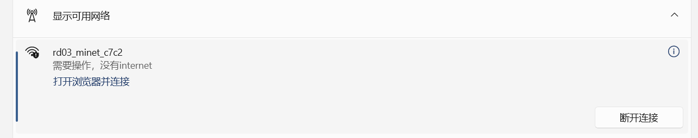

在路由器页面，完成初步配置。

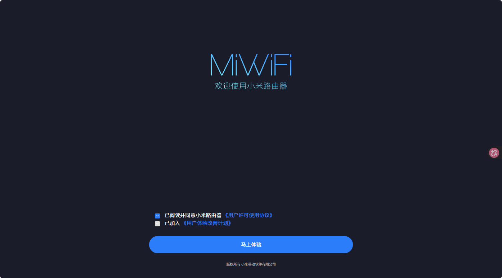

在初步配置的流程中，重点注意在上网向导中设置WiFi时，**记得取消勾选空闲时自动升级**。

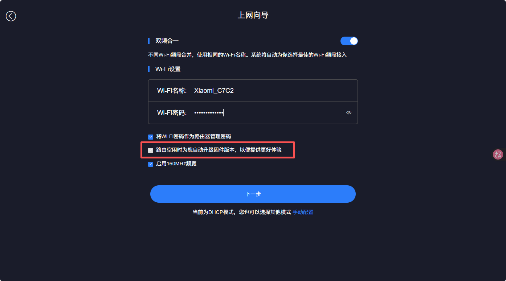

至此我们就进入了路由器的管理页面。从“路由状态”页面可以看到，博主的这个路由器版本是`1.0.64`。

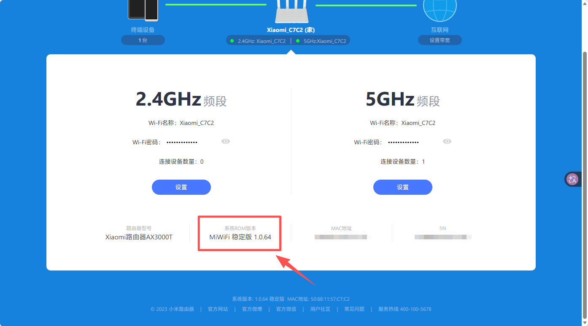

为了防止与博主当前网络环境下的主小米路由器产生路由冲突，先改局域网网段到 `10` 段。方法是在**常用设置 - 局域网设置**中，将局域网 IP 设置为`192.168.10.1`。保存，重启，重新连接电脑。

当然，如果是直接接入了目标的网络环境（比如家中），那也可以不修改，保持`192.168.31.1`的默认设置即可。

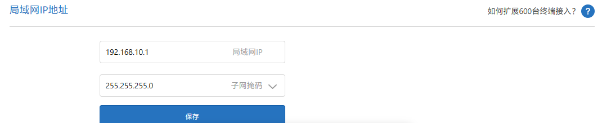

## 2 打开路由器的 SSH

### 2.1 使用开源项目 xmir-patcher 打开 SSH

如果在网上搜索“小米 AX3000T 开启 SSH”，我们肯定会看到一个非常经典的教程：利用路由器 Web 接口的命令注入漏洞，获取到后台的 `stok` 后，在 cmd 或终端中依次发送四条 POST 请求。

这四条命令的本质是修改 NVRAM 配置、绕过系统的启动校验并强行拉起 Dropbear (SSH) 服务：

```bash
# 1. 解除系统层面对 SSH 的封锁
curl -X POST http://192.168.31.1/cgi-bin/luci/;stok=<你的stok>/api/misystem/arn_switch -d "open=1&model=1&level=%0Anvram%20set%20ssh_en%3D1%0A"

# 2. 固化 NVRAM 配置到闪存
curl -X POST http://192.168.31.1/cgi-bin/luci/;stok=<你的stok>/api/misystem/arn_switch -d "open=1&model=1&level=%0Anvram%20commit%0A"

# 3. 篡改脚本将系统伪装成“调试模式”以绕过安全限制
curl -X POST http://192.168.31.1/cgi-bin/luci/;stok=<你的stok>/api/misystem/arn_switch -d "open=1&model=1&level=%0Ased%20-i%20's%2Fchannel%3D.*%2Fchannel%3D%22debug%22%2Fg'%20%2Fetc%2Finit.d%2Fdropbear%0A"

# 4. 正式启动 SSH 进程
curl -X POST http://192.168.31.1/cgi-bin/luci/;stok=<你的stok>/api/misystem/arn_switch -d "open=1&model=1&level=%0A%2Fetc%2Finit.d%2Fdropbear%20start%0A"
```

然后复制路由器 SN，去 [miwifi.dev](https://miwifi.dev/ssh) 算出 Root 密码就可以去连接 SSH 了。

不过，此方法通常只适用于 `1.0.48` 及更早版本的固件。博主这台路由器到手时的固件版本已经是 `1.0.64`，经实测，即使依次执行这四条命令后系统都返回了 `{"code":0}`（表面上执行成功），但当尝试连接 SSH 时，依然会提示 `Connection refused`。显然，官方在后续的固件中对这个漏洞的执行链做了修补。

为了不进一步增加折腾成本，我们就不用官方工具降级了，**博主决定采用稳定性更强、支持面更广，且操作方面的自动化开源方案：** `xmir-patcher`。

::github{repo="openwrt-xiaomi/xmir-patcher"}

将其代码库完整下载到本地，直接从网页下载 ZIP 或是 `git clone`都行，看你心情。接着 Windows 以管理员身份运行代码库中的`run.bat`，Linux 运行`run.sh`。界面如下图：

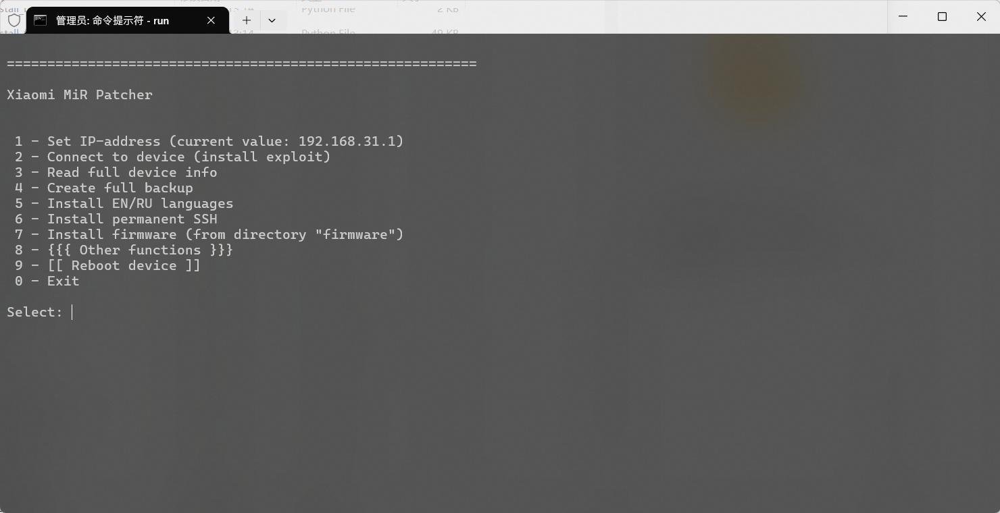

1. 设置路由器IP：选择【1】，输入路由器的IP地址，小米路由器默认 `192.168.31.1`，但我们这里就要改成 `192.168.10.1` 了。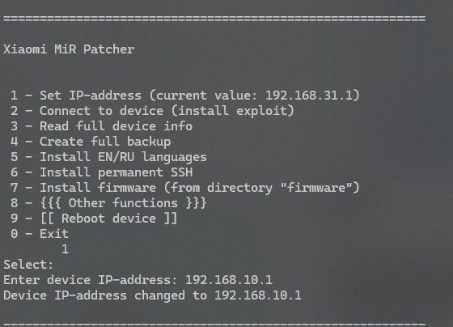
2. 解锁SSH，选择【2】，输入路由器后台管理密码，提交后会输出开启状态。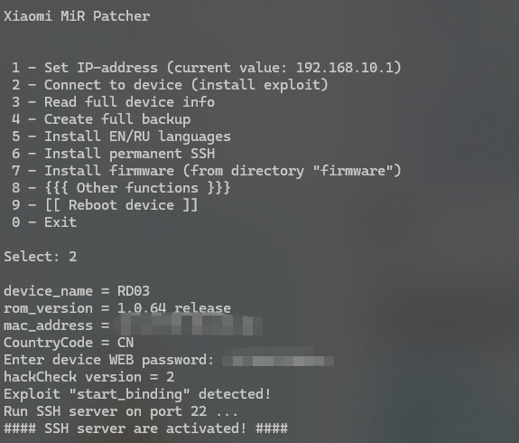
3. 修改root密码，选择【8】，再选择【2】修改 Root 密码。不修改也可以，默认的密码就是`root`。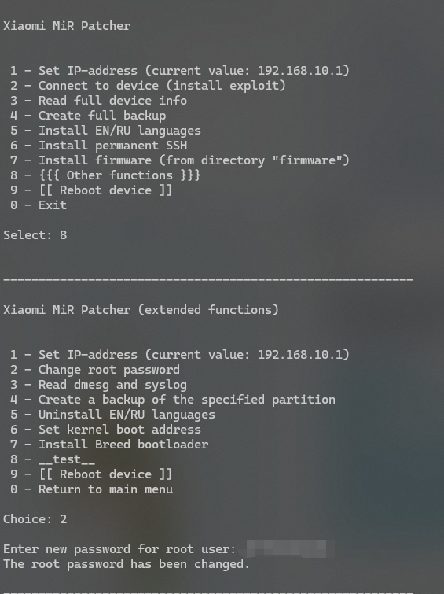
4. 持久化 SSH 的运行。因为小米路由器采用**核心目录开机动态还原**的系统策略，每次重启都不会保存更改，就像 Windows PE 一样，所以无论是现在开启的SSH，还是后续要安装的所有软件，我们都需要在正常运行后进行一个固化操作，确保开机后可以自动运行。在界面中选择【6】固化SSH。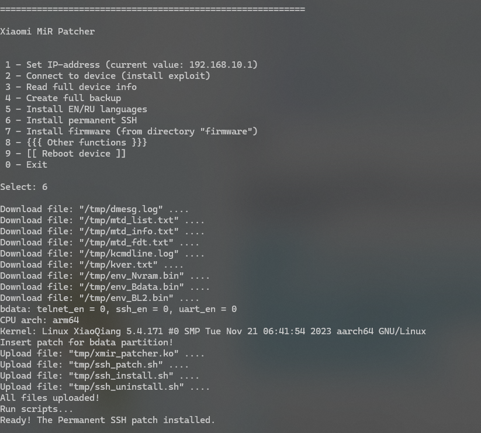

这时候就可以使用SSH工具连接到路由器终端了，博主全程使用 MobaXterm ，也比较推荐大家使用，因为它可以记住密码，还能直接管理路由器的文件。[官网](https://mobaxterm.mobatek.net)

新建会话，连接，输入root密码，出现 Banner `ARE U OK` 则成功。

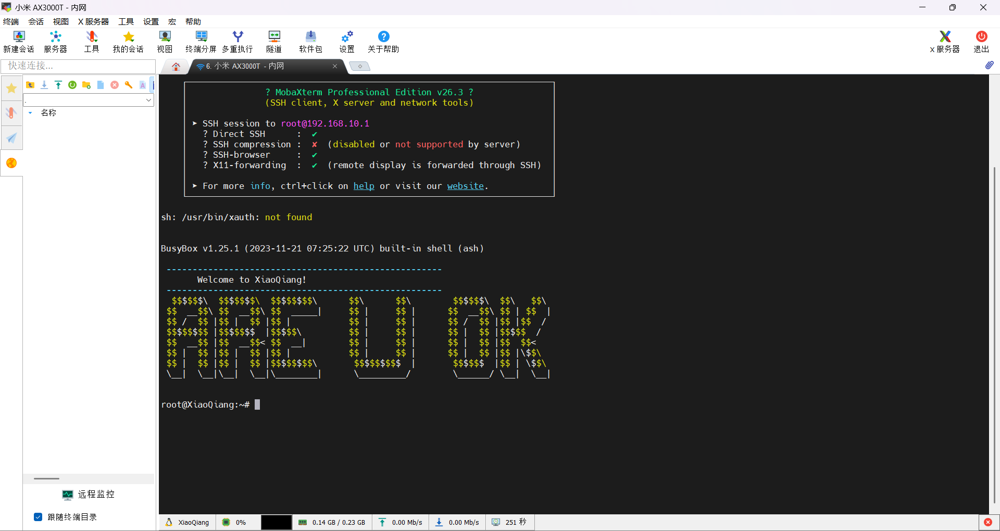

如果提示拒绝连接，如下图，可以重启一下路由器再连接。

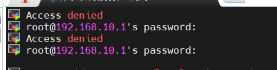

### 2.2 基本状态检查

这时候，我们可以对路由器的基本状态（特别是存储状态）进行检查，以便我们后续的安装操作。

#### 2.2.1 CPU 架构检查

```shell
root@XiaoQiang:~# uname -a
Linux XiaoQiang 5.4.171 #0 SMP Tue Nov 21 06:41:54 2023 aarch64 GNU/Linux
root@XiaoQiang:~# cat /proc/cpuinfo
processor       : 0
model name      : ARMv8 Processor rev 4 (v8l)
BogoMIPS        : 26.00
Features        : fp asimd evtstrm aes pmull sha1 sha2 crc32 cpuid
CPU implementer : 0x41
CPU architecture: 8
CPU variant     : 0x0
CPU part        : 0xd03
CPU revision    : 4

processor       : 1
model name      : ARMv8 Processor rev 4 (v8l)
BogoMIPS        : 26.00
Features        : fp asimd evtstrm aes pmull sha1 sha2 crc32 cpuid
CPU implementer : 0x41
CPU architecture: 8
CPU variant     : 0x0
CPU part        : 0xd03
CPU revision    : 4
```
从上面的输出结果可以看到，AX3000T 搭载的处理器属于主流的 ARM Cortex-A53 架构，并且系统运行在 64 位模式下。这意味着，后续我们在为路由器下载任何第三方软件（如 ZeroTier、Mihomo 等）的二进制执行文件时，必须认准 `ARM64` 或 `aarch64` 这两个关键后缀，千万别错下成常规 PC 的 `x86` 或者是老旧路由器的 `MIPS` 版本。

#### 2.2.2 存储空间检查

```shell
root@XiaoQiang:~# df -h
Filesystem                Size      Used Available Use% Mounted on
/dev/root                18.3M     18.3M         0 100% /
tmpfs                   119.5M    708.0K    118.8M   1% /tmp
ubi1:cfg                 24.3M    672.0K     22.4M   3% /data
ubi1:cfg                 24.3M    672.0K     22.4M   3% /userdisk
/dev/root                18.3M     18.3M         0 100% /userdisk/data
ubi1:cfg                 24.3M    672.0K     22.4M   3% /etc/config
ubi1:cfg                 24.3M    672.0K     22.4M   3% /etc/datacenterconfig
ubi1:cfg                 24.3M    672.0K     22.4M   3% /etc/smartcontroller
ubi1:cfg                 24.3M    672.0K     22.4M   3% /etc/parentalctl
ubi1:cfg                 24.3M    672.0K     22.4M   3% /etc/smartvpn
ubi1:cfg                 24.3M    672.0K     22.4M   3% /etc/ppp
ubi1:cfg                 24.3M    672.0K     22.4M   3% /etc/crontabs
ubi1:cfg                 24.3M    672.0K     22.4M   3% /etc/mipctl
tmpfs                   512.0K         0    512.0K   0% /dev
```

这是**最重要的一步**，也直接决定了我们后续的魔改方案。

从上面检查结果中可以看出，小米固件对存储空间的切分**非常抠门**。路由器的根目录 `/` 是一块被 100% 占满且只读的 ROM，而**留给用户唯一可写的物理持久化存储空间**，是挂载在 `/data`（或 `/userdisk`）的分区，**剩余容量仅有可怜的 22.4MB** ！

这就确立了我们的折腾策略：对于体积经过压缩后的 ZeroTier 等较小的、需要长期稳定运行的软件二进制文件，我们勉强能将其塞进 `/data` 实现本地持久化；但对于后续体积稍微大一点的软件，比如动辄二三十兆的 Mihomo，Flash 肯定是吃不消的。好在系统划分了一块 118.8MB 的 `/tmp` 内存盘 `tmpfs`，后续我们就得好好利用这块读写极快且不占闪存寿命的“风水宝地”，通过**脚本热加载**的形式让大软件在内存中跑。

#### 2.2.3 TUN 检查

```shell
root@XiaoQiang:~# ls -l /dev/net/tun
crw-------    1 root     root       10, 200 Jan  1  1970 /dev/net/tun

root@XiaoQiang:~# lsmod | grep tun
ip_tunnel              24576  2 ip_gre,sit
ip6_tunnel             36864  1 ip6_gre
ip6_udp_tunnel         16384  1 l2tp_core
tunnel4                16384  1 sit
tunnel6                16384  1 ip6_tunnel
udp_tunnel             16384  1 l2tp_core
```

Zerotier 的运行**强依赖 Linux 内核的虚拟网络设备（TUN/TAP）模块** ，之前博主没在 AC2350 上装成功，有一个重要原因就是官方内核彻底阉割了 TUN 支持。但从上方的查询结果来看，设备节点 `/dev/net/tun` 完好无损地存在着，并且通过 `lsmod` 可以看到内核已经内置并加载了大量相关的 `tunnel` 隧道模块。

**没有想到小米这次竟然这么大方，没对底层的 TUN 动刀子**，这把对于折腾玩家来说简直是“天胡开局”了！

## 3 Zerotier 的安装和配置

本章我们的总体目标就是：下载 Zerotier-One，对其使用 UPX 压缩以节省捉襟见肘的 `/data` 空间，安装后加入虚拟局域网并配置为 Moon 节点。

### 3.1 打开 IPv6 支持

Moon 的核心作用是**帮助没有公网 IP 的设备互相发现并打通直连，所以需要节点设备有公网IP**。目前家宽通常处于“大内网（多层 NAT）”，没有公网 IPv4 ，但是有公网 IPv6，所以将它作为 Moon 需要打开 IPv6 并允许外部设备通过 IPv6 访问路由器。

进入**路由器管理-常用设置-上网设置**，打开 IPv6 网络设置，上网方式为“自动配置”即可，关闭“IPv6 防火墙”。

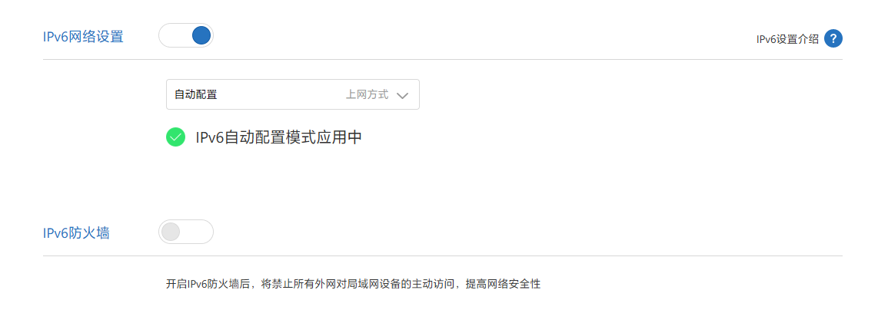

### 3.2 下载 Zerotier-One 并使用 UPX 压缩

由于我们计划在 `data` 分区直接放 Zerotier 二进制文件，考虑到只剩 22.4MB，所以要对 Zerotier 二进制文件进行压缩。

在 Windows 上下载并解压 UPX：[点击访问](https://github.com/upx/upx/releases/latest)

下载 Zerotier-One，由于官方仓库只提供源码下载，没有可现成使用的 `aarch64` 的编译版本，所以我们去[rafalb8 的仓库](https://github.com/rafalb8/ZeroTierOne-Static/releases)，下载最新的`aarch64` 静态编译版本`tar.gz`。
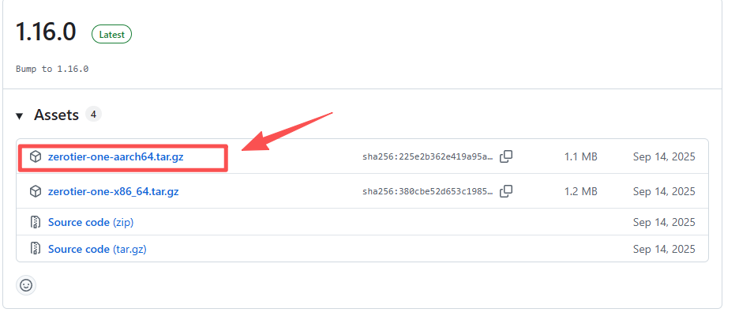

下载后打开，将压缩包 `bin` 文件夹下的 `zerotier-one` 文件解压到 `upx` 目录

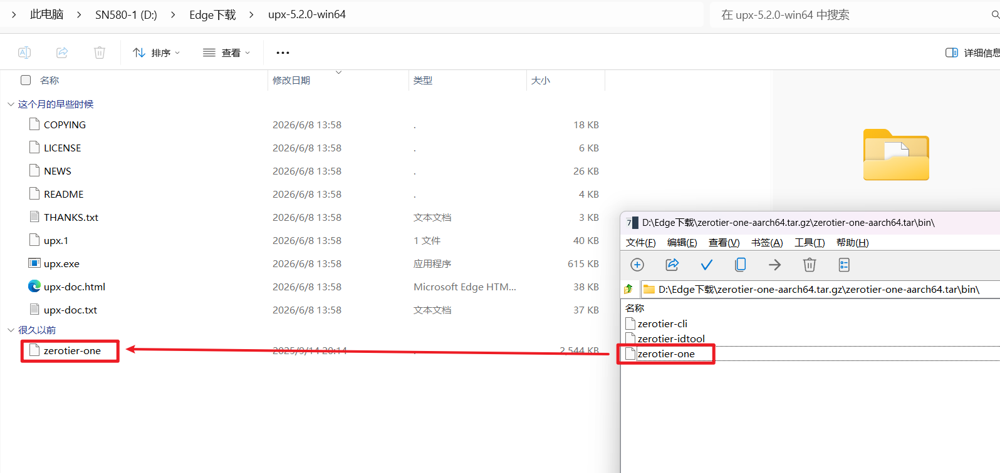

在 `upx`目录空白处右击打开终端，运行命令：

```shell
upx --best zerotier-one`
```
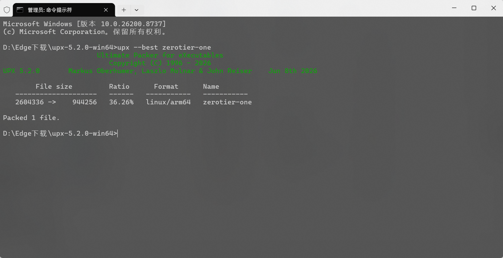

最终压缩后的 `zerotier-one` 二进制文件只有 **923KB**。

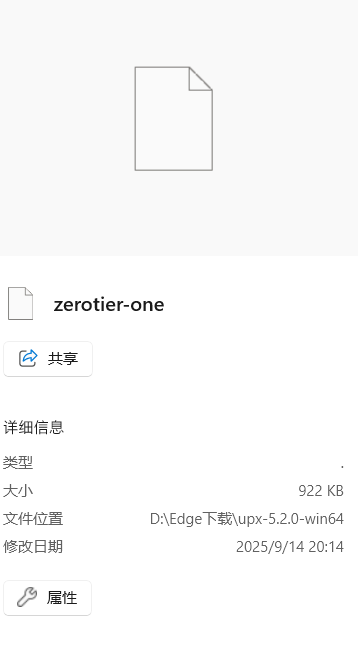

### 3.3 导入并安装 Zerotier-One

在 MobaXterm 的 SSH 的文件浏览窗口，进入路由器 `/data` 目录，导入刚刚准备好的`zerotier-one`文件。

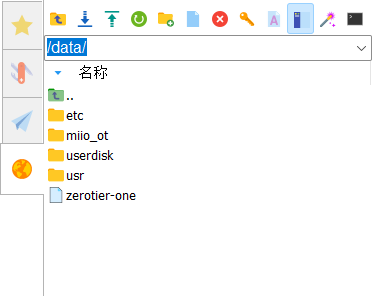

随后在 SSH 终端中执行以下命令：

```shell
# 1. 进入工作目录并赋予执行权限
cd /data
chmod +x zerotier-one

# 2. 创建专属的配置持久化目录
mkdir -p /data/zerotier

# 3. 核心机制处理（通过软链接触发 CLI 模式）
# ZeroTier 是一个单文件程序，它依靠读取命令行的 argv[0]（即自身被调用的名字）来决定是作为服务端运行，还是作为控制台工具运行。由于小米系统的 /usr/bin 无法写入，我们在 /data 下创建软链接来“欺骗”它。
ln -s /data/zerotier-one /data/zerotier-cli
ln -s /data/zerotier-one /data/zerotier-idtool

# 4. 首次后台启动守护进程（强制指定配置目录）
/data/zerotier-one -d /data/zerotier
```

看到类似下图的输出，就说明 Zerotier 已经成功跑起来了。

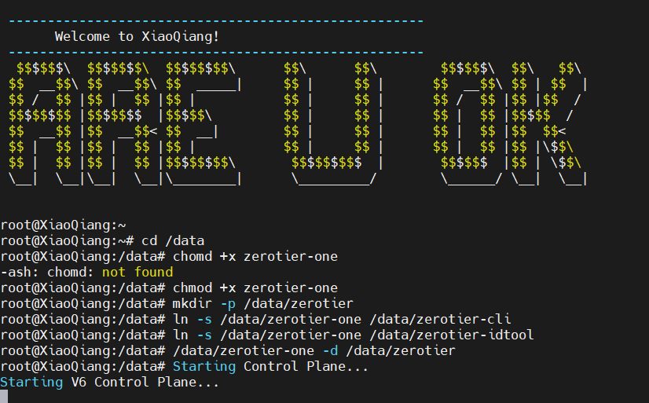

### 3.4 加入自己的虚拟局域网

因为 SSH 画面会一直卡在上图，所以推荐大家重新进一下 SSH 会话，千万别 `Ctrl + C` 哦！

接着去 [Zerotier 网页](https://my.zerotier.com/)，登录你的账号，复制你的局域网ID，在 SSH 中输入以下命令，加入你的局域网：

```shell
# 加入网络。注意：必须带上 -D 参数告诉 CLI 工具去哪里找鉴权 Token，6**************d替换为你的16位网络 ID
/data/zerotier-cli -D/data/zerotier join 6**************d
```

看到下图的 `200` 信息，回到 Zerotier 网页，授权一下，给一个固定 IP，这样就成功加入啦！
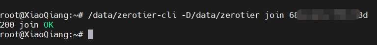
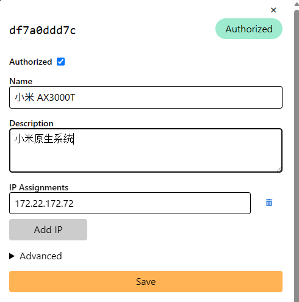

### 3.5 Moon 节点的设置

#### 3.5.1 创建 Moon 节点

:::warning
这一步请在正式接入你的目标网络环境（如家中网络）后再做，因为涉及到了公网 IP。
:::

首先查找公网 IPv6 地址。进入路由器管理页面，在首页“路由状态”点击“互联网状态”，复制“WAN IPv6地址”备用。

:::warning
地址后面可能会有`/64 /128`这类后缀，复制时不要把后缀复制进去！ 
:::

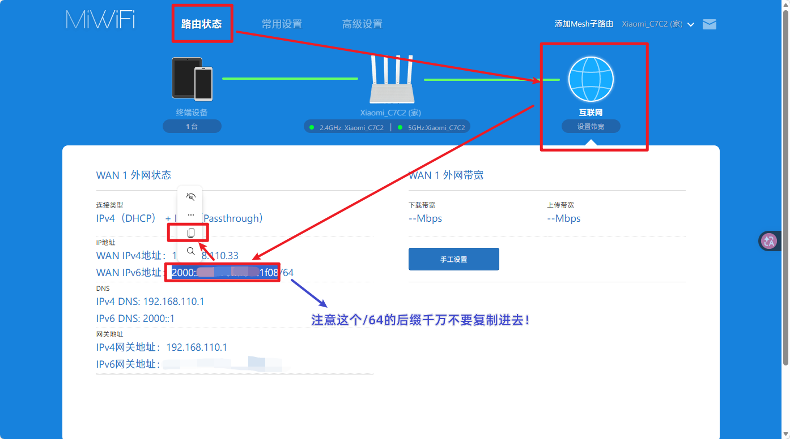

然后回到 SSH，输入命令，提取公钥并生成基础 `moon.json` 模板。

```shell
/data/zerotier-idtool initmoon /data/zerotier/identity.public >> /data/zerotier/moon.json
```

然后在 MobaXterm 左侧的文件浏览器中，进入 `/data/zerotier/` 目录。找到 `moon.json` 文件，直接双击它，MobaXterm 会调用内置的文本编辑器打开。向下滚动寻找 `roots` 数组。需要修改其中的 `stableEndpoints` 字段。本身是空的，需要先输入一对英文引号，在其中输入刚才复制的 IPv6 地址，后面加一个端口号 `/9993`，如下图。

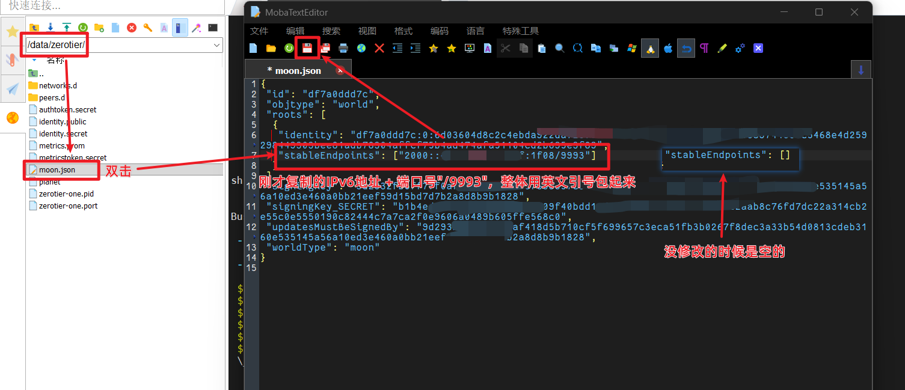

然后保存。出现覆盖或写入提示选择“是”。

签名并生效配置：回到 MobaXterm 的 SSH 终端中，依次执行以下命令，并重启服务：

```shell
# 利用修改好的 json 编译生成签名文件 (000000xxxx.moon)
/data/zerotier-idtool genmoon /data/zerotier/moon.json

# 创建 Moon 存放目录并移入
mkdir -p /data/zerotier/moons.d
mv 000000*.moon /data/zerotier/moons.d/

# 杀掉进程并重启，使其加载 Moon 配置
killall zerotier-one
/data/zerotier-one -d /data/zerotier
```

**至此，这台 AX3000T 就已经是一台合格的 IPv6 Moon 节点了。**

#### 3.5.2 为其他设备添加 Moon 节点

首先获取这台路由器的Zerotier ID。在终端输入：

```shell
/data/zerotier-cli -D/data/zerotier info
```

执行后，终端会返回类似这样的一行信息：

```plaintext
200 info a1b2c3d4e5 1.14.2 ONLINE
```

中间那串 **10 位由字母和数字组成的字符串**（例如示例中的 `a1b2c3d4e5`），就是这台路由器的 **ZeroTier ID**。

后续你只需要在其它运行 ZeroTier 客户端的电脑/服务器终端中，执行 `zerotier-cli orbit <这台路由器的ZeroTier ID> <这台路由器的ZeroTier ID>`，就可以享受到它的辅助打洞加速服务了。

### 3.6 持久化运行设置

#### 3.6.1 持久化运行的原理

这台 AX3000T 虽然底层是 OpenWrt，但小米对其进行了**严格的“防篡改”魔改**。它就像是网吧里装了“还原卡”的电脑，或者我们极客常玩的 Windows PE —— 每次开机时，系统都会从只读的底层模板中，将 `/etc/init.d/`、`/etc/rc.local` 甚至 `/etc/firewall.user` 等这些通常用来做开机自启的核心目录强制覆盖清空。这意味着，**传统的 OpenWrt 驻留自启教程在这里统统失效**。

那么，我们刚开始使用的 `xmir-patcher` 是怎么做到让 SSH 服务永久存活的呢？

博主顺藤摸瓜，扒开了 `xmir-patcher` 的源码，终于发现了它实现持久化的核心机密 —— **利用 OpenWrt 底层的 UCI (Unified Configuration Interface) 机制，进行“防火墙生命周期注入”。**

简单来说，就是“借鸡生蛋”：

1. 避开重置区。我们不碰那些开机会被还原的文件，而是将我们写好的启动脚本（比如 `start_zt.sh`）安全地存放在唯一不会被清空的物理分区 `/data` 下。

2. 利用 UCI 规则。小米系统虽然会还原脚本文件，**但它会保留核心的 UCI 配置文件（写入 NVRAM 闪存）** 。我们通过 UCI 命令，在系统的防火墙配置中强行插入一条 `include` 指令。

3. 当路由器开机、拨号成功、网络接口初始化完毕时，系统会自动重载防火墙。此时，**防火墙就会读取到我们通过 UCI 注入的规则**，顺着路径来到 `/data` 目录，把我们的脚本拉起来。

这个逻辑非常精妙！它不仅完全不怕小米的官方 OTA 升级，而且 Timing 很合适——对于 ZeroTier 或代理软件来说，等底层网络和防火墙就绪后再启动，能最大程度避免断网或死锁报错。

因此，这个做法就作为我们后续持久化自己安装的软件的**标准做法**了。后续无论是开启本节的 ZeroTier，还是后面我们要试验的任何软件（如缓存跑 Mihomo），我们都将严格遵循这个固化逻辑。

#### 3.6.2 编写 ZeroTier 启动脚本

我们遵循上节的研究结果，在 `/data` 下单独建一个 ZeroTier 启动脚本。

1. 在 MobaXterm 左侧进入 `/data` 目录。
2. 右键点击空白处，选择 **"New empty file" (新建空文件)**，命名为 `start_zt.sh`。
3. 双击打开 `start_zt.sh`，将以下代码粘贴进去：

```bash
// start_zt.sh
#!/bin/sh

# 等待 10 秒，确保系统的底层网络（网卡、TUN模块）已经初始化完毕
sleep 10

# 检查进程是否存在，避免防火墙重载时重复启动产生僵尸进程
if ! pgrep -f "/data/zerotier-one" > /dev/null; then
    # 强制后台运行，并指定配置文件目录
    /data/zerotier-one -d /data/zerotier
    
    # 顺手往系统日志里写一条记录，方便以后排错
    logger -t "ZeroTier-Patcher" "ZeroTier initialized from /data"
else
    logger -t "ZeroTier-Patcher" "ZeroTier is already running"
fi
```

4. 重要的一步：如下图，编辑完后，一定要在上方的“格式”菜单中选择 `Linux / Unix`，以免造成换行符冲突。之后所有用 MobaXterm 直接创建的脚本文件都需这样操作！
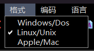

保存并关闭文件。在终端中执行命令，赋予它可执行权限：

```shell
chmod +x /data/start_zt.sh
```

#### 3.6.3 添加防火墙规则

在终端中运行下面几行代码：

```shell
# 1. 新建一个名为 zerotier 的防火墙脚本包含规则
uci set firewall.zerotier=include

# 2. 指定类型为 shell 脚本
uci set firewall.zerotier.type='script'

# 3. 指向我们刚才写好的自启脚本路径
uci set firewall.zerotier.path='/data/start_zt.sh'

# 4. 启用该规则
uci set firewall.zerotier.enabled='1'

# 5. 提交并保存修改到闪存（这一步极其关键，确保重启不丢失）
uci commit firewall
```

完成后执行`cat /etc/config/firewall`，如图，可见末尾增加了zerotier配置，添加成功。
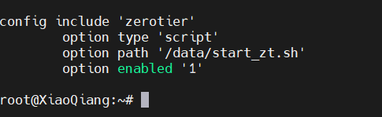

#### 3.6.4 重启验证

持久化配置完成后，最稳妥的验证方式就是直接拔电源或软重启。可以在终端输入：
```shell
reboot
```
等待路由器重启完成，再次用 MobaXterm 连接上 SSH，执行以下命令：
```shell
# 检查进程是否自动拉起
ps -w | grep zerotier

# 检查网络是否正常打通
/data/zerotier-cli -D/data/zerotier listpeers
```

如果进程存在，且节点列表正常输出，类似于下面，恭喜你！ZeroTier 成功部署！它现在已经像原厂服务一样扎根在这台 AX3000T 里了。
```shell
root@XiaoQiang:~# ps -w | grep zerotier
 2185 root     30684 S    /data/zerotier-one -d /data/zerotier
10406 root      1464 S    grep zerotier
root@XiaoQiang:~# /data/zerotier-cli -D/data/zerotier listpeers
200 listpeers <ztaddr> <path> <latency> <version> <role>
200 listpeers 68bea79acf 35.209.29.203/34689;6247;6247 247 1.16.2 LEAF
200 listpeers 778cde7190 103.195.103.66/9993;7634;67386 254 - PLANET
200 listpeers cafe04eba9 84.17.53.155/9993;2634;37366 183 - PLANET
200 listpeers cafe80ed74 185.152.67.145/9993;7634;40215 194 - PLANET
200 listpeers cafefd6717 79.127.159.187/9993;7634;67420 219 - PLANET
```

:::important
在本章的所有操作中，你可能已经注意到，我们执行 ZeroTier 相关的 CLI 命令（如 join、listpeers、info 等）时，都带上了 `-D/data/zerotier` 参数。这至关重要！

小米路由器的原厂系统默认会将程序配置写入内存盘 `/var/lib/zerotier-one`，这会导致一旦路由器重启，你辛苦配置好的网络节点和身份认证信息瞬间“灰飞烟灭”。通过显式添加 `-D/data/zerotier` 参数，我们是在强制告诉 ZeroTier 程序：**请去我的 `/data` 闪存分区读取和写入配置**。

记住这个“护身符”，它就是确保你的 ZeroTier 异地组网能够跨越重启、跨越断电，永久“钉”在路由器里的核心参数。
:::

## 4 Mihomo 热加载尝试

### 4.1 为什么要热加载？

#### 4.1.1 问题

在搞定了 ZeroTier 之后，博主的极客 DNA 彻底按捺不住了。既然底层的 TUN 模块健在，我们要把**硬路由软化** ，那不跑个透明网关简直暴殄天物啊！但当我们把目光转向 Mihomo 时，现实泼了一盆冷水。

Mihomo 作为一个功能极其强大的代理核心，它的官方原生 `ARM64` 二进制文件体积通常在 25MB 左右！即便我们像之前处理 ZeroTier 那样，用 UPX 进行极限压缩，最后的体积也只能勉强压到 `8MB` 上下。

大家不要忘了，我们这台路由器的 `/data` 分区总共只有可怜的 22.4MB。如果直接把 8MB 的核心文件塞进去，不仅浪费了极其宝贵的存储空间，而且 Mihomo 在运行过程中还需要下载动辄十几兆的路由规则库（`GeoSite.dat`、`GeoIP.dat`），这会让 `/data` 分区瞬间爆满，甚至导致路由器死机。

还有闪存寿命。Mihomo 运行时会频繁读写缓存数据（如 `cache.db`）和更新订阅节点。如果把它的工作目录设在物理闪存上，路由器的 Flash 颗粒可能在几个月内就会因为过度擦写而寿终正寝。

#### 4.1.2 总体思路

**对此，我们的思路就是：把118.8MB 的 `/tmp` 内存盘利用起来，让 Mihomo 实现开机热加载。** 具体来说：
1. 在本地的 `/data` 分区中，我们只保留几 KB 大小的 `config.yaml` 配置文件。
2. 编写一个自启脚本，在路由器开机并连上网络后，直接通过国内的加速镜像站，从 GitHub 拉取指定版本的 Mihomo 二进制压缩包（.gz格式）以及最新的国内 IP/站点数据库。
3. 脚本在 `/tmp` 内存盘中开辟一块专属空间，自动解压下载好的核心文件，并将配置和数据库都放入其中。Mihomo 的启动和后续的所有高频读写，都将完全在这个内存沙盒中进行。

这种方案不仅实现了对路由器物理闪存的 0 损耗，而且每次开机路由器都会自动获取最新的核心和规则库，**真正做到了“无盘热加载、热启动”**。

#### 4.1.3 管理面板

既然核心都在内存里跑了，为了节省空间，我们就不要把庞大的 管理面板 MetacubeXD 塞进路由器了。

Mihomo 本身提供了一个强大的外部控制 API。我们只需要在配置文件中暴露出 `9090` 端口，然后在局域网内的任何一台电脑或者 NAS 上部署 MetacubeXD 面板，输入路由器的 IP 和 `9090` 端口，就能实现对 Mihomo 节点和规则的可视化管理了。


### 4.2 Mihomo 配置的构建

在正式拉取核心程序之前，我们需要先给 Mihomo 准备好配置文件。在这个配置中，我们**不仅要配置好底层网络劫持，还要设置好动态订阅链接**，让它能在内存中自行更新节点。

在 MobaXterm 左侧的文件树中，进入 `/data` 目录。右键新建一个文件夹，命名为 `clash`。进入这个新建的 `clash` 目录，右键新建空白文件，将其命名为 `config.yaml`。

双击打开这个空文件，还是如上面所说，先在上方的“格式”菜单中选择 `Linux / Unix`，以免造成换行符冲突。然后将下面的配置代码完整复制进去：

```yaml
// config.yaml
# ================= 底层与面板配置 =================
port: 7890
socks-port: 7891
allow-lan: true
mode: rule
log-level: info
ipv6: false # 为了避免大内网IPv6路由黑洞，透明代理通常建议先关闭IPv6劫持

# 核心：对外暴露控制 API（面板就是连这个端口）
external-controller: 0.0.0.0:9090
secret: "ybjun666" # 【必须修改】面板连接密码，防止局域网内其他人乱改

# ================= DNS 与 TUN 配置 =================
dns:
  enable: true
  listen: 0.0.0.0:1053
  ipv6: false
  enhanced-mode: fake-ip
  fake-ip-range: 198.18.0.1/16
  nameserver:
    - 223.5.5.5
		- 1.1.1.1
    - 114.114.114.114

tun:
  enable: true
  stack: system
  auto-route: true
  auto-detect-interface: true

# ================= 动态订阅链接配置 =================
proxy-providers:
  Sub_1:
    type: http
    url: "https://你的第一个订阅链接.com/xxxxx" # 【修改为你的真实链接】
    interval: 86400 # 每 24 小时自动后台更新一次
    path: ./providers/sub1.yaml # 下载后存储在 /tmp/clash/providers 内存中
    health-check:
      enable: true
      interval: 600
      url: http://www.gstatic.com/generate_204

  Sub_2:
    type: http
    url: "https://你的第二个订阅链接.com/xxxxx" # 【修改为你的真实链接】
    interval: 86400
    path: ./providers/sub2.yaml
    health-check:
      enable: true
      interval: 600
      url: http://www.gstatic.com/generate_204

# ================= 策略组配置 =================
proxy-groups:
  - name: "🚀 手动切换"
    type: select
    use:
      - Sub_1
      - Sub_2

  - name: "⚡ 自动优选"
    type: url-test
    use:
      - Sub_1
      - Sub_2
    url: http://www.gstatic.com/generate_204
    interval: 300

# ================= 路由分流规则 =================
rules:
  # 白名单：确保你家局域网和NAS的访问绝对不绕路
  - GEOIP,LAN,DIRECT
  - DOMAIN-SUFFIX,ybjun.com,DIRECT 
  
  # 核心规则：国内流量直连
  - GEOSITE,CN,DIRECT
  - GEOIP,CN,DIRECT
  
  # 兜底规则：没有匹配到国内特征的，全部走你选择的节点
  - MATCH,🚀 手动切换
```

当然，你可以根据实际情况编写你自己的 Mihomo 配置，不过记得打开 `9090` 控制端口哦！

### 4.2 编写 tmp 热加载脚本并作持久化

#### 4.2.1 热加载脚本编写

在 `/data` 目录下新建 `start_clash.sh`，把格式改为`Linux / Unix` ，写入以下代码：

```bash
// start_clash.sh
#!/bin/sh

# ================= 辅助监控函数 =================
log_info() {
    logger -t "Mihomo-Patcher" "$1"
    echo ">>> [INFO] $1"
}
log_err() {
    logger -t "Mihomo-Patcher" "$1"
    echo "!!! [ERROR] $1"
}
# ================================================

# 1. 防重入检测
if pgrep -f "/tmp/clash/mihomo" > /dev/null; then
    log_info "Mihomo is already running, skipping boot."
    exit 0
fi

log_info "Starting Mihomo network boot sequence (v1.19.27) in BACKGROUND..."

# =======================================================
# 核心架构：将所有耗时操作放入子 Shell 并强制后台运行 (&)
# =======================================================
(
    # 2. 构建内存沙盒
    log_info "Creating tmpfs sandbox (/tmp/clash)..."
    mkdir -p /tmp/clash

    # 3. 核心逻辑：死等网络连通 (循环 ping 阿里 DNS)
    log_info "Checking network connectivity..."
    MAX_WAIT=30
    WAIT_CNT=0
    while ! ping -c 1 -W 1 223.5.5.5 > /dev/null 2>&1; do
        WAIT_CNT=$((WAIT_CNT+1))
        if [ "$WAIT_CNT" -ge "$MAX_WAIT" ]; then
            log_err "Network timeout! Boot aborted."
            exit 1
        fi
        sleep 2
    done

    log_info "Network is UP. Downloading payloads..."

    # 4. 利用加速节点拉取官方压缩包与 Geo 数据库
    CORE_URL="https://ghproxy.net/https://github.com/MetaCubeX/mihomo/releases/download/v1.19.27/mihomo-linux-arm64-v1.19.27.gz"
    GEOSITE_URL="https://ghproxy.net/https://github.com/MetaCubeX/meta-rules-dat/releases/download/latest/geosite.dat"
    GEOIP_URL="https://ghproxy.net/https://github.com/MetaCubeX/meta-rules-dat/releases/download/latest/geoip.dat"
    
    # 4.1 下载并解压核心程序
    if curl -L -k -f -s -o /tmp/clash/mihomo.gz "$CORE_URL"; then
        log_info "Core downloaded. Extracting gzip payload..."
        gzip -d /tmp/clash/mihomo.gz
        chmod +x /tmp/clash/mihomo
    else
        log_err "Core download failed!"
        exit 1
    fi

    # 4.2 提前下载 Geo 规则，打破死锁
    log_info "Downloading GeoSite and GeoIP databases..."
    curl -L -k -s -o /tmp/clash/GeoSite.dat "$GEOSITE_URL"
    curl -L -k -s -o /tmp/clash/GeoIP.dat "$GEOIP_URL"
    log_info "Geo databases downloaded."

    # 5. 复制本地固化的配置文件
    log_info "Copying config.yaml to tmpfs..."
    cp /data/clash/config.yaml /tmp/clash/config.yaml

    # 6. 点火运行
    log_info "Ignition! Starting Mihomo..."
    /tmp/clash/mihomo -d /tmp/clash > /tmp/clash/mihomo.log 2>&1 &
    
    # 7. 防火墙开门（为面板控制 API 放行 9090 端口）
    log_info "Opening firewall port 9090 for Dashboard..."
    iptables -I INPUT -p tcp --dport 9090 -j ACCEPT
    
    log_info "Boot sequence finished gracefully."
) &

# 脚本主进程瞬间退出，交还防火墙控制权
exit 0
```
这段脚本看似很长，但处处都是“心机”：
* 全量后台异步化 `( ... ) &`：这是解决断网阻塞的核心。耗时的网络检测和下载全被塞进了一个子 Shell 中并在后台运行，脚本的主进程瞬间就能走到最后的 `exit 0` 并把控制权交还给系统防火墙，家里其他设备的网络不会卡顿。
* 自带解压与打破死锁：利用国内的 GitHub 镜像源 `ghproxy.net` 不仅拉取了 `.gz` 核心文件，还直接通过系统自带的 `gzip -d` 命令原地解压，省去了电脑端转换的麻烦；同时，在启动核心前提前拉取了 Geo 数据库，规避了启动时的断网死锁。
* 全链路日志探针：利用 `log_info` 函数将运行状态同时输出到终端和系统日志中，不仅方便排错，还将 Mihomo 自身的运行日志重定向到了 `/tmp/clash/mihomo.log`，随时可以 troubleshooting。
* 动态放行：为了防止小米苛刻的自带防火墙拦截面板访问，脚本在启动核心后，利用 `iptables` 强行给 `9090` 控制端口开了一个绿灯。

保存这段脚本后，可以直接在 SSH 中敲入 `/data/dtart_clash.sh` 先试运行看看效果，如果没什么问题，Mihomo 成功加载，那就 OK 啦！

#### 4.2.2 UCI命令持久化

脚本准备就绪后，我们又要回到熟悉的持久化环节了。这里的做法和我们在第三章中对 ZeroTier 所做的完全一致，依然是利用 OpenWrt 底层的 UCI 机制，把我们的热加载脚本作为一条“防火墙规则”注入到系统启动生命周期中。

在终端依次粘贴并执行以下 5 条命令：

```shell
# 1. 新建名为 mihomo 的防火墙自定义规则
uci set firewall.mihomo=include

# 2. 声明规则类型为 shell 脚本
uci set firewall.mihomo.type='script'

# 3. 指定脚本的绝对路径
uci set firewall.mihomo.path='/data/start_clash.sh'

# 4. 启用该规则
uci set firewall.mihomo.enabled='1'

# 5. 提交保存到闪存（极其关键，确保重启后规则不丢失）
uci commit firewall
```

大功告成！现在就可以重启路由器看效果了。

### 4.3 阶段性总结

折腾到这里，按照正常逻辑，我们应该已经能在面板里选择节点并看到流量图了。但作为一篇硬核折腾记录，博主必须坦诚地告诉大家：**这套 Mihomo 方案目前还不能 100% 稳定可用，依然存在几个亟待解决的遗留问题。**

在博主的实际测试中，目前主要遇到了以下几个“坑”：

* 拉取太慢与偶发加载失败。虽然我们在脚本中使用了` ( ... ) &` 强制异步以防止断网，并且替换了国内的 CDN 镜像站，但实际拉取下载速度还是比较慢，只有几十 KB/s，有时也会遇到其它问题，进而引发 Mihomo 启动失败或启动后报错。
* 面板连接失败的报错。在某些情况下，即使通过 `ps` 命令看到 Mihomo 已经在内存盘里跑起来了，日志也显示启动成功，但浏览器连接 MetacubeXD 面板时依然会爆出 `ERR_CONNECTION_REFUSED`。明明 `iptables` 已经放行了 `9090` 端口，却还是会被不知名的底层机制拦截，或者遇到配置解析错误导致后台静默闪退。

这部分内容，博主还在继续探索“折腾”，后续的进展和结果，博主也将及时更新文章和大家分享。但之所以博主选择把第四章放出来，那是因为**至少目前证明了，这套“热加载”的架构思路本身，是完全可行的**。不过如果是其它比较小的、简单的软件，博主还是建议尽量把二进制放在 `/data` 中加载。

## 5 结语

回顾这趟给小米 AX3000T “软化硬路由”的折腾之旅，我们虽然是在极其苛刻的条件下“带着镣铐跳舞”，但依然取得了丰硕的阶段性成果。

在这篇文章中，我们不仅成功绕过了原厂固件的重置限制开启了固化 SSH，还彻底摸清了这台路由器的底层底牌（AArch64 架构、珍贵的 22MB 可写空间、庞大的 118MB 内存盘以及完整的 TUN 模块支持）。更重要的是，通过安装 ZeroTier 和探索 Mihomo，博主为大家总结出了一套在小米闭源魔改系统下，**通用且稳定的第三方软件部署与持久化流程**：

1. 寻找并下载目标软件对应的 `aarch64` 架构（或 ARM64）的静态编译二进制文件。
2. 如果软件体积较小且读写频率低（如 ZeroTier），建议使用 UPX 压缩后直接存放在 `/data` 物理分区，以求最稳；如果体积庞大且读写频繁（如 Mihomo），则利用自启脚本将其“热加载”到 `/tmp` 内存盘中运行，实现物理闪存的 0 损耗。
3. 在 `/data` 目录下编写对应的启动脚本，并在脚本中处理好网络延时等待、指定配置文件路径或异步下载等核心逻辑。
4. 利用 OpenWrt 底层的 UCI 机制（`uci set firewall.xxx=include...`），将启动脚本挂载到防火墙重载的生命周期中，从而无视系统本身的还原机制，实现持久化运行和开机自启。

诚然，对于需要透明网关、内网穿透或者跑各种复杂服务的需求，**直接在主路由旁边挂一个几十块钱的晶晨机顶盒显然是门槛更低、性能也更强大的解法**。但是，“折腾”二字本身的魅力，恰恰就藏在这些与底层系统斗智斗勇、在十几兆的夹缝中抠出空间的极客操作之中。压榨有限硬件的极限，本身就是一件充满了乐趣与成就感的事情。

这台 AX3000T 的潜力显然还未被完全挖掘。博主后续会继续研究 Mihomo 方案中的问题。敬请期待博主后续的研究与更新！咱们下期折腾再见！