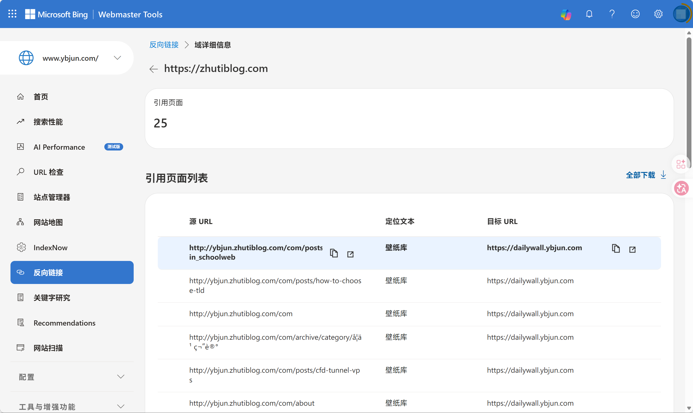
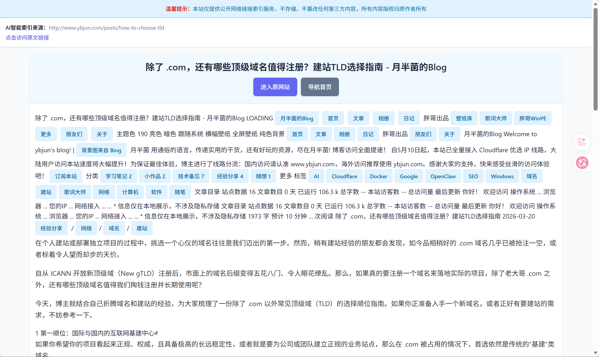
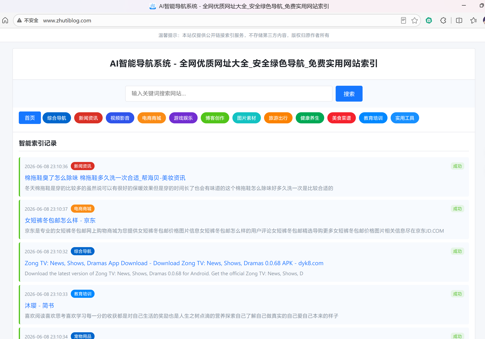
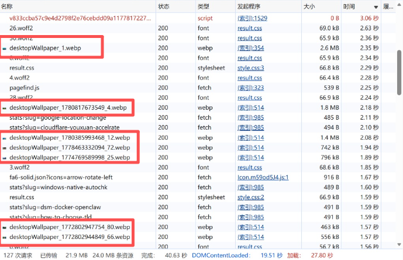
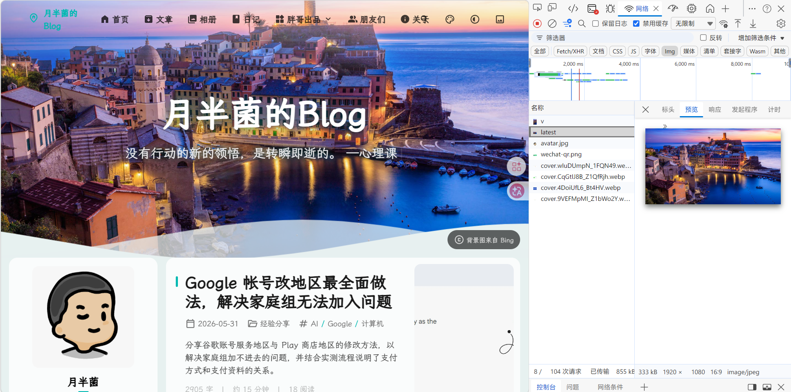
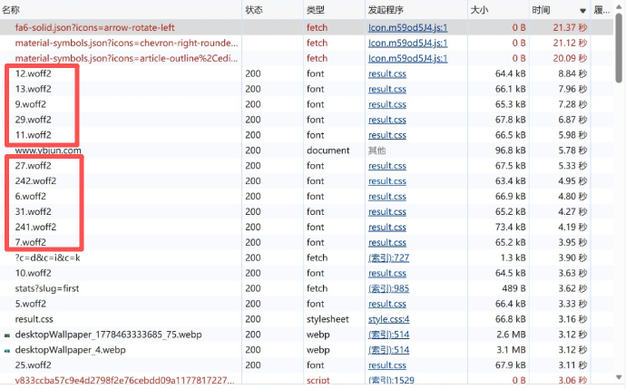
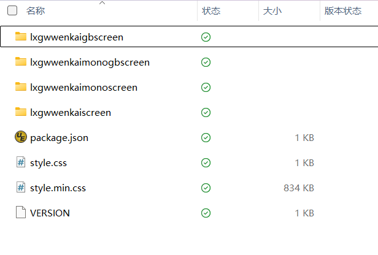
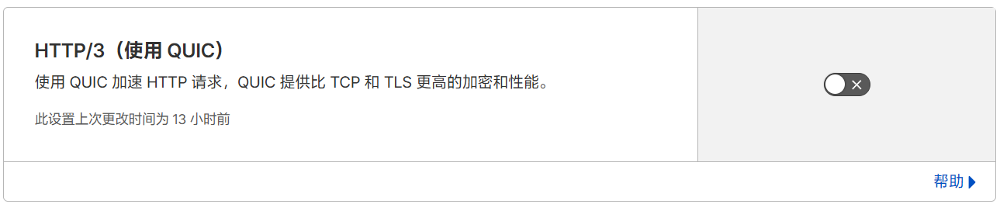
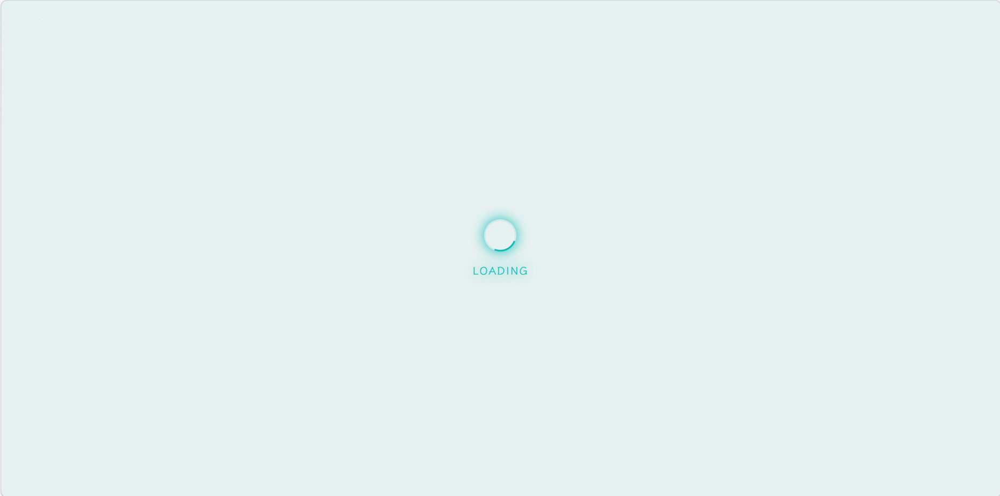

建站容易，优化不易。之前为了提升本站（基于 Astro + Svelte 构建，采用 Twilight 框架，属于类 Fuwari，结构比较重型）在国内的访问体验，博主特意给 Cloudflare 全家桶做了国内优选 IP。虽然在 ITDog 上测速一片青葱，看着非常唬人，**但实际在国内真实网络环境下访问时，博客加载依然需要很长时间**，有时候全屏的 Loading 动画甚至要转两到三分钟。

究竟是怎么回事？结合 Edge DevTools 的网络日志分析，博主意识到单纯的“网络线路优选”已经到了瓶颈，**真正的“性能杀手”可能藏在前端代码库的加载逻辑里**。下面，就是博主大刀阔斧对前端代码库进行分析、拆解和改造的全纪录。

## 1 恶意 SEO 镜像站防御

在着手优化速度之前，博主先发现了一个极其恶心但又及其搞笑的 SEO 问题。

### 1.1 遭遇“赛博缝合怪”

在例行检查 Bing Webmaster Tools (BWT) 的“反向链接”时，博主发现博客多出了大量来自` zhutiblog.com` 的反链。它甚至为我们贴心地创建了三级域 `ybjun.zhutiblog.com`，并极其拙劣地将本站部分链接给拼接了过去，例如 `http://ybjun.zhutiblog.com/com/posts/how-to-choose-tld`（多拼了一个子路径 `/com/`，盲猜是采集脚本的正则匹配失误，实在是太草台班子了）。

直接在浏览器中打开这些页面可以看到，他疑似直接暴力扒取了本站 HTML 的纯文本，连基本的页面排版都没有保留。经过深度追踪，**这是一种典型的恶意镜像（自动采集建站）事件**。攻击者利用劣质的爬虫或反代技术实时克隆了本站的内容，试图建立内容农场，以此窃取博客的内容与搜索引擎权重。


### 1.2 解决步骤 1：动态 Canonical URL 固权

这是对抗镜像站最釜底抽薪的一招。在 SEO 的权重规则中，规避重复内容是核心原则。即使对方通过反代篡改了域名，或者像这次一样暴力扒走了纯文本，只要我们 HTML `<head>` 中的**规范链接（Canonical URL）** 仍然指向原创站点，搜索引擎就会把该页面的所有权重全部分配给主站，镜像站最终只会沦为白干活的“无用索引”。

博主在 Astro 全局组件（如 Layout.astro）的 `<head>` 早期注入了动态生成逻辑。由于它是直接读取 `astro.config.mjs` 中的主站 `site` 域名配置，从根本上杜绝镜像站继承自身域名的可能性：

```javascript
// base.astro
// Canonical URL：始终基于 astro.config.mjs 中配置的主站 site 生成，避免镜像站继承自身域名。
const canonicalURL = new URL(Astro.url.pathname, Astro.site).toString();
```

```html
// base.astro
<head>
	<!-- 头部信息都改成规范链接 -->
  <link rel="canonical" href={canonicalURL} />
	<meta property="og:url" content={canonicalURL}>
</head>
```

### 1.3 解决步骤 2：Base64 混淆域名 + 前端异步反弹

反代镜像通常会用简单的正则表达式（如 `body.replace(/ybjun\.com/g, 'mirror.com')`）来暴力篡改 HTML 里的域名。为了防止我们的防御脚本被无脑替换，博主在 `<head>` 的最顶端注入了一段**基于 Base64 混淆的强力反弹脚本**。

它不仅巧妙避开了明文正则扫描，还完美兼容了 Cloudflare Pages 的 .pages.dev 分支预览环境、本地开发环境，以及博主的其他合法子域。只要这段代码位于 `<meta charset>` 和 `<title>` 之后，浏览器在遇到未授权域名时，甚至来不及加载庞大的 CSS 和图片资源，就会瞬间将用户（或支持 JS 渲染的爬虫）强行“弹”回 `www.ybjun.com`。

```html
// base.astro
    <head>
        <meta charset="UTF-8" />
				<script is:inline>
						(() => {
								// 确保仅在客户端浏览器环境中执行，避免 Astro SSR 构建报错
								if (typeof window === "undefined") return;

								// Base64 解码函数，混淆域名以躲避静态正则替换爬虫
								const decodeHost = (value) => atob(value);
        
								const mainDomain = decodeHost("eWJqdW4uY29t"); // ybjun.com
								const pagesDomain = decodeHost("eWJqdW4tYmxvZy1kdm0ucGFnZXMuZGV2"); // ybjun-blog-dvm.pages.dev
        
								// 精确匹配的白名单
								const allowedHosts = new Set([
										mainDomain,
										decodeHost("d3d3LnlianVuLmNvbQ=="), // www.ybjun.com
										decodeHost("MTI3LjAuMC4x"),         // 127.0.0.1
										decodeHost("bG9jYWxob3N0"),         // localhost
										decodeHost("*****************"),         // 放入其他需要加入白名单的域名 Base64
								]);

								const host = window.location.hostname.toLowerCase();
        
								// 动态校验机制
								// 1. 允许所有合法的子域 (例如 dailywall.ybjun.com, lrc.ybjun.com)
								const isAllowedSubdomain = host.endsWith("." + mainDomain);
								// 2. 严格允许 Cloudflare Pages 分支预览环境 (例如 dev.ybjun-blog-dvm.pages.dev)
								const isAllowedPagesPreview = new RegExp(`^.+\\.${pagesDomain.replace(/\./g, '\\.')}$`).test(host) || host === pagesDomain;

								// 核心防御逻辑：如果当前域名不符合任何白名单规则，则触发重定向
								if (!allowedHosts.has(host) && !isAllowedSubdomain && !isAllowedPagesPreview) {
										// 使用 window.location.replace 避免污染用户的浏览器历史记录
										window.location.replace(
												"https://www." + mainDomain + window.location.pathname + window.location.search + window.location.hash
										);
								}
						})();
				</script>
    <head>
```

### 1.4 总结

动态 Canonical URL 确保了无论代码被复制到哪里，搜索引擎收录的“唯一真神”永远是主站。Base64 混淆反弹脚本 拦截了绝大部分依赖浏览器渲染的高级反代镜像，同时保护了 Cloudflare Pages 带宽不被恶意盗刷。

这种依靠大量垃圾内容拼接的所谓“AI导航系统”，由于排版混乱且缺乏实际价值，其生命周期往往极短，很快就会被 Google 和 Bing 的算法自动 K 站。将其防御妥当后，我们终于可以安心地继续推进博客的极致速度优化了。


## 2 把必应每日一图作为背景图

### 2.1 问题和痛点

本站原本采用了多张博主精选的高清必应美图作为幻灯片轮播背景。这些图片存放在前端的本地仓库中，虽然已经通过 WebP 格式压缩到了 1M 以内，但在使用 CF 全家桶且未经国内分发的情况下，**动辄数十 MB 的初始图片请求会瞬间挤占首屏带宽，极易产生严重阻塞**。


除此之外，多张背景图的幻灯片播放采用 Ken Burns 效果，也会造成极大的性能开销，拖慢加载速度，但关闭后幻灯片过渡会及其生硬，很难看。所以博主认为，有必要动代码了，大幅修改整个背景图片加载机制。


至于如何精简，博主第一时间就想到了建站前的最初想法——**使用必应每日一图作为博客背景**，这样既可以在加载时避免幻灯片形式的网络资源和性能开销，还能确保每天有变化。之所以一开始建站时没这么做，是因为博主看到 Twilight 主题框架默认的背景加载机制本身很不错，并且似乎只支持网站本地的照片，所以就沿用原始框架采用精选图片幻灯片播放了。

### 2.2 必应今日美图边缘流式透传 API

众所周知，这个博客并非博主上线的第一个网站。真正的第一个网站应该是[胖哥必应美图库（dailywall.ybjun.com）](https://dailywall.ybjun.com/)。这也是个 CF 全家桶站点，使用 R2 存储桶储存每日图片，使用 Workers 作为 API 和核心处理层。


所以，博主决定在这个 Worker 上做改造，使其新增一个能够直接返回当日壁纸图的 API 分支，并且**使用流式透传**，而非直接重定向到 R2 存储桶中对应的图片链接：
```javascript
// worker.js
async fetch(request, env, ctx) {
  try {
    // === 路由分发 (此处省略其它路由分支) ===
    // === 获取最新壁纸图片直链 (流式透传，直接返回图片本体) ===
    if (path.startsWith('/image/latest')) {
      const { results } = await env.DB.prepare(
        "SELECT * FROM wallpapers ORDER BY enddate DESC LIMIT 1"
      ).run();
      
      if (!results[0]) {
        return errorResponse("No wallpaper found", 404, origin);
      }
      
      const dbInfo = results[0];
      let targetUrl = dbInfo.pic_url_1080; // 默认获取 PC 横屏
      
      if (path === '/image/latest/v') {
        targetUrl = dbInfo.pic_url_1920; // 手机竖屏
      } else if (path === '/image/latest/uhd') {
        targetUrl = dbInfo.pic_url_uhd;  // 4K
      }
      
      // 关键 1：从数据库记录的 URL 中提取出 R2 存储桶里的真实文件名
      const fileName = targetUrl.split('/').pop();
      
      // 关键 2：通过绑定的 MY_BUCKET 直接走内网去拿图片对象
      const object = await env.MY_BUCKET.get(fileName);
      
      if (!object) {
        return errorResponse("Image file not found in R2 bucket", 404, origin);
      }
      
      // 关键 3：组装响应头，继承 R2 的元数据，并注入 CORS 和缓存控制
      const headers = new Headers({
        "Content-Type": object.httpMetadata?.contentType || "image/jpeg",
        "Cache-Control": "public, max-age=7200", // 浏览器缓存 2 小时
        "ETag": object.httpEtag, // 帮助浏览器做 304 缓存协商
        ...getCorsHeaders(origin) // 注入跨域头，通杀所有预览分支
      });

      // 关键 4：直接将 R2 的 ReadableStream (object.body) 返回给前端
      return new Response(object.body, {
        status: 200,
        headers: headers
      });
    }
	}
}
```

这样，当访问`api域名/image/latest`时，Worker 会直接从 D1 壁纸数据库中查到 R2 存储桶中今天壁纸的`1920x1080`尺寸的原图链接，并直接将这个链接的图片原始数据返回。`api域名/image/latest/v`同理，只不过返回的是`1920x1080`尺寸的竖屏原图。

:::warning
**不建议在这里使用 302 直接跳转到直接获取的原图链接**，因为实际应用到网站中时，可能会触发 CF 的防盗链机制，导致一切正常，甚至不报错，就是无法获取图片。**实际上被 CF 无情地 403 了**。
:::

至此，API 已经准备好了，接下来，我们就把 API 接入到博客前端代码库。

### 2.3 代码逻辑新增

这里博主并不想把“必应每日一图作为背景”的逻辑直接写死进去。毕竟 Twilight 原本的壁纸系统已经比较完善，支持横幅模式、全屏模式、多图轮播、位置控制、Ken Burns 动效等配置。如果为了接入每日一图就把原逻辑大改一通，后续想切回原来的精选壁纸幻灯片反而会很麻烦。

所以这次改造的核心思路是：**把必应每日一图做成壁纸系统里的一个可选模式。** 也就是说，原来的配置全部保留，只在壁纸配置里新增一个开关`IsDailyWall` ：

```yaml
//twilight.config.yaml
site:
  wallpaper:
    mode: banner
    IsDailyWall: true
    src:
      desktop:
        - /assets/images/desktopWallpaper_1.webp
      mobile:
        - /assets/images/mobileWallpaper_1.webp
```

当它为 `true` 时，博客不会再读取本地配置里的多张壁纸，也不会启用原来的轮播逻辑，而是固定使用刚才做好的 API 获取今日美图，如果获取不到，就 Fallback 到网站本地目录中提前准备好的备用图。当它为 `false` 或者不写时，主题会完全回到 Twilight 原本的壁纸逻辑，继续使用 `src` 里配置的本地图片和轮播配置。

为了让 TypeScript 不报错，还需要在配置结构里补上`IsDailyWall`这个字段：

```typescript
// config.ts
wallpaper: {
    mode: "fullscreen" | "banner" | "none";
    // 是否固定使用必应每日一图。启用后忽略 src 与 carousel 配置。
    IsDailyWall?: boolean;
    src:
        | string
        | string[]
        | {
                desktop?: string | string[];
                mobile?: string | string[];
          };
    position?: "top" | "center" | "bottom";
    };
};
```

接下来，就要分别改动两个真正负责显示背景图的组件：横幅壁纸模式的`banner.astro`，以及全局壁纸模式的`FullscreenWallpaper.astro`。

首先是 `banner.astro`。原本这个组件会从 `config.src` 中读取桌面端和移动端图片，如果配置了多张图片，就进入轮播逻辑。**现在我们在它前面加一层判断**：如果 `IsDailyWall` 为 `True`，就直接把图片源替换成每日一图 API。
```astro
// banner.astro
const dailyWallSources = {
    desktop: ["https://API地址/image/latest"],
    mobile: ["https://API地址/image/latest/v"],
};
const dailyWallFallback = {
    desktop: "/assets/images/wallpaper_fallback/desktopWallpaper_fallback.webp",
    mobile: "/assets/images/wallpaper_fallback/mobileWallpaper_fallback.webp",
};
// 获取当前设备类型的图片源
const getImageSources = () => {
    if (isDailyWall) return dailyWallSources;
    const toArray = (src: any) => [src || []].flat();
    const { src } = config;
    const isObj = src && typeof src === "object" && !Array.isArray(src);
    const desktop = toArray(isObj ? (src as any).desktop : src);
    const mobile = toArray(isObj ? (src as any).mobile : src);
    return {
        desktop: desktop.length > 0 ? desktop : mobile,
        mobile: mobile.length > 0 ? mobile : desktop,
    };
};
const imageSources = getImageSources();
// 每日一图模式下禁用原生轮播
const carouselConfig = isDailyWall ? undefined : config.carousel;
const isCarouselEnabled =
    !isDailyWall && (imageSources.desktop.length > 1 || imageSources.mobile.length > 1);
const carouselInterval = carouselConfig?.interval || 6;
```
然后，在实际渲染单张图片的地方，把备用图也传进去。这样即使 API 短时间异常，页面也不会直接空背景:
```astro
// banner.astro
<ImageWrapper
    alt="Mobile banner"
    class:list={["block md:hidden object-cover h-full w-full transition duration-600 opacity-100"]}
    src={imageSources.mobile[0] || imageSources.desktop[0] || ""}
    fallbackSrc={isDailyWall ? dailyWallFallback.mobile : undefined}
    position={config.position}
    loading="eager"
/>
<ImageWrapper
    id="banner"
    alt="Desktop banner"
    class:list={["hidden md:block object-cover h-full w-full transition duration-600 opacity-100"]}
    src={imageSources.desktop[0] || imageSources.mobile[0] || ""}
    fallbackSrc={isDailyWall ? dailyWallFallback.desktop : undefined}
    position={config.position}
    loading="eager"
/>
``` 

这样，横幅模式下的背景图加载逻辑就变成了：
* `IsDailyWall: true`：只加载每日一图；
* `IsDailyWall: false`：继续使用 Twilight 原来的本地壁纸配置；
* 每日一图模式下强制禁用轮播；
* 壁纸位置、横幅高度、文字层、波浪效果等原有配置全部保留。

对全局壁纸模式的 `FullscreenWallpaper.astro` 如法炮制，只是作用区域从顶部横幅变成了全屏背景，相关代码这里就省略了。

**最终效果就是：开关打开后，博客每天只请求一张当天桌面端背景或一张移动端背景，不再加载一整个本地幻灯片列表，也不再执行 Ken Burns 轮播动画；开关关闭后，原来的精选壁纸轮播系统仍然可以继续使用。**

这样既没有破坏 Twilight 原本的配置结构，又把每日一图接入成了一个独立、可回退、可维护的增强背景模式。


## 3 字体的非阻塞化调优

### 3.1 字体加载痛点

把背景图从多张变成一张后，国内加载速度有了一点提升，但依然比较慢。

提取了一次耗时 1 分多钟的 HAR 日志后，博主倒吸了一口凉气——另一个拖慢速度的“元凶”竟然是**字体加载**。 


为了实现精美的排版，本站使用了**霞鹜文楷**的 Web 分片字体，其源公共 CDN `cdn.jsdelivr.net` 上。由于该 CDN 在国内环境极易受到干扰，加载一个核心的 `result.css` 有时就要卡上 1 分钟，就比如在一次 2 分多钟加载完成的 HAR 中，明确看出 `cdn.jsdelivr.net` 竟然被解析到了法兰克福！更要命的是，CSS 内部采用 `@import` “套娃”式请求，让原本**能并行的网络瀑布流变成了串行**，会彻底卡死渲染树。

所以，博主决定先把霞鹜文楷留下，尝试将字体分片本地化，看能不能借助优选 IP 的力量加快其加载速度。如果实在不行，那就退回系统字体吧。

### 3.2 将字体分片本地化

其实，这件事很简单了，使用以下命令，在一个空文件夹中下载霞鹜文楷 Web 字体包：

```bash
npm install lxgw-wenkai-screen-web
```

安装完成后，进入 `node_modules/lxgw-wenkai-screen-web/` 目录，里面应该有四种字体：


`GB` 当然就是 `GB2312` 字符集的版本，至于普通版和 Mono 版，可以看官方 GitHub 仓库中的说明：


最后，博主选用 `LXGW WenKai Screen` ，直接将文件夹内的全部文件复制到博客前端仓库 `public/assets/LXGWWenKai/` 目录。然后，直接在主配置 `twilight.config.yaml` 中将字体源改写为本地相对路径，确保日后换字体只改配置不改代码。完事。
```yaml
//twilight.config.yaml
site:
	font:
    LXGW WenKai Screen:
      src: /assets/LXGWWenKai/result.css
      family: LXGW WenKai Screen
```

### 3.3 增加异步渲染机制

不过，仅仅把字体文件本地化还不够。我们还要解决一下串行加载的问题。

因为霞鹜文楷这种 Web 分片字体依赖一个 `result.css` 入口文件来声明后续的几百个 `@font-face` 分片。如果直接用传统方式无脑引入：

```html
<link rel="stylesheet" href="/assets/LXGWWenKai/result.css">
```

浏览器依然会把它当作渲染阻塞资源。对于国内访问者来说，即便资源已经走本站域名和优选 IP，只要网络稍微抖动，首屏依然会被这几十 KB 的样式表死死卡住。

为了彻底消除阻塞，博主对字体加载组件`fontLoader.astro`进行了调整，引入了**预加载 + 异步启用 + 无脚本兜底**机制。

```astro
// fontLoader.astro
<link rel="preload" as="style" href="/assets/LXGWWenKai/result.css">
<link rel="stylesheet" href="/assets/LXGWWenKai/result.css" media="print" onload="this.media='all'">
```
第一行的 preload 负责告诉浏览器：这个 CSS 很重要，可以提前下载。

第二行才是真正的样式表，但它一开始被设置成了 `media="print"`。因为当前页面不是打印场景，所以浏览器不会把它当作首屏渲染必须等待的样式表。
等 CSS 文件加载完成后，再通过`onload="this.media='all'"`把它切回正常样式表。这样一来，字体 CSS 依然会被加载，但不会再像以前那样卡住页面首屏渲染。

同时，为了避免极端情况下用户禁用了 JavaScript，代码里还保留了一个 `noscript` 兜底。如果浏览器不执行脚本，那就退回普通 CSS 加载方式，至少保证字体样式仍然可用：
```astro
// fontLoader.astro
<noscript>
    <link rel="stylesheet" href="/assets/LXGWWenKai/result.css">
</noscript>
```

对于非 CSS 入口的字体文件，例如直接配置 `.woff2`、`.ttf` 之类的资源，则继续使用 `@font-face`，并显式加上 `font-display: swap`：
```astro
// fontLoader.astro
<style set:html={`
    @font-face {
        font-family: "${font.family}";
        src: url("${font.src}");
        font-display: swap;
    }
`} />
```
其的作用也很直接：先用系统字体把文字显示出来，等自定义字体加载完成后再替换。这样即使字体资源加载较慢，用户也不会面对一片空白文字。最后，再把全局字体变量注入到页面中：
```astro
// fontLoader.astro
<style is:global set:html={`
    :root {
        --font-family-fallback: ${fallbacks};
        --global-font-family: ${finalFontFamily};
    }
    body {
        font-family: var(--global-font-family);
    }
`} />
```
这样改完后，字体加载逻辑就变成了：
* 字体文件成为本站本地资源；
* 字体入口 CSS 通过 `preload` 提前下载；
* 实际样式表用 `media="print"` 避免阻塞首屏；
* 加载完成后自动切换为 `media="all"`；
* 禁用脚本时由 `noscript` 兜底；
* 字体未就绪前先使用系统字体，避免文字区域空白。

最终效果就是，页面会优先完成首屏渲染，字体则在后台加载并逐步替换。虽然用户可能会短暂看到系统字体到霞鹜文楷的切换，但相比之前被一个字体 CSS 卡住几十秒甚至一分钟，这个代价完全可以接受。

## 4 终极解决，打破卡顿

完成上述步骤后，按理说加载速度会变快不少。但博主发现，海外网络环境访问确实快了很多，基本能“秒加载”。但国内网络环境无缓存硬刷新时，**有时候居然还得加载足足几分钟！** 网络面板显示请求在串行排队，区区几十 KB 的字体切片和文章头图还是要耗费几十秒，**频繁挂起，就像在懒加载一样**。

### 4.1 最大的影响因素：HTTP/3

经过对比分析多次加载的 HAR，博主似乎找到了**最大的影响因素**：原因在于博主为域名`ybjun.com`在 Cloudflare 开启了 **HTTP/3 (QUIC)**。HTTP/3 基于 UDP 协议，所以浏览器经常会在访问时优先走 UDP 。但在国内部分复杂网络环境下，经常会对国际出口的 UDP 流量部署严苛的 **QoS 限速和随机丢包**策略。多路复用下的几百个小字体请求挤在受限的 UDP 通道里，直接触发了队头阻塞，带宽被死死卡在几 KB/s。 

解决方案也很简单，向实际的网络环境妥协。进入 CF 控制台，在域名的“速度设置 - 协议设置”中，**果断关闭 HTTP/3 (使用 QUIC)**，让流量老老实实走 TCP (HTTP/2)。


没想到，这下真的就如同打通了任督二脉，新的加载测试中，国内网络下终于出现了大范围的并行请求，DOM 加载速度也终于降低到最慢 20-30 秒。

### 4.2 重构 Loading 加载画面逻辑

现在，速度已经明显提起来了，但博主很快发现，还有一个很隐蔽的问题：**开场的 Loading 遮罩本身也可能成为白屏制造机**。

Twilight 原本的全屏 Loading 动画是绑定在 `window.onload` 上的。这个思路在资源都很快的情况下没问题，但一旦某个非关键资源卡住，例如字体、背景图、第三方脚本、图片请求等，**Loading 遮罩就会一直盖在页面上**。用户看到的不是“页面加载慢”，而是“整个网站像打不开”。


所以这里的优化思路很简单：Loading 不应该等待所有资源加载完成，而应该**在 DOM 可用后尽快退场**。也就是说，只要 HTML 结构已经解析完成，页面主体可以展示，就先让用户看到内容。至于图片、字体、统计脚本这些资源，可以继续在后台慢慢加载。

```astro
// base.astro
if (typeof window !== 'undefined') {
    let loadingOverlayHidden = false;
    const finishInitialAnimation = (enableBanner: boolean) => {
        document.documentElement.classList.remove('is-loading');
        document.documentElement.classList.add('show-initial-animation');
        setTimeout(() => {
            document.documentElement.classList.remove('show-initial-animation');
            if (enableBanner) {
                document.documentElement.classList.remove('banner-restoring');
            }
        }, 1200);
    };
    const hideLoadingOverlay = () => {
        if (loadingOverlayHidden) return;
        loadingOverlayHidden = true;
        const overlay = document.getElementById('loading-overlay');
        const enableBanner = document.body.classList.contains('enable-banner');
        if (overlay) {
            overlay.classList.add('fade-out');
        }
        setTimeout(() => {
            if (overlay) {
                overlay.style.display = 'none';
            }
            if (enableBanner) {
                document.documentElement.classList.add('banner-restoring');
                setTimeout(() => finishInitialAnimation(enableBanner), 600);
            } else {
                finishInitialAnimation(enableBanner);
            }
        }, 600);
    };
    if (document.readyState === 'loading') {
        document.addEventListener('DOMContentLoaded', hideLoadingOverlay, { once: true });
    } else {
        hideLoadingOverlay();
    }
    // 兜底：即使 DOMContentLoaded 因异常未触发，也最多等待 10 秒。
    setTimeout(hideLoadingOverlay, 10000);
}
```

这段逻辑主要做了三件事：
* 把退场时机从等待 `window.load` 改成了 `DOMContentLoaded`。`window.load` 要等图片、字体、样式表、脚本等资源全部加载完才触发，而 `DOMContentLoaded` 只要页面 DOM 结构解析完成就会触发。对博客这种内容型网站来说，后者显然更适合首屏体验。
* 加了一个 `loadingOverlayHidden` 状态锁。这样可以避免 `DOMContentLoaded` 和兜底定时器同时触发时，重复执行 Loading 退场动画。
* 加了一个 10 秒兜底熔断，哪怕极端情况下 `DOMContentLoaded` 没有正常触发，Loading 也不会无限盖住页面，最多 10 秒就会强制退场。

这样改完后，Loading 画面就不再和所有资源的加载状态强绑定了。页面主体可以更早展示，用户也不会因为某个无关资源卡住，就一直被挡在 Loading 遮罩后面。对于国内网络环境下偶发的字体、图片、第三方请求超时，这个优化尤其有效。

## 5 总结

一番折腾下来，国内环境下无缓存硬重载的 DOM 加载时间终于被**压到了 10 秒以内**，彻底告别了动辄几分钟的转圈梦魇。+

技术优化的乐趣，不仅仅在于让进度条跑得更快，更在于把每一个“加载缓慢”和“恶意镜像”的阻碍，转化为深入理解底层物理网络与前端工程化的阶梯。优化暂告一段落，但折腾永无止境。