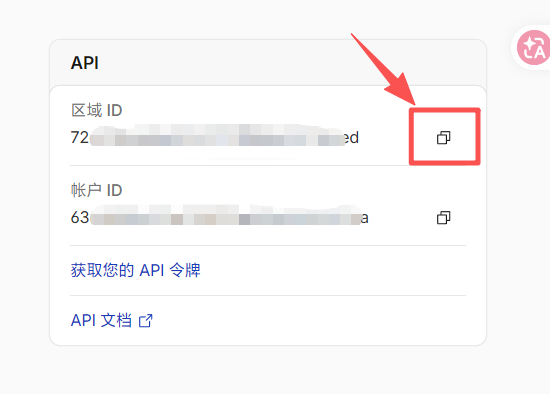
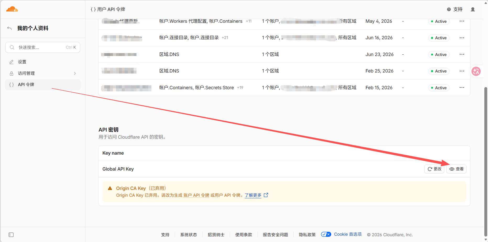
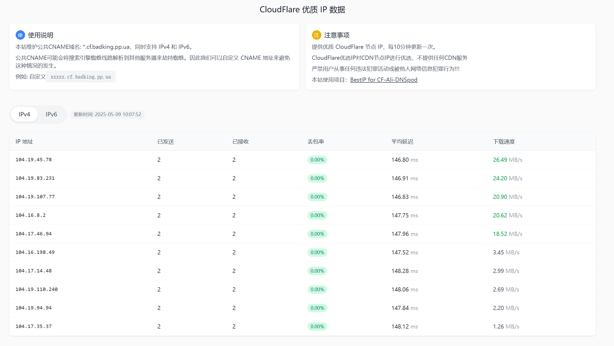
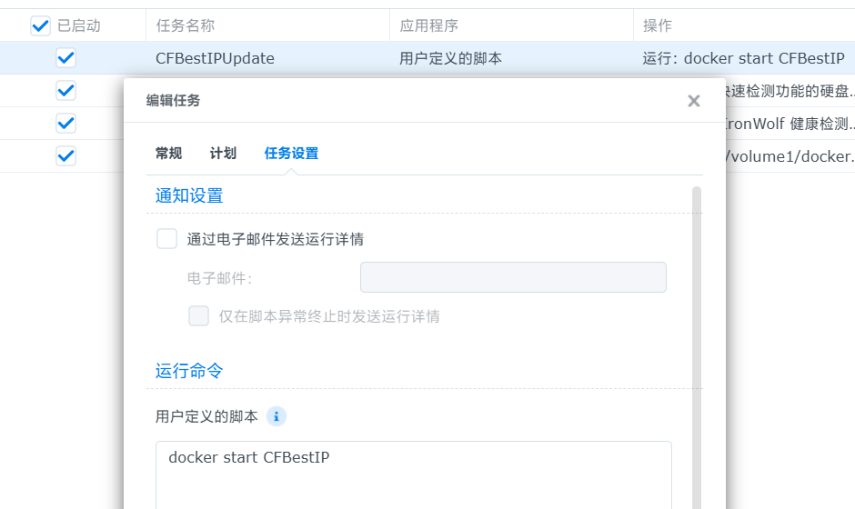

之前我们曾分享过对站点做 Cloudflare 大陆地区优选 IP 的加速方案（[点此跳转查看](https://ybjun.com/posts/cloudflare-youxuan-accelrate/)）。但最近发现，可能因为许多人滥用 CF 优选边缘节点自建科学上网或其他不正当用途，导致大陆各大运营商加紧了对部分热门边缘节点的风控与拦截，包括但不限于高频丢包、TCP劣化甚至直接阻断 443 端口等手段。这直接影响了我们正常的建站使用，**曾经的“大陆加速器”又变回了“减速器”**，经常导致浏览器无限转圈加载。

为了将网络连通性彻底掌握在自己手里，博主决定使用开源项目 `IonRh/Cloudflare-BestIP` 自己构建 CF 优选。其核心思路是：在本地 NAS 的真实宽带环境下，定期测速寻找当前最优秀的边缘节点 IP 并自动更新 DNS 记录，从而替换掉那些被严重滥用的公共优选节点列表。

::github{repo="IonRh/Cloudflare-BestIP"}

本文并不完整记录该开源项目基础的构建、部署和调试过程。本文仅针对在实际跑通流程中遇到的配置陷阱，特别是编写部署命令和编辑 `config.json` 配置文件时容易踩到的坑点进行简单记录。建议有需要的读者将本文与原项目的 `README` 结合阅读，以便少走弯路。

## 1 编辑 `config.json` 要注意

部署这个项目时我们大概率会遇到一个令人抓狂的 Bug ：明明已经把参数填好了，但每次重启 Docker 容器，日志都会报错，并且填好的 `config.json` 会被强行恢复成官方的默认模板。

这是因为 `Cloudflare-BestIP` 的底层是由 Go 语言编写的。Go 的 `encoding/json` 库对 JSON 格式有着“洁癖”般的严格要求。

当我们在复制粘贴 AI 生成的配置，或者使用某些简易文本编辑器时，文件中极易混入不可见的 非断行空格 或是 UTF-8 BOM 签名。Go 程序在启动读取配置时，一旦遇到这些不可见字符，就会直接抛出 JSON 解析崩溃。**这里特别点名群晖 DSM 自带的文本编辑器，使用 DSM 部署的读者一定要避免使用！**

为了防止程序出现问题，作者写了一个粗暴的容错机制：只要判断配置文件读不出来，就立刻用写死的默认配置把原文件覆盖掉！ 这就是为什么我们的配置总是“神秘消失”的原因。

**为了绝对保证配置文件的纯净，推荐仅使用以下两种方式编辑 `config.json`：**

1. 桌面端：强烈建议通过 SMB 或 FTP 等方式将 NAS 或软路由中本项目的配置文件夹映射到本地电脑，然后使用 VS Code 或 UltraEdit 等专业的代码编辑器进行修改并保存。
2. SSH 终端：如果你习惯命令行，直接通过 SSH 连入宿主机，使用 `vim /挂载路径/config.json` 进行原生的终端编辑，这样绝不会混入任何奇怪的格式字符。

## 2 头部参数

首先来看 `config.json` 开头的几条参数：

```json
{
  "IP_Type": "ipv4&ipv6",        // IP类型: ipv4 | ipv6 | ipv4&ipv6
  "IP_Number": 10,               // 更新的IP数量
  "IPv4_Url": "https://raw.gitmirror.com/IonRh/Cloudflare-BestIP/main/IPfile/ip.txt",     // IPv4地址列表URL
  "Best_IPv4": "",    // 最佳IPv4地址URL（不填即可）
  "IPv6_Url": "https://raw.gitmirror.com/IonRh/Cloudflare-BestIP/main/IPfile/ipv6.txt",     // IPv6地址列表URL
  "Pushinfo": "https://api.telegram.org/bot<TOKEN>/sendMessage?chat_id=<CHAT_ID>&text=",
  "debug": false                 // 调试模式开关
}
```

### 2.1 IP 数据源地址必须替换（`IPv4_Url` / `IPv6_Url`）

默认配置中，IP 列表的下载链接使用的是 gitmirror 镜像站，但由于众所周知的原因，这个站是用不了的，所以我们将其替换为稳定且有国内节点备案的 jsdelivr CDN 链接。请在 对应行修改为：

```json
"IPv4_Url": "https://cdn.jsdelivr.net/gh/IonRh/Cloudflare-BestIP@main/IPfile/ip.txt",
"IPv6_Url": "https://cdn.jsdelivr.net/gh/IonRh/Cloudflare-BestIP@main/IPfile/ipv6.txt",
```

### 2.2 `IP_Number` 数量设定：贪多嚼不烂

默认配置文件可能会下发 8 个甚至 10 个更多的 IP， **这里建议自用情况，将其修改为 3 即可。**

因为国内访问 Cloudflare 边缘节点的网络波动非常大。放行过多的次优 IP 会导致 DNS 轮询时，访客命中高延迟或高丢包劣质节点的概率大幅增加。仅保留测速排名最高、0 丢包的前 3 个极品 IP，反而能提供最稳的 TLS 握手与访问体验。

需要注意的是，这个 `IP_Number` 的数值是区分协议的。如果你在前面的 `IP_Type` 字段填写了 `"ipv4&ipv6"`，那么设置为 3 意味着脚本最终会给你的目标子域名推入 3 条 `A` 记录 和 3 条 `AAAA` 记录，总计添加 6 个解析。

### 2.3 `Pushinfo` 需要反代

对于有条件使用 Telegram 的用户，可以通过 BotFather 创建机器人，并将组装好的 API 链接填入 `Pushinfo`，以便每次优选完成后能收到实时通知。

但是大家都知道官方 API 域名 `api.telegram.org` 是啥情况。而这个测速脚本为了保证结果真实可用，必须使用原生网络环境。所以有需求的话，可利用 Cloudflare Workers 自行对 Telegram API 域名做一个极简的反向代理，并绑定到你自己的子域名上。随后，将配置文件中的官方域名替换为你的反代域名。不过博主没啥需求，就没弄。

### 2.4 `debug` 必须开

不仅仅是为了能在 Docker 日志中看到详细具体的信息，而且截至发文前的最新版本，如果不开 Debug 模式，就经常会遇到各种报错。所以还是打开它吧，反正也没啥影响。

需要注意的是，默认的配置文件中， `debug` 配置可能在文件末尾，如果找不到就往后看看。

## 3 Cloudflare DNS 的配置

接着，就是要来配置目标域名了，我们需要把优选 IP，推送给我们托管到 Cloudflare 的域名进行解析，这样才能让优选 IP 为我们所用。

找到`config.json` 中 `"Cloudflare"` 这一配置块，在本文中我们假设要将 `cf.contoso.com` 作为优选域名：

```json
"Cloudflare": {
  "Enabled": true,              // 是否启用
  "Domain": "contoso.com",      // 主域名  
  "SubDomainName": "cf",       // 子域名
  "Email": "your@email.com",    // CF账户邮箱
  "ZoneID": "your_zone_id",     // 域名Zone ID
  "ApiKey": "your_api_key",     // CF API密钥
  "Proxy": false                // 是否启用CF代理
},
```

其中：

* `Enabled`：设为 `true`，激活 Cloudflare 的 DNS 自动更新模块。
* `Domain`：填写你托管在 Cloudflare 上的主域名，这里就是 `contoso.com`。
* `SubDomainName`：用于承载优选 IP 的子域名，这里就是 `cf`。

:::warning
**这里不建议使用泛解析，如填写 `*` 或 `*.cf` 等。**

一方面，经查看源码，该工具底层是一个庞大的 Shell 脚本。如果作者未对变量进行严谨的引号包裹，星号 `*` 可能会被 Linux 直接识别为通配符，从而去匹配当前目录下的所有文件。这不仅会导致更新失败。

另一方面，`*.cf` 这样的泛解析涉及到了四级域名， CF 的免费版计划默认不为四级域名提供 HTTPS 证书，因此即使添加解析成功，也可能面临无法使用的问题。

很多公共优选站使用泛解析，在一定程度上有防止风控的原因，不过我们自建的、仅供自用的站点也不会有太大访问，所以也不用担心这些问题。
:::

* `Email`：填写你 Cloudflare 账号邮箱。
* `ZoneID`：登录 [CF 控制台](https://dash.cloudflare.com/)，进入你的域名`contoso.com`概述页面，在页面右下角的“API”面板中可以直接复制“区域 ID”。


* `ApiKey`： **这里必须填写你账号的 Global API Key！** 很多注重安全的用户会习惯性去创建一个权限受限的自定义 API Token，但该脚本的 DNS 更新模块只认旧版的全局鉴权协议。获取方法是：点击 cf 控制台右上角头像 -> 配置文件 -> 左侧 API 令牌 -> 滑到最底部找到“Global API Key” -> 点击查看并复制填入。


* `Proxy`：也就是是否为这个目标域名开启“小黄云”。 **必须设为 `false`。** 这意味着该条解析仅作为 DNS 使用，不经过 CF 的泛播代理。如果填 `true`（开启小黄云），访客将获取到 CF 随机分配的 IP，优选了个寂寞。

## 4 `CloudflareST` 测速核心参数调优

接下来是整个优选体系的“心脏”——`CloudflareST` 配置段。这里底层调用的是大名鼎鼎的 XIU2/CloudflareSpeedTest 测速核心，这行参数的设定，直接决定了最终拿到的 IP 质量到底有多硬。

::github{repo="XIU2/CloudflareSpeedTest"}

```json
"CloudflareST": {
  "Enabled": true,
  "CFST_URL": "https://cf.xiu2.xyz/url",
  "CFST_conf": "-t 4 -n 600 -dn 10 -dt 10 -tp 443 -tl 200 -tll 0 -tlr 0.1 -sl 3",
  "ShowProgress": false
}
```

这部分不要盲目照搬默认模板，**建议根据自己的实际网络环境和站点媒体体量进行“榨干式”的调优。** 以下是参数的逐一说明：

* `Enabled`：设为 `true`，毋庸置疑，开启核心测速功能。
* `CFST_URL`：测速时用于下行带宽测试的基准文件地址。默认的 `https://cf.xiu2.xyz/url` 通常足够稳，但如果你的本地网络死活测不出速度，可能是该域名被当地运营商阻断了，可以寻找其他大带宽的 CF 节点文件进行替换。
* `CFST_conf`：这是最关键的测速规则，建议按以下逻辑进行调整：
	* `-t 4`：每个候选 IP 的 Ping 次数。4 次足够规避偶发的网络抖动。
	* `-n 600`：每次从总库中随机提取参与测速的 IP 数量。默认值往往较小，但在 NAS 充裕的性能加持下，强烈建议将其拉高到 500 甚至 600。在更广阔的候选池里“大浪淘沙”，更容易撞见极品节点。
	* `-tp 443`：测速端口。因为我们是建站加速，强制走 HTTPS 协议，这里必须且只能是 443，测其他端口毫无意义。
	* `-tl 200` 与 `-tlr 0.1`：延迟上限限制在 200ms，丢包率上限限制在 10%（0.1）。这是保证 Web 页面不转圈、TLS 顺利握手的底线标准。
	* 核心点 `-sl 3`：下载速度下限（单位 MB/s）。官方默认模板往往是 `-sl 1`，但这很容易导致最终选出一些“延迟极低、但带宽像牙签”的残次节点。如果你的博客像本站一样有较多配图或较大的静态资源，强烈建议将速度下限提升到 3 甚至 5，狠狠过滤掉小管子，确保首屏加载足够狂暴。
* `ShowProgress`：建议设为 `false`。由于我们是在 Docker 容器中以后台守护或定时任务的形式运行测速，终端进度条不仅毫无意义，还会向 Docker 管理器输出大量刷新日志。特别在群晖 DSM 下很可能直接写爆并死锁日志数据库，导致 Container Manager 直接瘫痪罢工。

## 5 进阶玩法：配置 Cloudflare KV 数据库

如果你不仅想让程序默默在后台更新 DNS，还想随时随地直观地查看当前测出的“极品 IP”列表及其延迟、速度等详细数据，那么可以开启这个 KV 数据库模块。

```json
"CloudflareKV": {
  "Enabled": true,
  "KVapiToken": "your_api_key",
  "KVaccountID": "your_ID",
  "KVnamespaceID": "your_ID"
}
```

配合原作者在 GitHub 仓库中留下的 `worker.js` 代码，你可以通过 Cloudflare Workers 构建一个优选 IP 监控网页。


这里的配置文件就很好理解了：
* `Enabled`：设为 `true`。开启后，每次测速脚本运行完毕，都会将最新的 IP、丢包率、延迟、下载速度及更新时间打包成特殊格式的字符串，精准推送到你的 Cloudflare KV 数据库中。
* `KVapiToken`：这里填写的是你单独创建的可以编辑 KV 的令牌。在 Cloudflare 控制台新建一个自定义的 API 令牌，为其赋予 **账户 -> Workers KV 存储 -> 编辑** 的权限。生成后，将其填入此处。
* ·KVaccountID·：你的 Cloudflare 账户 ID。登录控制台后，随便点开一个域名的概述页面，在右下角“API”面板中可以直接复制这串 32 位的字母数字组合。
* `KVnamespaceID`：在 CF 控制台的左侧菜单找到“存储和数据库” -> “Workers KV”，手动创建一个属于你的命名空间。创建成功后，列表右侧会显示对应的 ID，复制填入此处即可。

此时，你只需在 Cloudflare 新建一个 Worker 服务，将原项目仓库中的 `worker.js` 源码复制进去，并在该 Worker 的“设置 -> 绑定”中， **将你刚创建的 KV 空间绑定到代码中定义的变量名上** 。一键部署后，你就能通过绑定的自定义域名，随时访问一个实时同步的优选结果展示面板了。

## 6 自动化运行配置

完成了所有配置并成功拉起容器后，你会发现一个现象：这个 Docker 容器跑完一次测速并更新完 DNS 后，就直接自动停止了。

虽然在 `config.json` 中有一个 `"TestSetime"` 配置块，将其设为 `true` 可以让容器常驻后台保活，并每隔几分钟去 Ping 一下目标域名，一旦发现延迟或丢包超标就重新触发测速。但对于博主这种以静态博客为主的实际需求来说，这种高频的后台守护完全是性能的浪费，甚至可能增加被 API 接口风控的风险。

所以博主决定，**保持容器的“一次性”运行机制，借助宿主机系统的定时任务，每天固定跑几次即可**（比如每 6 小时跑一次，完美覆盖早、中、晚、夜四个高峰时段的网络波动）。

### 6.1 群晖 DSM 定时任务设置

如果你和博主一样是在群晖 NAS 上部署，请直接使用系统自带的“任务计划”：

1. 用管理员账户登录群晖 DSM，打开 **控制面板** -> **任务计划**。
2. 点击 **新增** -> **计划的任务** -> **用户定义的脚本**。
3. **常规设置：** 任务名称随意（如“CF优选更新”），但 **“用户账号”下拉菜单必须且一定要修改为 `root`！** 如果使用你自己的管理员账号，底层会因为没有直接调度 `docker.sock` 的权限而频频报出 `permission denied` 的启动失败错误。
4. **计划设置：** 选择“每天运行”。建议错开整点，比如“首次运行时间”设为 `01:16`，“运行频率”设为 `每 6 小时`运行一次。
5. **任务设置：** 在“用户定义的脚本”框中输入唤醒命令（假设容器名是 `CFBestIP`）：
   
```bash
docker start CFBestIP
```

设置完毕后保存即可。每次触发时间一到，群晖就会用 Root 权限在后台默默唤醒这个容器，它跑完一套完整的测速推送流程后，就会自动停掉。


### 6.2 其他普通 Linux 设备

如果你是部署在普通的 Ubuntu/Debian 服务器或是软路由（如 OpenWrt）上，直接使用 Linux 原生的 crontab 定时任务即可：

1. root 进 SSH，输入命令编辑定时任务：`crontab -e`
2. 在文件末尾添加以下规则（时间逻辑与上述群晖方案一致，即每天的 01:16、07:16、13:16、19:16 执行，假设容器名是 `CFBestIP`）：`16 1,7,13,19 * * * docker start CFBestIP >/dev/null 2>&1`
3. 保存并退出。系统 Cron 守护进程会自动接管，提供免维护的自动化优选服务。

## 7 总结

经过最近这几天的观察与深度测试，这套在 NAS 本地宽带环境下纯手工搭建的专属 CF 优选 IP 体系，终于让因为公共节点被阻断而无限转圈的博客成功“起死回生”。

毫不夸张地说，相比于之前那些被万人拥挤、经常被运营商高频 QoS 甚至直接拔网线的公共优选域名，自建专属池的体验简直是降维打击。0 丢包的极致红利，配合开启的 HTTP/3 (QUIC) 协议以及 Pages 边缘缓存，让站点在国内复杂的网络环境下，终于再次实现了久违且丝滑的“秒开”体验。

在这个“公用池随时会炸”的时代，把底层路由的控制权重新牢牢握在自己手里的感觉，确实让人无比踏实。希望这篇填满血泪的“避坑实录”能帮到同样在折腾 Cloudflare 建站优化的极客小伙伴们，少走弯路，一次点亮。生命不息，折腾不止，我们下篇文章再见！