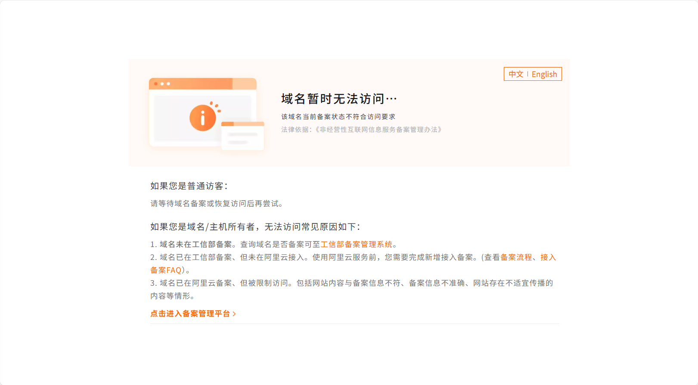
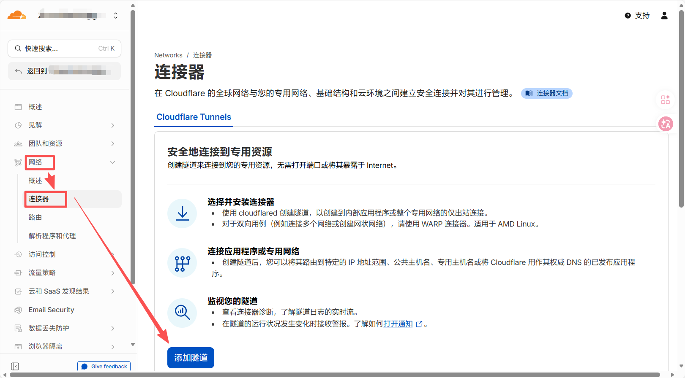
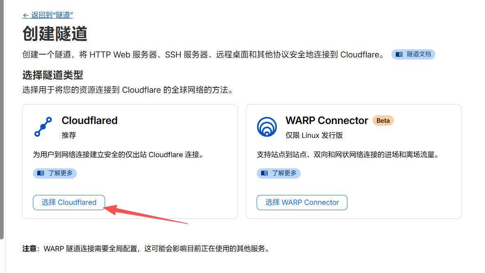
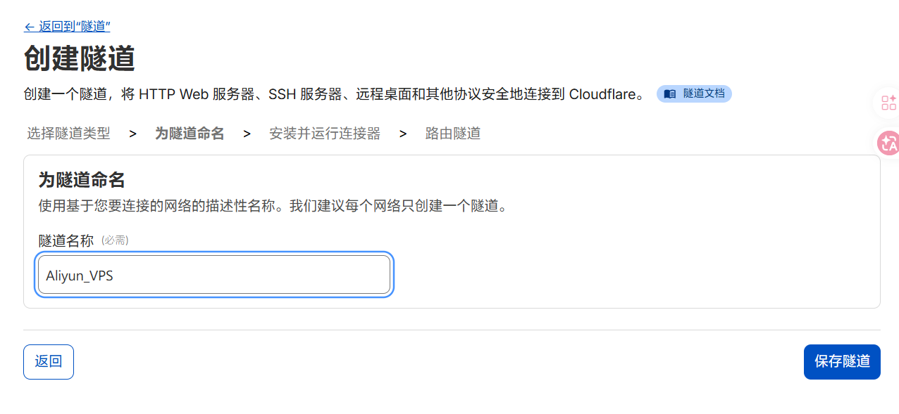
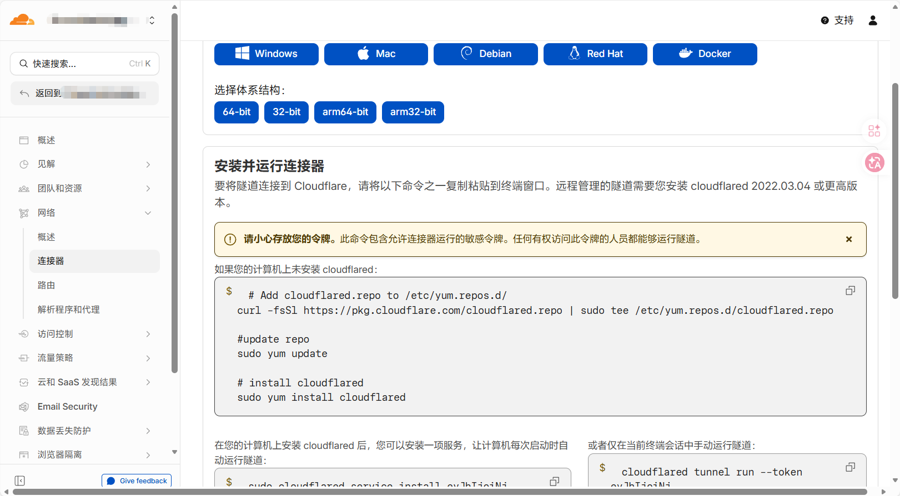
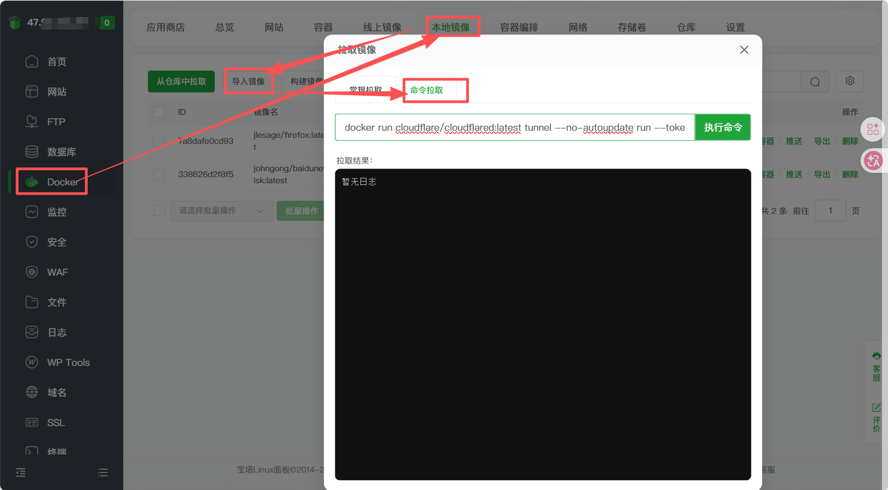
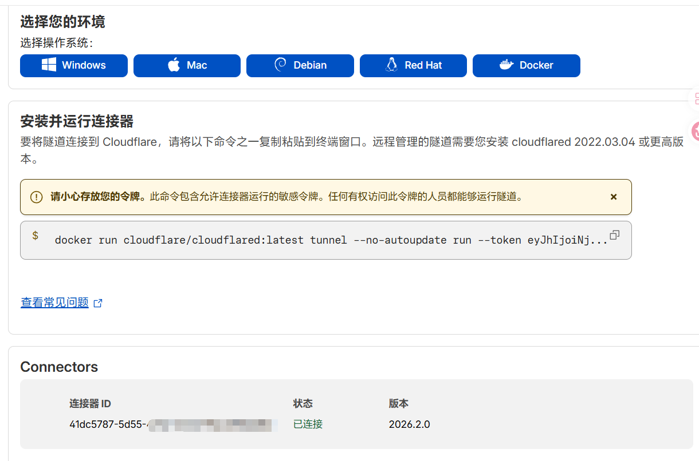

众所周知，如果我们将未备案的域名添加解析记录到一台位于国内的VPS，那么在域名访问时，大概率会被云服务商因为域名未备案而拦截。但最近博主发现，可以通过创建**Cloudflare ZeroTrust 网络连接器**的方式实现正常访问，此外还能获取 CF 的全球 CDN 加速、自动设置 HTTPS 证书、安全防护等其他功能。



:::warning
本文章内容仅供学习交流和技术备忘，切莫用此技术做违法违规的事情！若要正式建站，还是应该遵循国内一般流程规定，在国内正规服务商完成域名注册、服务器购买、ICP备案和公网安备等步骤！
:::

## 1 Cloudflare ZeroTrust 连接器配置

首先登录你的CF账号，在左栏中找到 **Zero Trust** 点击进入。如果是第一次进入，可能会提示需要绑定支付方式后开通。这里的绑卡支持VISA、万事达等国际卡，自行操作即可。然后点击开通，不用担心扣费，因为我们大概率是用不完免费额度的。*（CF的恩情还不完呐👋😭👋）*

然后，在ZeroTrust的左栏中，找到**网络-连接器**进入，点击页面下方的**添加隧道**。


隧道类型选择**Cloudflared**，这种方式无需复杂配置，对不同的操作系统也比较友好。点击后输入一个隧道的名字，然后点击**保存隧道**即可。



保存隧道后，就会弹出不同操作系统下Cloudflared部署方法和命令了，只要**选择你的服务器对应的系统和架构并按要求操作**即可。博主做测试的VPS是Ubuntu 24，所以用**Docker形式**部署。


## 2 服务器的配置

开始前说明，博主用于测试的VPS是Ubuntu 24，所以用**Docker形式**部署。这台VPS有宝塔面板，所以接下来**对服务器的配置全程都在宝塔面板完成**，就不敲指令了。

### 2.1 服务器部署 Cloudflared

首先复制CF网页上提供的docker模式部署命令。注意**命令包含你的隧道token，不要泄露！** docker部署命令应该形如：

``` bash
docker run cloudflare/cloudflared:latest tunnel --no-autoupdate run --token ******
```

打开服务器的宝塔面板，点击**Docker-本地镜像-导入镜像-命令拉取**，将上述命令粘贴进去，点击**执行命令**，等待部署成功。


部署成功后回到刚才CF的网页，下方显示我们刚添加的服务器已经连接了。点击下一步，然后切回宝塔面板，进行网站的部署和配置。


### 2.2 部署网站或服务

此时回到宝塔面板，在**Docker 总览**中找到并点击刚才创建的容器，进入详情窗口，点击左栏**容器网络**，记下其中的**网关**地址，如下图就是`172.17.0.1`，等会有用。


然后在宝塔面板的“网站”界面添加你要做的网站部署。例如博主在这里，就计划用上期文章刚注册的免费域名`ohoh.eu.cc`，部署一个由 Gemini 3.1 Pro 生成的简单的 Frutiger Aero 风格测试页（PHP）。但最重要的是，在网站部署设置的**域名管理**中，需要**把计划绑定的域名`ohoh.eu.cc`以及我们刚刚记录的网关IP`172.17.0.1`都填进去**，如果使用非标准端口，直接加到IP后面即可。部署创建后，使用文件管理放入网页的文件，就不用管了。


:::note
上面的描述中，域名管理**最重要的是把网关IP填进去**，域名这条不是很重要，但博主说让大家同时填入目标域名的原因有二：一是规范配置记录以便后续维护，二是如果你想同时用宝塔面板为这个网站部署免费https证书，实现全流程https访问，是需要填入域名以便为这个域名申请证书的。
:::

:::tip
其实，即使不在宝塔面板为网站申请https证书也可以。使用隧道方法的访问链路和打开小黄云的DNS解析访问链路是类似的。都是用户浏览器先连接CF CDN，再由CDN连接你的服务器。我们自己在宝塔面板申请的https证书，**保护的是后面“CDN连接服务器”这一段**，不管怎样，前端用户和CDN的链接都是https加密且由CF自动提供免费证书的。因此，**是否要在宝塔面板申请https证书以便实现全链路加密保护，你可结合实际情况和需求确定**。
:::

然后回到CF页面，此时应该就到了**添加服务**这一页了。你可以为你的服务设置需要的域名、主机名（子域）和子路径名称。像博主这里测试，计划直接用`ohoh.eu.cc`即可，因此就只选择相应域名即可，其余都不填了。

:::caution
如果你也想直接将域名的根记录直接用作建站，则请注意，**子域（主机名）此时什么都别填**，而不是像添加DNS解析记录一样写一个@。
:::

然后下方服务，请根据你自己的实际需求选择服务类型，像我们建站就根据你是否在宝塔面板申请了https证书来选择https或http。重点是，**我们后面的URL必须填写之前记录的网关IP和端口号**！例如，在我们的测试案例中，如果选了HTTPS，则URL填写`172.17.0.1:443`，选了HTTP，则URL填写`172.17.0.1:80`。如果你的服务部署在不同端口号上，则如实填写端口号即可。


## 3 保存测试

保存后，我们就成功完成了隧道的创建和连接！此时稍等片刻，我们用浏览器打开`ohoh.eu.cc`，就会发现，我们之前部署的 Frutiger Aero 简易网页已经成功打开！


后续，我们还可以在隧道的设置中增加其他设备，或是为设备增加应用程序路由以部署其它服务。并且，全程都没有提示域名未备案。因此博主又加了一条，把之前在同服务器上81端口的h5ai下载站部署到了`dl.ohoh.eu.net`上。部署后，我们也不需要在浏览器输入端口号了，即可直接访问，因为一切和服务器的通信都由CF按配置接管了！
