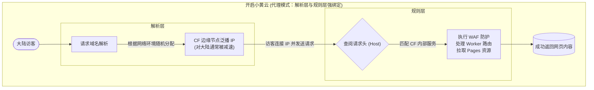

:::important[报告同志们一个好消息！]
自5月10日起，本站已全量接入 Cloudflare 优选 IP 线路，大陆用户访问本站速度将大幅提升！为保证最佳体验，博主进行了线路分流：国内访问请认准 [www.ybjun.com](https://www.ybjun.com) ，海外访问推荐使用 [ybjun.com](https://ybjun.com) 。感谢大家的支持，快来感受丝滑的访问体验吧！
:::

众所周知，月半菌的Blog（本站）是一个**彻底的“Cloudflare 全家桶”拥趸**。主站前端的 GitHub 仓库实时对接部署至 Pages；后端手搓了相册、评论、统计等多个核心 Worker API，底层则使用 D1 数据库存储博客全局数据，使用 R2 存储桶存放相册照片。

这套 Serverless 架构确实既“优雅”又省心，但唯独存在一个致命痛点：**Cloudflare 免费版的 Anycast（泛播）网络对中国大陆极度不友好。** 默认分配的 IP 往往需要绕道美国西海岸（即使分配的 CDN 在港澳台也可能会绕路），走拥堵的 163 国际骨干网，导致国内访客访问本站时，特别是首次访问，经常要看着 Loading 动画转上将近一分钟才能刷出内容。这也是大家称 Cloudflare CDN 在大陆是**减速器**的原因。


针对这个问题，圈内最成熟的解法是使用“IP / CNAME 优选”。但目前**网上的教程大多针对 VPS 或单一反代场景**，常常需要引入 Cloudflare for SaaS 进行复杂的跨域接管，稍有不慎就会遇到各种 1000、1100、522 报错，让人云里雾里。

所以，本文并不想重复那些花里胡哨又晦涩难懂的骚操作，也不想去卡 SaaS 的 Bug，而是博主针对目前最新的 CF 托管方案，深度分享对本站已应用、亲测有效的**适用于 CF 全家桶的原生单域名优选全流程与踩坑实录**。

## 1 优选节点究竟是什么？

要搞懂优选，必须先拆解 Cloudflare 那朵“小黄云（代理状态）”的底层逻辑。


当小黄云开启时，CF 实际上在做两件事：

1. **解析层**：根据访客的网络环境，DNS 返回一个 CF 的边缘节点泛播 IP。当然对于大陆用户，对这个 IP 的访问通常是**被减速**的。
2. **规则层**：访客连接上该 IP 后，边缘节点会查阅请求头，执行 WAF 防护、**匹配 CF 内部的服务**，如处理 Worker 路由或拉取 Pages 静态资源。

在原生状态下，这两层是强绑定的。换句话说，你所有解析到自己域名的 CF 相关服务，都会固定走这两层的路子。




**到底什么是“优选节点”？** 其实它们并非什么神秘的第三方服务器，本质上依然是 Cloudflare 庞大 Anycast 网络中的真实节点。区别在于，这些节点是由热心网友和开源社区通过海量测速、**精挑细选出来的“黄金 IP 池”**（例如直连香港 CMI、日韩或美西的高级路由节点等）。它们对大陆三大运营商的线路极为友好，能最大程度避开拥堵的国际骨干网。

所以，对本站的核心优化思路和目标就是：**将之前的双层机制解耦**。

首先**接管解析层**，让域名解析时不再全球漫无目的的 Anycast 分配，而是直接打到这些优选节点上；同时**保留规则层**，让这些节点在接管流量后，依旧能完美触发我们部署在 CF 上的各项服务与路由规则。


## 2 准备工作

在正式开工前，需要确保主力域名（本站就是 `ybjun.com`）已托管在 Cloudflare，即 NS 记录是 CF 的服务器。如果还没有托管过来，可以去之前[注册免费域名的文章](https://www.ybjun.com/posts/dpdns-free-domain/#4-cloudflare-%E6%89%98%E7%AE%A1)中查看教程。

为了避免未来优选 IP 池失效导致全站大面积修改，我们先建立一个**统一的优选中转点**：

在 CF 主力域名 的 DNS 面板中，新建一条 `CNAME` 记录，名称设为 `cdn`，目标指向找到的优质第三方优选域名（如 `*.cf.090227.xyz`）。

:::warning
此记录的代理状态必须设置为**灰色云朵（仅 DNS）**！
:::


后续，所有的前端、API、存储桶等实际使用的域名，都将统一 `CNAME` 到 `cdn.ybjun.com`。这个站点将自动返回优选节点的IP解析。并且，未来即便这条优选源宕机，需要更换新的源，只需修改这一条记录即可。

## 3 R2 存储桶的优选

首先来为存储本站相册照片的 R2 存储桶作优选。在本站的初始构建中，博主实用了统一规格的webp作为照片格式，同时加大了边缘节点对存储桶的缓存时间，这些措施都可以在一定程度上提升照片的加载速度。

先为 R2 存储桶添加一个**自定义三级域名**（这里以 `picslow.ybjun.com`为例），需要注意的是，这个域名**并无优选**，而是常规的自定义域名，我们不要直接把这个域名用在项目中。添加方法是：在存储桶的设置界面 **“自定义域”栏目** 下，就可以添加了。


然后创建**云连接器（Cloud Connector）**。进入 `ybjun.com` 域名的侧边栏 -> **规则 (Rules) -> Cloud Connector**。选择 **Cloudflare R2**。


选择刚才的相册存储桶，并选择自定义域： `picslow.ybjun.com`，下一步。


假设最终我们要**用于项目**中的存储桶**加速域名**为`picfast.ybjun.com`，在这里显示的界面中，先输入一个云连接器名称，然后在下方的表达式编辑区域，前面两个下拉框确保选择为**主机名、等于**，然后在后面的“值”输入框中输入`picfast.ybjun.com`。点击**部署**。


此时 CF 提醒我们，`picfast.ybjun.com`还没有 DNS 解析记录，可能无法使用。我们直接选择**创建新代理 DNS 记录**，并在下方选择 `CNAME` 记录，名称就是`picfast.ybjun.com` 或者直接填 `picfast`，“目标”输入我们第二章创建的中转点`cdn.ybjun.com`。创建记录和部署规则。


当看到下图的界面时，就代表ok了！这时候可以回到`ybjun.com`的 DNS 记录中确认一下，确保 `picfast` 的小黄云没有开，如果是开着的，手动编辑关一下就行。


至此，R2 存储桶直连优选链路打通完成，博客相册加载速度有了肉眼可见的提升。

## 4. Worker 的优选（同 Zone 降维法）

对于评论、统计等动态 API 层，由于无法使用云连接器，我们需要利用 CF 的同 Zone 内部路由机制。

**标准三步曲：**

1. **获取内部通行证**：进入对应 Worker 的“触发器”页面，添加**三级自定义域**（如 `commentblog.ybjun.com`）。这一步不仅会促使 CF 签发免费证书，还会向全网边缘节点下发合法的内部通行证。
2. **DNS 偷梁换柱**：去 DNS 面板，把刚才系统强制生成的带锁橙云记录删掉（源头删除法：若删不掉，可回 Worker 触发器里先删掉自定义域，再进行下一步），手动添加 `CNAME` 指向 `cdn.ybjun.com`，**设为灰云**。
3. **路由拦截**：回到 Worker 触发器，添加 **路由 (Routes)**：`commentblog.ybjun.com/*`，区域选择 `ybjun.com`。

当带有优选 IP 的请求抵达边缘节点时，由于同 Zone 通行证的存在，请求不会被 Error 1001 拦截，而是被 Worker 路由瞬间唤醒。

## 5. Pages 前端主站的优选应用（一波三折）

如果你认为前端 Pages 也能用同样的方法搞定，那就大错特错了。在这部分，博主踩足了坑：

- **❌ 失败尝试 1：直接修改 Pages 记录**。图省事直接把 Pages 自动生成的 `www` 记录改成灰云？GitHub 一旦 Push 触发自动构建，Pages 会强制校验 DNS 的合规性，发现不是橙云后，直接让你的前端域名掉线。
- **❌ 失败尝试 2：使用 SaaS 的两头堵**。既然同 Zone 规矩多，我用另一个闲置域名开 SaaS 跨域回源总行了吧？结果被 CF 底层逻辑“两头堵”：因为 `ybjun.com` 是原生 Zone，优先级碾压导致 SaaS 不生效，报 **Error 1000**；而强行用跨域 Host 回源 Pages 项目时，又因安全机制直接被掐断，报 **Error 522 (连接超时)**。

### ✅ 最终解决方案：Worker 桥接代理

既然 Pages 这么难伺候，我们就把它当成一个纯后端的 Worker 来代理。通过 Worker 在 CF 内部高速骨干网直接拉取源站数据，免除一切 DNS 校验烦恼。

新建一个轻量级 Worker（如 `pages-proxy`），注入以下代码：

```
export default {
  async fetch(request) {
    const url = new URL(request.url);
    // 将访客请求的 host 狸猫换太子，指向你的纯净源站
    // 注意：因 *.pages.dev 在大陆被 SNI 阻断/DNS 污染，这里我直接填写了已绑定的正常域名 ybjun.com
    url.hostname = 'ybjun.com'; 
    const newRequest = new Request(url, request);
    return fetch(newRequest);
  }
};
```

清理掉 Pages 里的 `www` 自定义域后，重复上文 API 优选的步骤：**DNS 设灰云 CNAME 指向中转枢纽，并在 Worker 里添加 `www.ybjun.com/\*` 的拦截路由**。主站至此完美起飞！

## 6. 踩坑实录与高价值 Tips

### 🕳️ SSL 证书的“四级域名陷阱”

在优化初期，为了不修改前端代码，我曾尝试对 `media.blog.ybjun.com` 这个四级域名进行加速，结果遭遇无解的 `ERR_SSL_VERSION_OR_CIPHER_MISMATCH` 报错。 **核心原因**：Cloudflare 免费的 Universal SSL 仅提供三级通配符保护（即 `*.ybjun.com`）。四级及以上的域名必须购买高级证书或使用 SaaS 强行发证。**避坑指南：全栈降维，老老实实把所有 API 和图床都改成三级域名！**

### 💡 Tips：D1 数据库历史 URL 无缝迁移

将四级域名降维到三级域名后，存在 D1 数据库里几百条旧的图片 URL 怎么办？手改是不可能的，一行 SQLite 代码教你做人：

先执行 `SELECT` 预览修改效果（安全第一）：

```
SELECT 
    id, 
    url AS old_url, 
    REPLACE(url, '[https://media.blog.ybjun.com](https://media.blog.ybjun.com)', '[https://mediablog.ybjun.com](https://mediablog.ybjun.com)') AS new_url 
FROM Photos 
WHERE url LIKE '[https://media.blog.ybjun.com](https://media.blog.ybjun.com)%';
```

确认无误后，直接执行 `UPDATE` 更新，耗时 0.3ms 搞定历史遗留问题：

```
UPDATE Photos 
SET url = REPLACE(url, '[https://media.blog.ybjun.com](https://media.blog.ybjun.com)', '[https://mediablog.ybjun.com](https://mediablog.ybjun.com)') 
WHERE url LIKE '[https://media.blog.ybjun.com](https://media.blog.ybjun.com)%';
```

## 7. 结语与成果展示

经过这一套“抽丝剥茧”的手术，目前博客的访问速度有了质的飞跃。

我们来看看测速工具（ITDog）的直观对比，优化前，国内节点一片飘黄/飘红，晚高峰更是惨不忍睹；优化后，全国节点一片绿意盎然，响应时间基本被压榨到了 50-150ms 的物理极限。

*[此处插入优化前的 ITDog 一片黄截图]* *[此处插入优化后的 ITDog 一片绿截图]*

这套“同 Zone 原生降维优选”架构，不仅彻底摆脱了复杂的 SaaS 配置和跨域烦恼，后期的维护成本也趋近于零。尽情享受 Cloudflare 边缘计算带来的极致快感吧！