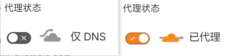

:::important[报告同志们一个好消息！]
自5月10日起，本站已全量接入 Cloudflare 优选 IP 线路，大陆用户访问本站速度将大幅提升！为保证最佳体验，博主进行了线路分流：国内访问请认准 [www.ybjun.com](https://www.ybjun.com) ，海外访问推荐使用 [ybjun.com](https://ybjun.com) 。感谢大家的支持，快来感受丝滑的访问体验吧！
:::

众所周知，月半菌的Blog（本站）是一个**彻底的“Cloudflare 全家桶”拥趸**。主站前端的 GitHub 仓库实时对接部署至 Pages；后端手搓了相册、评论、统计等多个核心 Worker API，底层则使用 D1 数据库存储博客全局数据，使用 R2 存储桶存放相册照片。

这套 Serverless 架构确实既“优雅”又省心，但唯独存在一个致命痛点：**Cloudflare 免费版的 Anycast（泛播）网络对中国大陆极度不友好。** 默认分配的 IP 往往需要绕道美国西海岸（即使分配的 CDN 在港澳台也可能会绕路），走拥堵的 163 国际骨干网，导致国内访客访问本站时，特别是首次访问，经常要看着 Loading 动画转上将近一分钟才能刷出内容。这也是大家称 Cloudflare CDN 在大陆是**减速器**的原因。

针对这个问题，圈内最成熟的解法是使用“IP / CNAME 优选”。但目前**网上的教程大多针对 VPS 或单一反代场景**，常常需要引入 Cloudflare for SaaS 进行复杂的跨域接管，稍有不慎就会遇到各种 1000、1100、522 报错，让人云里雾里。

所以，本文并不想重复那些花里胡哨又晦涩难懂的骚操作，也不想去卡 SaaS 的 Bug，而是博主针对目前最新的 CF 托管方案，深度分享对本站已应用、亲测有效的**适用于 CF 全家桶的原生单域名优选全流程与踩坑实录**。

## 1. 优选节点究竟是什么？

要搞懂优选，必须先拆解 Cloudflare 那朵“小黄云（代理状态）”的底层逻辑。

当小黄云开启时，CF 实际上在做两件事：

1. **解析层**：根据访客的网络环境，DNS 返回一个 CF 的边缘节点泛播 IP（对于大陆用户，通常是拥堵的“减速” IP）。
2. **规则层**：访客连接上该 IP 后，边缘节点会查阅请求头，执行 WAF 防护、匹配 Worker 路由或拉取 Pages 静态资源。

在原生状态下，这两层是强绑定的。**所谓的“优选节点”，就是由热心网友或开源社区维护的、对大陆三大运营商路由友好的 CF 边缘节点 IP 池（例如直连香港 CMI、日韩或美西优质线路）。**

我们的核心优化思路是：**接管解析层**（在 DNS 中将域名指向上文提到的优质 IP 域名，并关闭小黄云），同时**欺骗并保留规则层**（利用 CF 内部的通行证机制，让边缘节点依然认得我们的域名并照常执行代码）。

## 2. 准备工作：打造统一优选枢纽

在正式开工前，你需要准备一个主力域名（例如本站的 `ybjun.com`），并确保其 NS 记录已托管在 Cloudflare。

为了避免未来优选 IP 池失效导致全站大面积修改，我们强烈建议先建立一个**统一的中转枢纽**： 在 CF 的 DNS 面板中，新建一条 `CNAME` 记录，名称设为 `cdn`，目标指向你找到的优质第三方优选域名（如 `cdn2026.cf.090227.xyz`）。 ⚠️ **注意：此记录的代理状态必须设置为灰色云朵（仅 DNS）。**

后续所有的前端、API、图床，都将统一 CNAME 到 `cdn.ybjun.com`。未来即便优选源宕机，只需修改这一条记录即可完成全站急救。

## 3. R2 存储桶的优选应用（图床起飞）

博客的图片如果加载缓慢，前端再快也是白搭。对于 R2 对象存储，我们放弃直接暴露 `*.r2.dev` 的做法，拥抱 CF 最新的原生功能。

1. **绑定自定义域**：在 R2 存储桶的设置中，添加一个**三级自定义域**（如 `mediablog.ybjun.com`）。
2. **云连接器（Cloud Connector）**：进入 `ybjun.com` 域名的侧边栏 -> **规则 (Rules) -> Cloud Connector**。创建一条规则：当主机名匹配 `mediablog.ybjun.com` 时，直接路由至你的目标存储桶。
3. **DNS 切流**：回到 DNS 列表，将系统刚生成的 `mediablog` 橙云记录删除（或修改），新建一条 `CNAME` 记录指向 `cdn.ybjun.com`，状态保持**灰云**。

至此，图床直连优选链路打通，图片瞬间秒开。

## 4. Worker API 的优选应用（同 Zone 降维法）

对于评论、统计等动态 API 层，由于无法使用云连接器，我们需要利用 CF 的同 Zone 内部路由机制。

**标准三步曲：**

1. **获取内部通行证**：进入对应 Worker 的“触发器”页面，添加**三级自定义域**（如 `commentblog.ybjun.com`）。这一步不仅会促使 CF 签发免费证书，还会向全网边缘节点下发合法的内部通行证。
2. **DNS 偷梁换柱**：去 DNS 面板，把刚才系统强制生成的带锁橙云记录删掉（源头删除法：若删不掉，可回 Worker 触发器里先删掉自定义域，再进行下一步），手动添加 `CNAME` 指向 `cdn.ybjun.com`，**设为灰云**。
3. **路由拦截**：回到 Worker 触发器，添加 **路由 (Routes)**：`commentblog.ybjun.com/*`，区域选择 `ybjun.com`。

当带有优选 IP 的请求抵达边缘节点时，由于同 Zone 通行证的存在，请求不会被 Error 1001 拦截，而是被 Worker 路由瞬间唤醒。

## 5. Pages 前端主站的优选应用（一波三折）

如果你认为前端 Pages 也能用同样的方法搞定，那就大错特错了。在这部分，博主踩足了坑：

- **❌ 失败尝试 1：直接修改 Pages 记录**。图省事直接把 Pages 自动生成的 `www` 记录改成灰云？GitHub 一旦 Push 触发自动构建，Pages 会强制校验 DNS 的合规性，发现不是橙云后，直接让你的前端域名掉线。
- **❌ 失败尝试 2：使用 SaaS 的两头堵**。既然同 Zone 规矩多，我用另一个闲置域名开 SaaS 跨域回源总行了吧？结果被 CF 底层逻辑“两头堵”：因为 `ybjun.com` 是原生 Zone，优先级碾压导致 SaaS 不生效，报 **Error 1000**；而强行用跨域 Host 回源 Pages 项目时，又因安全机制直接被掐断，报 **Error 522 (连接超时)**。

### ✅ 最终解决方案：Worker 桥接代理

既然 Pages 这么难伺候，我们就把它当成一个纯后端的 Worker 来代理。通过 Worker 在 CF 内部高速骨干网直接拉取源站数据，免除一切 DNS 校验烦恼。

新建一个轻量级 Worker（如 `pages-proxy`），注入以下代码：

```
export default {
  async fetch(request) {
    const url = new URL(request.url);
    // 将访客请求的 host 狸猫换太子，指向你的纯净源站
    // 注意：因 *.pages.dev 在大陆被 SNI 阻断/DNS 污染，这里我直接填写了已绑定的正常域名 ybjun.com
    url.hostname = 'ybjun.com'; 
    const newRequest = new Request(url, request);
    return fetch(newRequest);
  }
};
```

清理掉 Pages 里的 `www` 自定义域后，重复上文 API 优选的步骤：**DNS 设灰云 CNAME 指向中转枢纽，并在 Worker 里添加 `www.ybjun.com/\*` 的拦截路由**。主站至此完美起飞！

## 6. 踩坑实录与高价值 Tips

### 🕳️ SSL 证书的“四级域名陷阱”

在优化初期，为了不修改前端代码，我曾尝试对 `media.blog.ybjun.com` 这个四级域名进行加速，结果遭遇无解的 `ERR_SSL_VERSION_OR_CIPHER_MISMATCH` 报错。 **核心原因**：Cloudflare 免费的 Universal SSL 仅提供三级通配符保护（即 `*.ybjun.com`）。四级及以上的域名必须购买高级证书或使用 SaaS 强行发证。**避坑指南：全栈降维，老老实实把所有 API 和图床都改成三级域名！**

### 💡 Tips：D1 数据库历史 URL 无缝迁移

将四级域名降维到三级域名后，存在 D1 数据库里几百条旧的图片 URL 怎么办？手改是不可能的，一行 SQLite 代码教你做人：

先执行 `SELECT` 预览修改效果（安全第一）：

```
SELECT 
    id, 
    url AS old_url, 
    REPLACE(url, '[https://media.blog.ybjun.com](https://media.blog.ybjun.com)', '[https://mediablog.ybjun.com](https://mediablog.ybjun.com)') AS new_url 
FROM Photos 
WHERE url LIKE '[https://media.blog.ybjun.com](https://media.blog.ybjun.com)%';
```

确认无误后，直接执行 `UPDATE` 更新，耗时 0.3ms 搞定历史遗留问题：

```
UPDATE Photos 
SET url = REPLACE(url, '[https://media.blog.ybjun.com](https://media.blog.ybjun.com)', '[https://mediablog.ybjun.com](https://mediablog.ybjun.com)') 
WHERE url LIKE '[https://media.blog.ybjun.com](https://media.blog.ybjun.com)%';
```

## 7. 结语与成果展示

经过这一套“抽丝剥茧”的手术，目前博客的访问速度有了质的飞跃。

我们来看看测速工具（ITDog）的直观对比，优化前，国内节点一片飘黄/飘红，晚高峰更是惨不忍睹；优化后，全国节点一片绿意盎然，响应时间基本被压榨到了 50-150ms 的物理极限。

*[此处插入优化前的 ITDog 一片黄截图]* *[此处插入优化后的 ITDog 一片绿截图]*

这套“同 Zone 原生降维优选”架构，不仅彻底摆脱了复杂的 SaaS 配置和跨域烦恼，后期的维护成本也趋近于零。尽情享受 Cloudflare 边缘计算带来的极致快感吧！