:::important[报告同志们一个好消息！]
自5月10日起，本站已全量接入 Cloudflare 优选 IP 线路，大陆用户访问本站速度将大幅提升！为保证最佳体验，博主进行了线路分流：国内访问请认准 [www.ybjun.com](https://www.ybjun.com) ，海外访问推荐使用 [ybjun.com](https://ybjun.com) 。感谢大家的支持，快来感受丝滑的访问体验吧！
:::

众所周知，月半菌的Blog（本站）是一个**彻底的“Cloudflare 全家桶”拥趸**。主站前端的 GitHub 仓库实时对接部署至 Pages；后端手搓了相册、评论、统计等多个核心 Worker API，底层则使用 D1 数据库存储博客全局数据，使用 R2 存储桶存放相册照片。

这套 Serverless 架构确实既“优雅”又省心，但唯独存在一个致命痛点：**Cloudflare 免费版的 Anycast（泛播）网络对中国大陆极度不友好。** 默认分配的 IP 往往需要绕道美国西海岸（即使分配的 CDN 在港澳台也可能会绕路），走拥堵的 163 国际骨干网，导致国内访客访问本站时，特别是首次访问，经常要看着 Loading 动画转上将近一分钟才能刷出内容。这也是大家称 Cloudflare CDN 在大陆是**减速器**的原因。
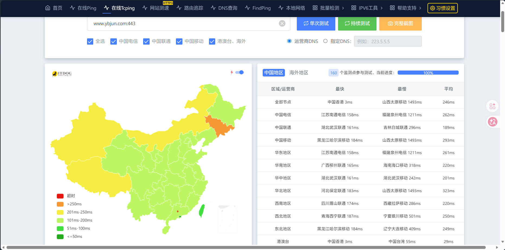

针对这个问题，圈内最成熟的解法是使用“IP / CNAME 优选”。但目前**网上的教程大多针对 VPS 或单一反代场景**，常常需要引入 Cloudflare for SaaS 进行复杂的跨域接管，稍有不慎就会遇到各种 1000、1100、522 报错，让人云里雾里。

所以，本文并不想重复那些花里胡哨又晦涩难懂的骚操作，也不想去卡 SaaS 的 Bug，而是博主针对目前最新的 CF 托管方案，深度分享对本站已应用、亲测有效的**适用于 CF 全家桶的原生单域名优选全流程与踩坑实录**。

## 1 优选节点究竟是什么？

要搞懂优选，必须先拆解 Cloudflare 那朵“小黄云（代理状态）”的底层逻辑。


当小黄云开启时，CF 实际上在做两件事：

1. **解析层**：根据访客的网络环境，DNS 返回一个 CF 的边缘节点泛播 IP。当然对于大陆用户，对这个 IP 的访问通常是**被减速**的。
2. **规则层**：访客连接上该 IP 后，边缘节点会查阅请求头，执行 WAF 防护、**匹配 CF 内部的服务**，如处理 Worker 路由或拉取 Pages 静态资源。

在原生状态下，这两层是强绑定的。换句话说，你所有解析到自己域名的 CF 相关服务，都会固定走这两层的路子。


**到底什么是“优选节点”？** 其实它们并非什么神秘的第三方服务器，本质上依然是 Cloudflare 庞大 Anycast 网络中的真实节点。区别在于，这些节点是由热心网友和开源社区通过海量测速、**精挑细选出来的“黄金 IP 池”**（例如直连香港 CMI、日韩或美西的高级路由节点等）。它们对大陆三大运营商的线路极为友好，能最大程度避开拥堵的国际骨干网。

所以，对本站的核心优化思路和目标就是：**将之前的双层机制解耦**。

首先**接管解析层**，让域名解析时不再全球漫无目的的 Anycast 分配，而是直接打到这些优选节点上；同时**保留规则层**，让这些节点在接管流量后，依旧能完美触发我们部署在 CF 上的各项服务与路由规则。

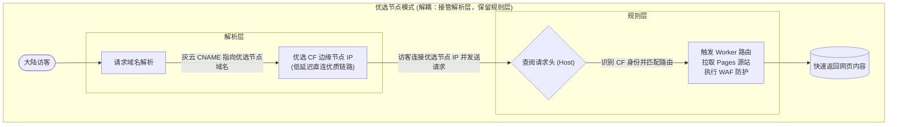

## 2 准备工作

在正式开工前，需要确保主力域名（本站就是 `ybjun.com`）已托管在 Cloudflare，即 NS 记录是 CF 的服务器。如果还没有托管过来，可以去之前[注册免费域名的文章](https://www.ybjun.com/posts/dpdns-free-domain/#4-cloudflare-%E6%89%98%E7%AE%A1)中查看教程。

为了避免未来优选 IP 池失效导致全站大面积修改，我们先建立一个**统一的优选中转点**：

在 CF 主力域名 的 DNS 面板中，新建一条 `CNAME` 记录，名称设为 `cdn`，目标指向找到的优质第三方优选域名（如 `*.cf.090227.xyz`）。

:::warning
此记录的代理状态必须设置为**灰色云朵（仅 DNS）**！
:::
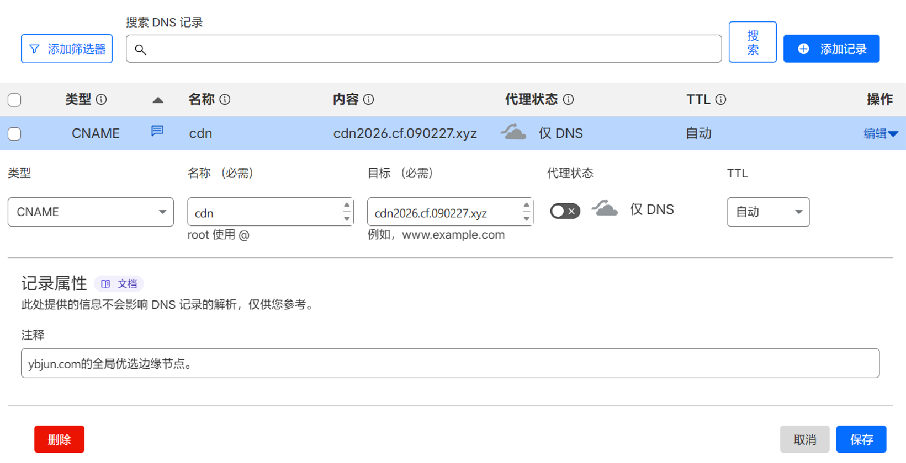

后续，所有的前端、API、存储桶等实际使用的域名，都将统一 `CNAME` 到 `cdn.ybjun.com`。这个站点将自动返回优选节点的IP解析。并且，未来即便这条优选源宕机，需要更换新的源，只需修改这一条记录即可。

## 3 R2 存储桶的优选

在本站的初始构建中，对于存储相册照片的 R2 存储桶，博主采用了统一尺寸和规格的 WebP 格式，并调高了边缘节点对存储桶的缓存 TTL 。这些常规措施虽能在一定程度上缓解压力，但面对跨洋直连的高丢包率，依然有些捉襟见肘，所以为 R2 存储桶作优选是很有必要的。对此，我们将拥抱 Cloudflare 近期推出的原生功能：**Cloud Connector（云连接器）**。


:::warning
在规划所有的自定义域名分配时，包括但不限于R2存储桶、Worker、Pages，包括所有要使用的自定义域名和优选加速域名，**请务必确保全部使用三级域名**（例如 `picslow.ybjun.com`），绝对不要使用四级及以上的域名（例如 `pic.api.ybjun.com`）!

原因在于，CF 免费版提供的 Universal SSL 证书仅支持三级通配符保护（即 `*.ybjun.com` ）。一旦你使用四级或更高等级域名，且不打开灰云，而是去做优选，边缘节点将无法提供有效证书，**访客会直接遭遇 `ERR_SSL_VERSION_OR_CIPHER_MISMATCH` 连接错误！**
:::


先为 R2 存储桶添加一个**自定义三级域名**（这里以 `picslow.ybjun.com`为例），需要注意的是，这个域名**并无优选**，而是常规的自定义域名，我们不要直接把这个域名用在项目中。添加方法是：在存储桶的设置界面 **“自定义域”栏目** 下，就可以添加了。
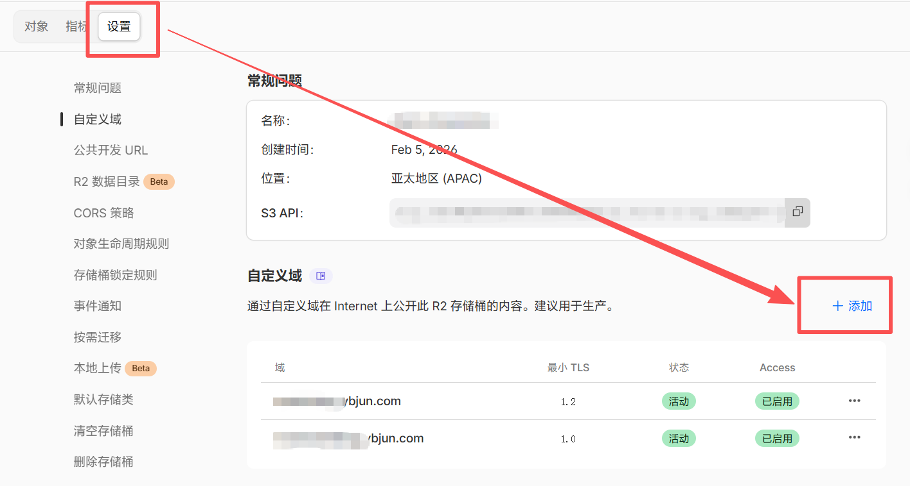

然后创建**云连接器（Cloud Connector）**。进入 `ybjun.com` 域名的侧边栏 -> **规则 (Rules) -> Cloud Connector**。选择 **Cloudflare R2**。
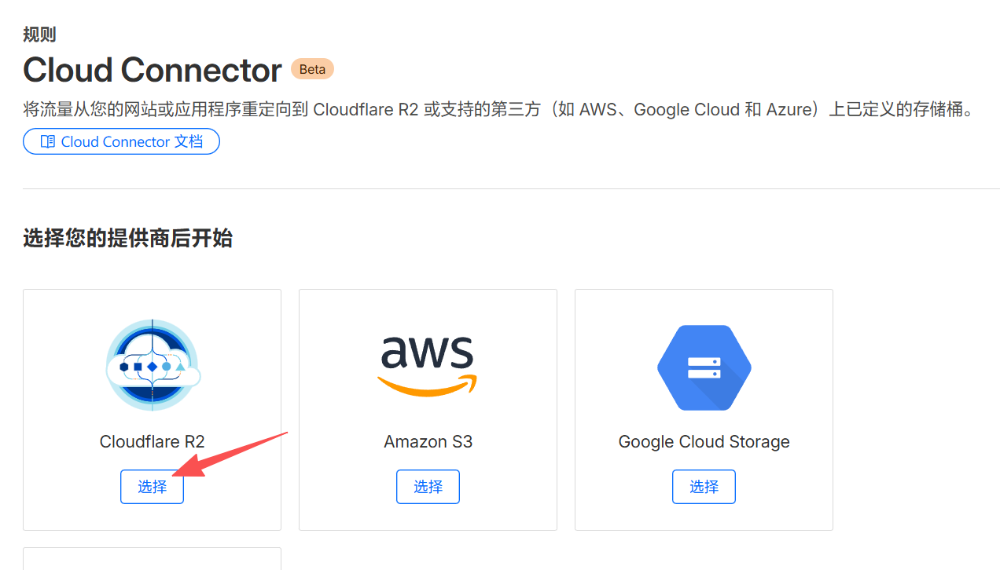

选择刚才的相册存储桶，并选择自定义域： `picslow.ybjun.com`，下一步。
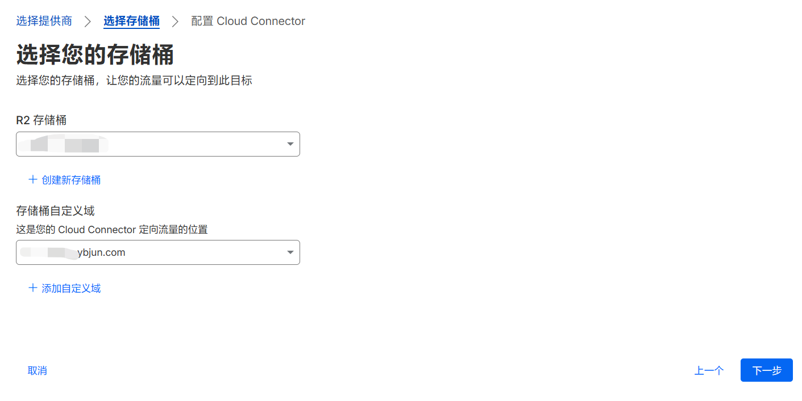

假设最终我们要**用于项目**中的存储桶**优选加速域名**为`picfast.ybjun.com`，在这里显示的界面中，先输入一个云连接器名称，然后在下方的表达式编辑区域，前面两个下拉框确保选择为**主机名、等于**，然后在后面的“值”输入框中输入`picfast.ybjun.com`。点击**部署**。
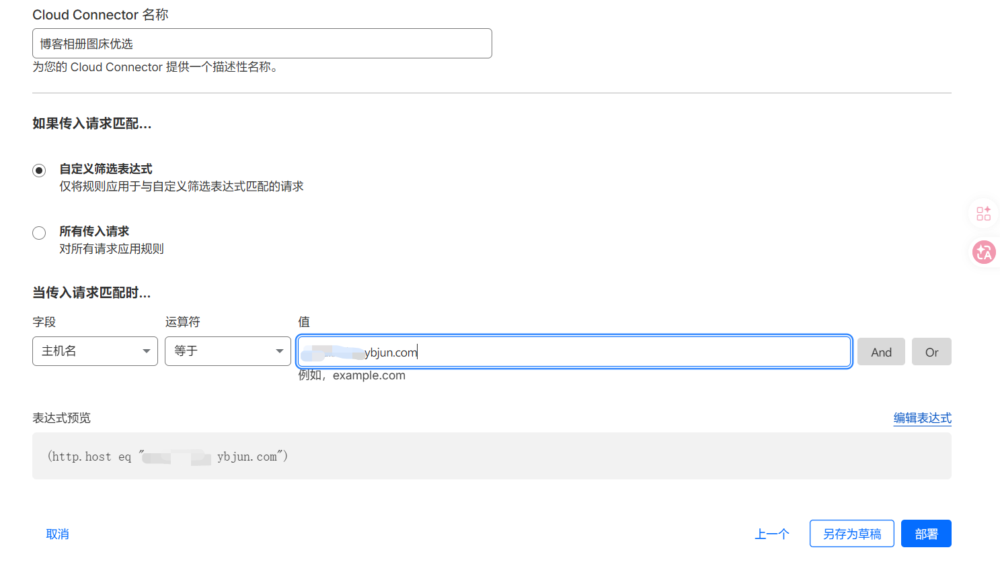

此时 CF 提醒我们，`picfast.ybjun.com`还没有 DNS 解析记录，可能无法使用。我们直接选择**创建新代理 DNS 记录**，并在下方选择 `CNAME` 记录，名称就是`picfast.ybjun.com` 或者直接填 `picfast`，“目标”输入我们第二章创建的中转点`cdn.ybjun.com`。创建记录和部署规则。
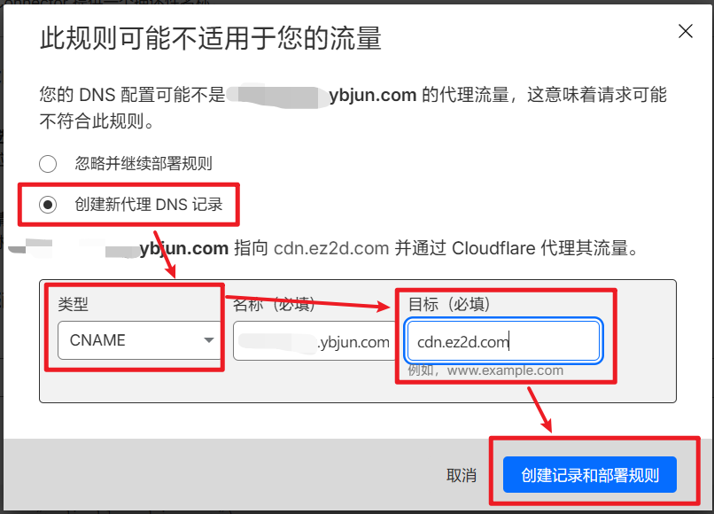

当看到下图的界面时，就代表ok了！这时候可以回到`ybjun.com`的 DNS 记录中确认一下，确保 `picfast` 的小黄云没有开，如果是开着的，手动编辑关一下就行。
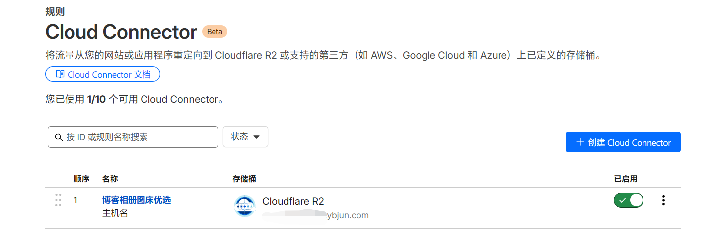

至此，R2 存储桶直连优选链路打通完成，博客相册加载速度有了肉眼可见的提升。

:::note
如果你像博主一样，为了规避四级域名证书报错的坑，将原来数据库里的老图床域名（如 `pic.api.ybjun.com`）全量降维成了三级加速优选域名（`picfast.ybjun.com`），面对 D1 数据库里成百上千条照片链接怎么办？

手动改是不可能的，直接在 D1 控制台使用1行 SQLite 原生语句，一秒内即可搞定历史技术债：
```sql
UPDATE photos_meta 
SET picurl = REPLACE(picurl, 'https://pic.api.ybjun.com', 'https://picfast.ybjun.com') 
WHERE picurl LIKE 'https://pic.api.ybjun.com%';
```
:::

## 4 Workers 的优选

本站的核心业务逻辑全部依赖于博主手搓的 3 个 Workers API。在前后端分离的 Serverless 架构中，如果仅仅是前端静态页面加载快，而 Workers 接口响应迟缓，访客依然会长时间卡在 Loading 动画里，整体的交互体验将大打折扣。因此，对这几个 Workers 进行优选加速，**是全站提速的关键环节**。

好消息是，相比于其他组件，Workers 的优选改造相对而言**最方便**。这是因为 Cloudflare 为 Workers 提供了两种灵活的流量接入方式：**“自定义域 (Custom Domains)”** 和 **“Workers 路由 (Workers Routes)”**。

在确定我们要使用哪种方式前，我们先要明白这俩东西究竟是咋回事，有何区别。

### 4.1 自定义域和 Workers 路由到底有何区别？

简单来说，它们的区别在于 **“控制权的归属”** 和 **“DNS 记录的绑定方式”** ：

* **自定义域 (Custom Domains) —— “全包揽的硬绑定”**
    当你在 Worker 中添加自定义域时，Cloudflare 会接管一切：它会为你自动申请 SSL 证书，并**强制在你的 DNS 面板中生成一条关联该 Worker 的专属 DNS 记录**。
    然而，这条由系统自动生成的 DNS 记录是被**强行锁死为小黄云（已代理）状态的**。你既无法修改它的目标地址，也无法将其关闭为灰云。既然无法将其修改为灰云并 CNAME 到我们的中转节点，这条路在优选架构下自然就被彻底堵死了。
* **Workers 路由 (Workers Routes) —— “同 Zone 内部的软拦截”**
    与自定义域的“硬绑定”不同，路由功能本质上是一个部署在 CF 边缘节点内部的**拦截器**。它本身并不负责创建或管理 DNS 记录，它的逻辑仅仅是：“只要有流量进入了这个 Zone（区域），且请求的 URL 匹配我设定的规则（例如 `api123.ybjun.com/*`），我就把流量劫持给 Worker 处理”。
    正因为路由不干涉 DNS，我们获得了完全的自由。我们可以在 DNS 面板中手动创建一条 `api123` 的 `CNAME` 记录，将其设为**灰云（仅 DNS）** 并指向 `cdn.ybjun.com`。

**总结**：自定义域会锁死 DNS 导致无法优选，而 Workers 路由则将 DNS 解析权完全交还给我们。因此，在本站的 API 优选方案中，我们不适用自定义域，采用 **“手动 CNAME + Workers 路由”** 的解决方法。

### 4.2 操作步骤

首先进入目标 Worker。假设这个 Worker 计划继续使用之前的自定义域`api123.ybjun.com`作为优选加速域名。

点击**设置**，在**域和路由**栏目下，删除之前的自定义域`api123.ybjun.com`，然后添加，选择**路由**。
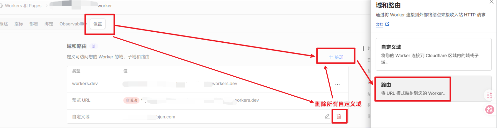

**区域**选择主域名`ybjun.com`，在**路由**处填写**优选加速域名 +** `/*`，这里就是`api123.ybjun.com/*`，点击**添加路由**。

:::important
这里注意，优选加速域名后面必须要填上`/*`！`/*`是一个通配符，代表此域名下的**所有路径**，这里填上`/*`，就可以确保 Cloudflare 把所有对`api123ybjun.com`及其下任何路径的请求都转发给 Worker。当然一般而言，如果这里填的内容没有以`/*`结尾，CF 就会拦截并让你补上。
:::

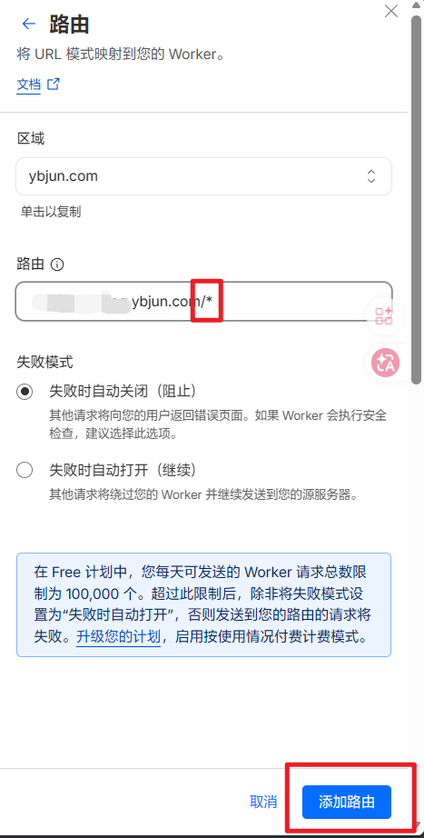

接着，再回到`ybjun.com`的 DNS 记录页，添加一条 `CNAME` 记录，把 `api123` 指向 `cdn.ybjun.com`，**关闭小黄云**，操作完毕！
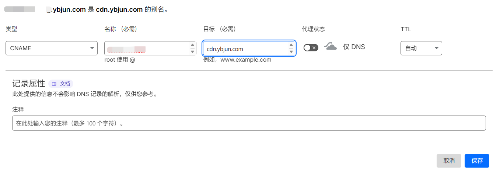

### 4.3 结果对比

下面，我们用一种最直观的方式来感受一下 Worker API 在优选加速前后的访问差距，那就是使用 `itdog.cn` 提供的 `TCPing` 工具。

下图是优选加速前的本站评论区 API 全国访问结果：
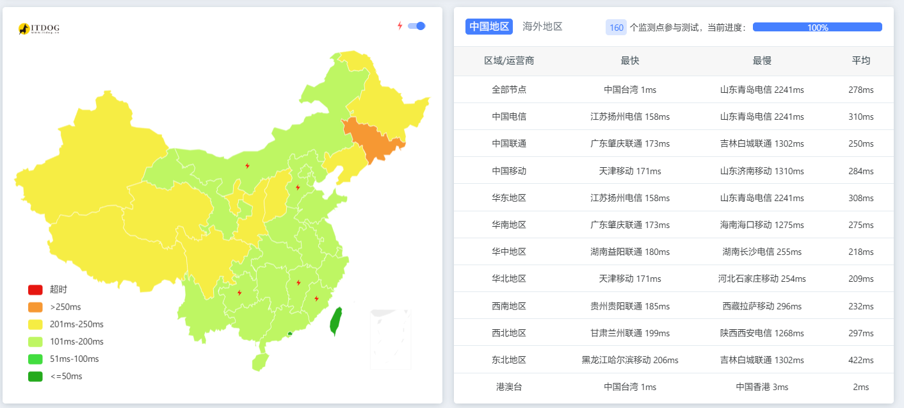

下图是优选加速后的本站评论区 API 全国访问结果：
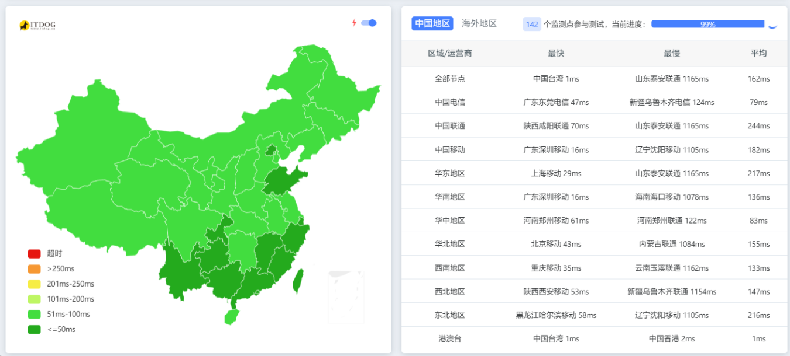

**优选效果，一目了然！**

## 5 Pages 的优选

如果你认为前端 Pages 也能用 Workers 一样的方法搞定，那或许会让你失望了。因为 **Pages 只支持自定义域，不支持路由**！
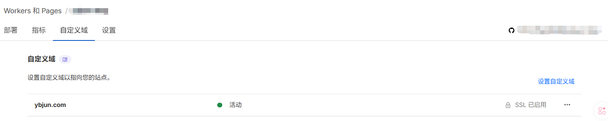

当然，网上有教程提到，可以把 Pages 项目通过一些方法 **转成 Workers** 来实现“强行路由”。这样做对于**直接部署现成网页文件**的 Page 来说确实可以，但对本站就不适用了。

因为本站的部署流是：`GitHub 前端仓库有新 Commit -> Pages 编译  -> Pages 部署`，可以看到编译和部署都是由 Pages 完成的，问题就在于**如果改成 Workers 就不支持编译了**。那就只能再去单独配置 GitHub Action 自动编译并推到这边的 Worker，这样要动的“手术”就更大了，完全没有必要。
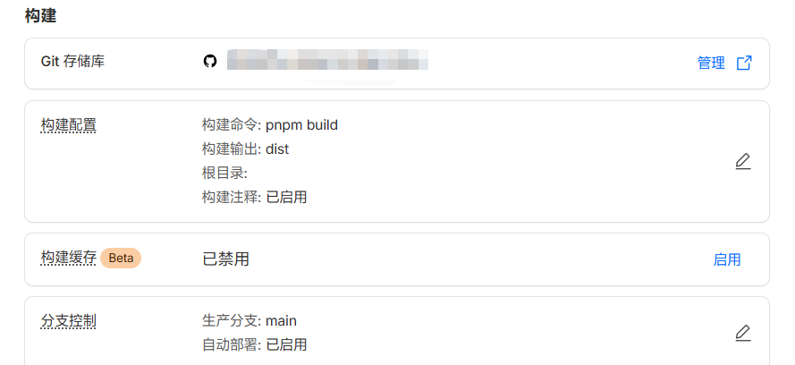

面对这种架构上的“死局”，博主一度陷入了沉思。本以为仅承担静态站点部署的 Pages 做优选加速理应最简单，没成想反而成了整套方案中**最难啃的一块硬骨头**。在摸索最终解法的过程中，博主参考网上的各种教程进行了两次尝试。虽然最后都以“翻车”告终，但其踩坑经历极其经典，涉及到了 Cloudflare 极其底层的路由逻辑，**以及对一些“互相引用”的教程网文的适用性探讨**，所以非常值得复盘分享。

### 5.1 失败尝试1：被停用的自定义域

既然 Pages 必须使用自定义域，那我们按照 Worker 的逻辑，“偷梁换柱”手动接管其自定义域的解析层，行不行？所以博主做了如下步骤的尝试：

1. *在 Pages 项目中正常绑定自定义域 `www.ybjun.com`。*
2. *待证书和 DNS 生效后，前往 DNS 记录界面，手动将这条由 Pages 生成的记录改为灰云（仅 DNS），并手动把 `CNAME` 的目标由 `*.pages.dev` 修改为我们的优选 `cdn.ybjun.com`。*

刚修改完确实能**短时间起效**，但只要 GitHub 仓库一有新的 Commit 触发 Pages 的自动构建，或仅仅是过一段时间，`www.ybjun.com` 的自定义域状态就会变成**已停用**。**浏览器访问时报错**`Error 1000 DNS points to prohibited IP`。
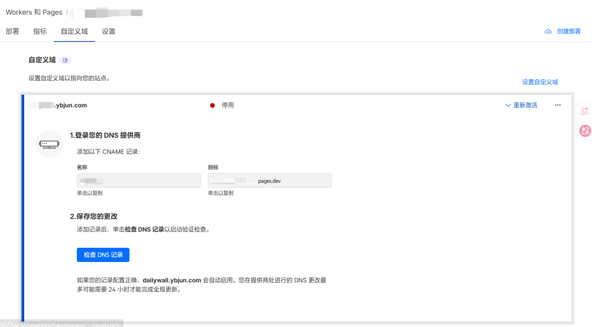

**原因分析：** Cloudflare Pages 有一套极其严格的 CI/CD 域名校验机制。每当项目重新编译部署，系统都会扫描你的 DNS 记录，确保自定义域依然指向 `*.pages.dev`。一旦发现 DNS 记录对不上，Pages 为了安全起见会认为该域名已失效，从而直接停用。

### 5.2 失败尝试2：使用 CF for SaaS 的两头堵

上面的踩坑证明了在同一个域名下强行修改 Pages 的 DNS记录是行不通的。于是博主决定试试**网上通用的、都在说的 Cloudflare for SaaS (自定义主机名)**，利用一个辅助域名`ybjtest.com`作为中转，绕过 Pages 的检测。
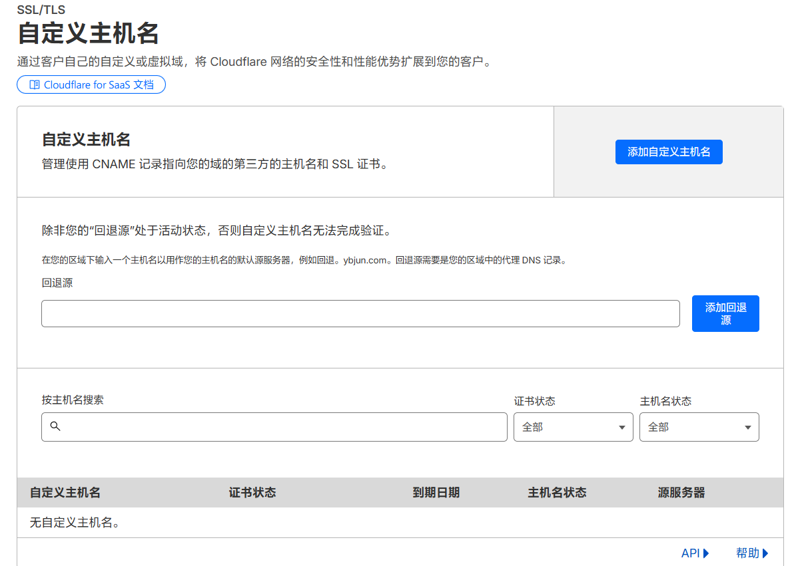

在详细复盘之前，有必要先简单提一嘴**被目前各大网上教程奉为圭臬的 Cloudflare for SaaS（自定义主机名）到底是个什么东西**。本质上，这是 CF 为 SaaS 企业提供的一项服务，允许外部客户将自己的域名接入到企业的主体服务中，并由 CF 统一签发证书和路由兜底。

例如，某电商平台`shopping.com`为在平台注册的店家提供“自定义主机名”服务。这样，一个叫`mobilefan`的手机卖家就可以直接将自己的网站`mobilefan.com`直接纳入`shopping.com`提供的一系列网络服务中，可以统一签发证书，可以参与路由规则，等等，而不是必须使用长长的三级域名`mobilefan.shopping.com`。

但国内的网友们发现并利用了其中的一个**机制漏洞**：一旦你在 SaaS 中添加并验证了某个域名，CF 的全球边缘节点就会为该域名发放一张“特许通行证”。有了这张通行证，你就可以将该域名的 DNS 强制 `CNAME` 到任何一个优选节点上。当流量抵达优选边缘节点时，**由于有 SaaS 登记在册，CF 不会将其判定为非法请求而拦截（不报 Error 1001），而是顺着“回退源”放行**。

正因如此，利用 SaaS 的这个机制“骗”过规则层，几乎成了近年来全网 CF 优选教程里的万金油标配。

具体来说，博主是这么做的：

1. **设置回退源。** 为主站 Page 绑定一个`ybjtest.com`下的三级域名`ybjun.ybjtest.com`作为自定义域，这个域名将作为**回退源**使用。
2. **添加辅助域名的优选源中转。** 为`ybjtest.com`添加一条名为`cdn` 的 `CNAME` 记录，指向`*.cf.090227.xyz`。
3. **开启 CF for SaaS。** 在`ybjtest.com` 控制台左侧打开 **SSL/TLS -> 自定义主机名**，先添加回退源`ybjun.ybjtest.com`，再按照要求，添加自定义主机名`www.ybjun.com`进去，并为`www.ybjun.com`添加相应的证书 TXT 记录和主机验证 TXT 记录，使得验证通过，自定义主机名可以正常使用。
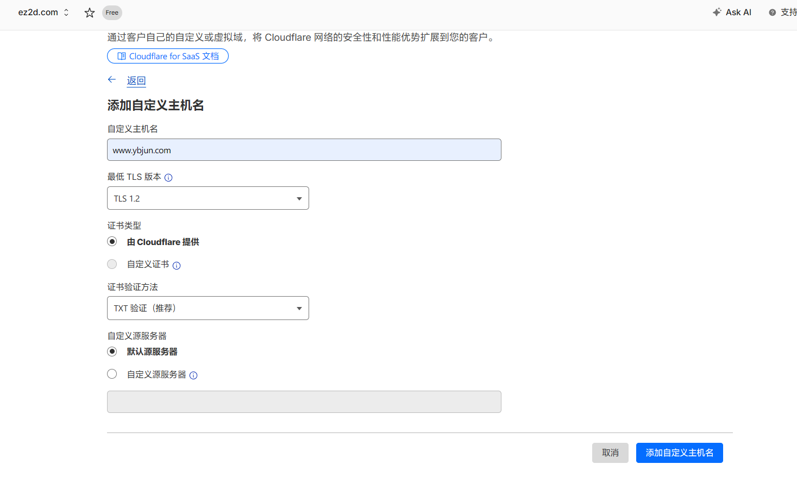
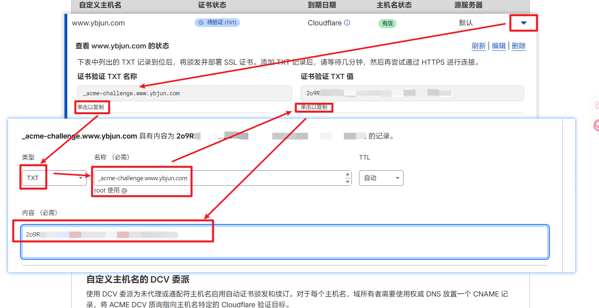
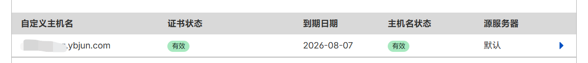

接下来需要为`www.ybjun.com`添加灰云的优选 `CNAME` 记录，但问题就这么来了， **“一根筋”就此变为“两头堵”** 。

* 把`CNAME`目标指向`cdn.ybjtest.com`，浏览器访问会`Error 522`。原因是虽然 SaaS 确实被触发了，但回退源`ybjun.ybjtest.com`是一个 Pages 域名。CF 的安全机制中，SaaS 回源到 Pages 项目极其容易触发 522（连接超时），因为 **Pages 的边缘节点拒绝接受带有被篡改的 Host 头的异常回源请求**，直接把连接掐断了。
* 把`CNAME`目标指向`cdn.ybjun.com`，浏览器访问会`Error 1000`。原因是**在 CF 的底层路由协议中：原生 Zone 内的路由优先级永远大于 SaaS 自定义主机名**。当请求 `www.ybjun.com` 到达优选节点时，节点一看：“哦，`ybjun.com` 就在系统里，我直接去查它的原生 DNS 表。” 节点根本就懒得去查`ybjtest.com` 里的 SaaS 名单。结果节点在 `ybjun.com` 里一看，`www` 是个灰云，而且没有绑 Worker 路由，也没有绑 Pages，**直接判定为“非法回环解析”**，扔回一个无情的 `Error 1000`。

由上可见，网上广为流传的 Cloudflare for SaaS 方案，可能主要还是适用于 VPS 等其它部署方案，**并不适用于 Pages 项目**。Pages 的自定义域是“动不得”的，而 SaaS 路由在同 Zone 下又是“进不来”的。面对这种左右为难的局面，博主最后只能尝试一种**兜底的“曲线救国”方案**——跳出 Pages 的框架，做一个简单的 Worker 代理去转发 Page 的流量。

### 5.3 最终方案：Worker 桥接代理

既然 Pages 这么难伺候，我们就做一个小 Worker 桥接一下，毕竟由第三章可知，Worker 的优选还是很简单的。所以我们的思路就是，让优选节点去直接这个 Worker，让 Worker 在 CF 内部直接拉取源站数据和转发流量，免除一切烦恼。

新建一个 Worker（例如 `pages-proxy`），填入以下代码：

```javascript
//worker.js
export default {
  async fetch(request) {
    const url = new URL(request.url);
    url.hostname = 'ybjun.com';     // 替换成你实际的 pages.dev 域名或自定义域
    const newRequest = new Request(url, request);
    return fetch(newRequest);
  }
};
```

:::tip
由于博主想实现分流和对比，因此改掉了之前 `ybjun.com` 展平 `CNAME` 到 `www.ybjun.com` 的设定，直接将 `ybjun.com` 绑定为了 Page 的自定义域，作为未优选加速的全球访问渠道。中国大陆用户访问优选加速的`www.ybjun.com`。
由于`*.pages.dev`在中国大陆访问可能受限制，因此博主在上面 Worker.js 中填入了自定义域名`ybjun.com`以避免可能出现的其他问题，博主个人也比较推荐大家这么写。
:::

接着重复上文 Workers 优选的步骤：**DNS 设`www.ybjun.com`灰云 `CNAME` 指向`cdn.ybjun.com`，并在 Worker 里添加 `www.ybjun.com/*` 的路由**。主站至此完美起飞！

## 6 踩坑实录

在全栈优选的这条路上，可谓是“步步惊心”。这一章博主将把整个过程中几个“坑”进行复盘。方便大家的学习和排查。**当然，许多更折磨人但有教育意义的踩坑已经融合到了前文中，这里就不再赘述了。
**
### 6.1 “消失”的证书

这是本站优化过程中遇到的第一个“拦路虎”，也是最具隐蔽性的坑。

**现象描述：** 当博主尝试对 `pic.api1.ybjun.com` 进行优选后，浏览器直接报错：`ERR_SSL_VERSION_OR_CIPHER_MISMATCH`。无论如何刷新、清除缓存，甚至重新申请证书都无济于事。

**原因分析：** 这是由 Cloudflare Universal SSL（通用证书）的保护范围决定的。CF 为免费版用户提供的**通配符证书仅支持到三级域名**（即 `*.ybjun.com` 和 `ybjun.com`）。一旦你的域名深度达到了四级（如 `pic.api1.ybjun.com`），它就超出了通用证书的覆盖范围。特别是关闭小黄云的时候，边缘节点将无法提供有效证书，导致 TLS 握手瞬间崩溃。

不过有个例外，当我们将四级域名直接绑定为 Workers 等内容的自定义域，CF 也会额外为这些域名申请证书保护。具体可以去 CF 域名控制台的 **SSL/TLS -> 边缘证书** 中查看。

**解决过程：**“全栈降维”。博主将所有涉及到的四级域名全部重构为三级域名，这就要对前端代码库和数据库内相关内容进行替换。前端代码库让 Agent 直接操作即可，为了处理 D1 数据库中成百上千条历史链接，博主配合 SQL 的 REPLACE 函数完成了自动化替换。

### 6.2 虚惊一场

**现象描述：** 在优选工作接近尾声时，DNS 列表中突然跳出了满屏的黄色感叹号警告：“本记录可能会暴露 `api3.ybjun.com` 的源站地址...”。

**原因分析：** 这是 Cloudflare 的源站保护误报。当博主在配置优选加速域名时，如果不小心开启了某个优选加速域名的小黄云，而这个域名又指向了一个已经设为灰云的优选中转（`cdn.ybjun.com`），CF 就会认为你试图隐藏源站，却又通过其他记录泄露了它。

**解决过程：**“保持一致性”。在优选架构中，既然我们要接管解析层，**那么所有参与优选的三级子域名都必须统一保持灰云状态**。将这些记录全部修正为灰云后，警告自动消失。所以，添加优选加速域名记录时记得关掉小黄云！

## 7 成果展示

经过这一套“抽丝剥茧”的手术，目前博客在中国大陆的访问速度已经有了质的飞跃。

我们来看看测速工具（ITDog）的直观对比，优化前，国内节点一片飘黄，晚高峰更是惨不忍睹；优化后，全国节点一片绿意盎然，响应时间基本被压到了 50-100ms。

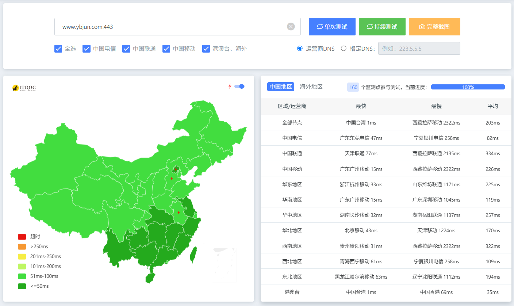

**这套“原生单域名优选”架构，不仅彻底摆脱了复杂的 SaaS 配置和跨域烦恼，更重要的是将后期维护成本降到了极低**：未来优选源一旦宕机，全站仅需修改 cdn.ybjun.com 这一条记录，所有的前端、API、图床即可瞬间同步切换。

折腾建站本身就是一场与网络协议和底层逻辑不断“博弈”的过程。当我们看着一片红黄的测速图瞬间变成满屏绿色，响应时间有明显提升时，所有的试错和踩坑就都是值得的。希望本站的这篇“血泪实录”能帮到同样在使用 CF 全栈架构的你，让我们一起排忧解难！