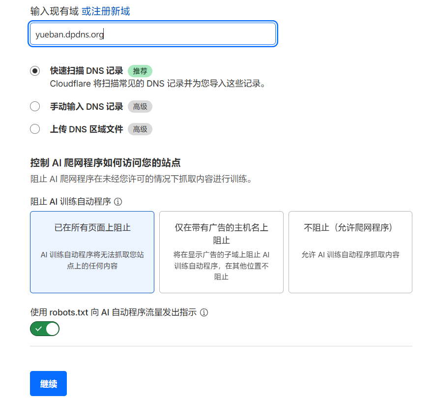
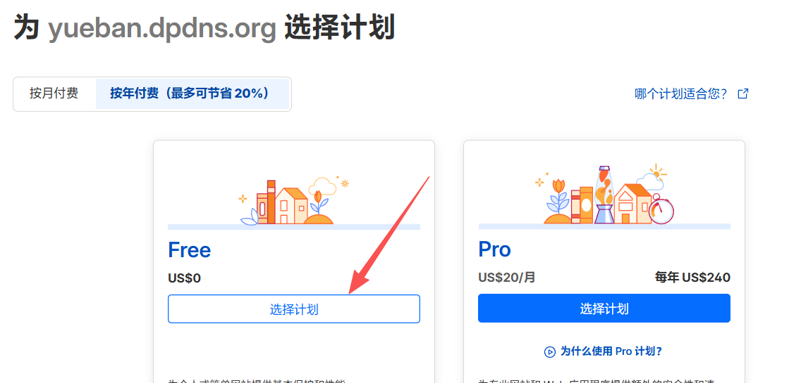
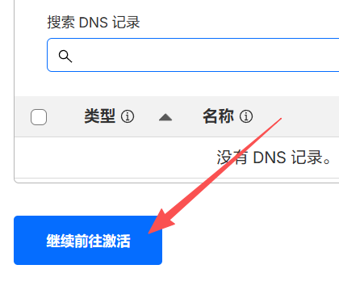
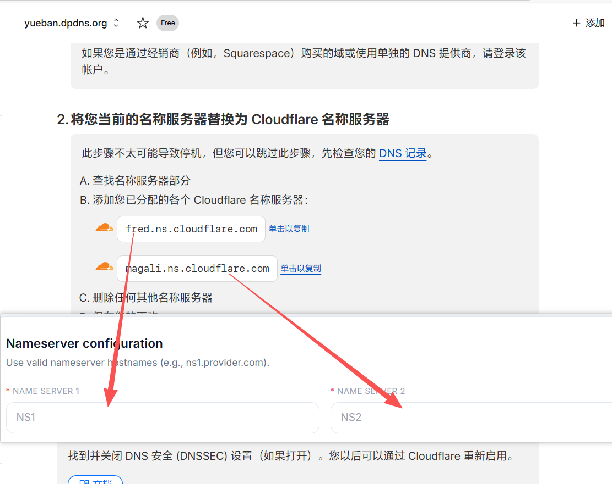
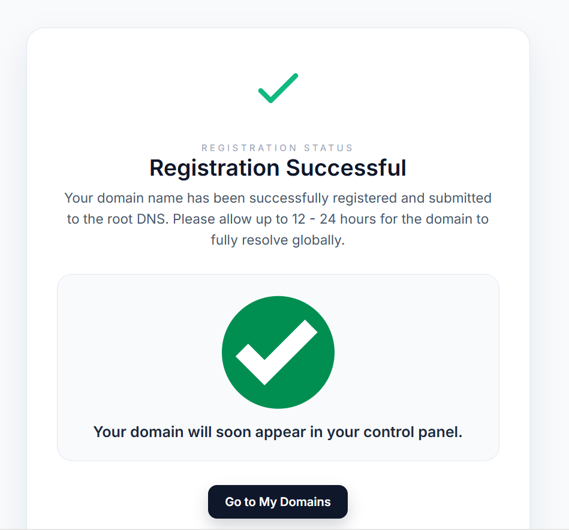
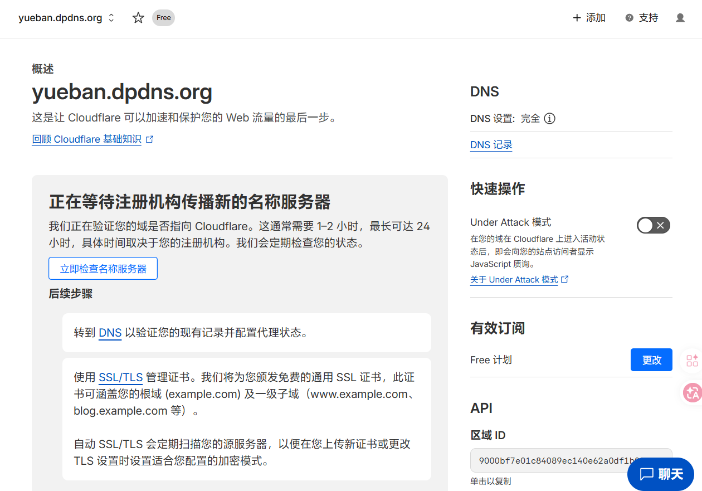
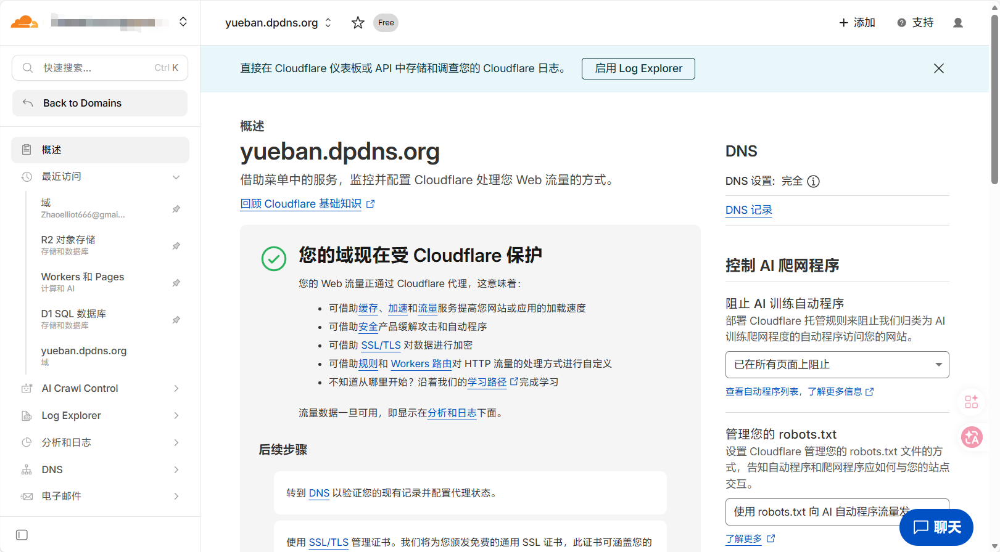
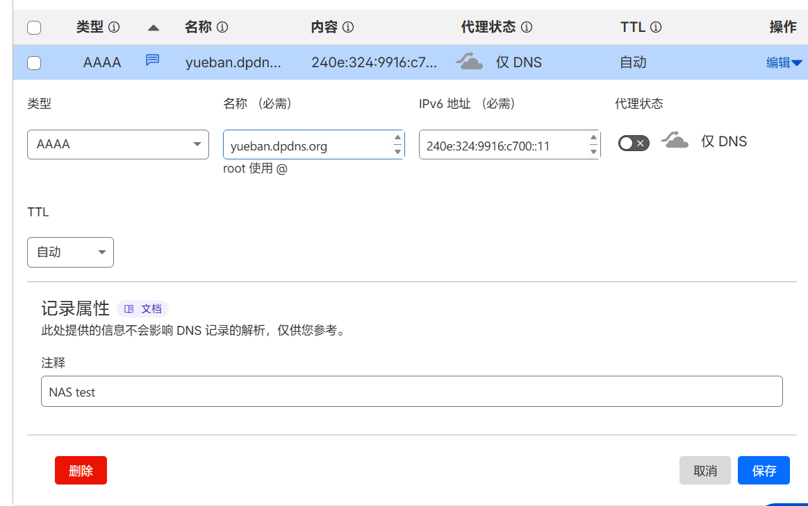
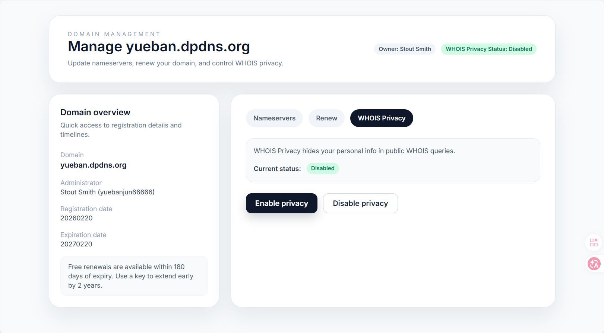

对于技术爱好者而言，拥有一个**属于自己的域名**还是很有用的。不仅可以为NAS做DDNS以便外部访问，还可以搭建个人网站、个人博客、个人下载站等，对计算机专业的学生，也可以用于临时托管自己的web课设项目。
但域名是要买的，如果我们使用需求很小，且仅限于自用，可能就会感觉不太值得每年花费几十块钱去维持这个域名。
对这种个人自用需求来说，**xyz顶域的1.111B域名**其实就是个很不错的选择，在Spaceship注册，可以使用支付宝，一年只要四块钱。不过我们今天要介绍的，则是由一个非营利组织The Hack Foundation运营的开源免费域名项目**DigitalPlat**。通过这个项目我们就可以获得永久免费的、可以通过Cloudflare托管的顶级域名。

:::warning
本文教程仅供技术交流与个人学习使用。免费资源来之不易，请大家合规使用，切勿滥用于非法用途，共同维护良好的网络环境。
:::

## 1 前置条件
你需要有一个GitHub账号，并至少满足以下条件：
> 1. 注册满30天
> 2. 近期内有提交过内容或给别的项目点过star

以上条件是因为，虽然DigitalPlat的注册无需身份信息和支付信息，但其使用**GitHub KYC**作身份验证，证明你是活跃着的真人。

:::important
DigitalPlat 注册得到的域名属于公共子域，不支持在中国大陆备案，请大家在使用时务必遵守法规。如果是企业或团队需要构建网站，建议还是注册正规域名并依规建站。
:::

## 2 注册 DigitalPlat 账号
首先，打开 [DigitalPlat网站](https://domain.digitalplat.org/) 。
:::tip
如果遇到网络无法访问的问题，请自行解决。
:::
点击**Register a domain**，会让你登录账号，此时选择界面下方的**Sign up**，进入注册。

这里面，所有信息都可以按照自己的想法随便填，但**邮箱必须填写自己的真实邮箱**！qq、126、163这种国内邮箱也可以。
至于地址和电话，可以直接使用 [美国地址生成器](https://usaddressgen.com/) 随机生成，注意地址信息要复制完整地址，因为DigitalPlat要求地址内至少要包含两个逗号；电话要以美国代号 **+1-** 开头，后面出现的数字中括号和连字符全部删除。
填好全部信息后，点击下方**Register**完成注册，此时你的邮箱会收到一封验证邮件，点击邮件内的链接完成验证，没收到的，去查一查垃圾箱。

---

接着，返回DigitalPlat主页登录你的账号，登录后会提醒你需要KYC验证，此时下拉选择**GitHub OAuth**，然后使用GitHub账号登录，只要满足条件，验证就会通过。

## 3 开始注册域名

验证通过确定后就会直接进入Dashboard。

普通用户只有一个免费域名的额度，一般是够用了，如果不够，相信你也看到dashboard中的提示了，**给该项目在GitHub上点个star即可多加一个免费域名额度**。
该项目的GitHub地址为：[https://github.com/DigitalPlatDev/FreeDomain](https://github.com/DigitalPlatDev/FreeDomain)
用你验证用过的GitHub账号进去点一个star，然后回DigitalPlat Dashboard，点击**clickhere to verity**完成验证，这样你的可用免费域名数就变成了2个。

接着点击顶栏的**Register**，划到页面最底部，就可以选择自己想要的公共子域，并输入自己想注册的域名了。因为是公共子域，所以虽然其提供的是`.dpdns.org`这样的两级后缀，但其实是和`.com.cn`、`.edu.cn`这样，可以独立托管。我们注册`yueban.dpdns.org`。

:::note[关于后缀怎么选]
DigitalPlat 一共提供了四种后缀，`.dpdns.org`、`.us.kg`、`.qzz.io` 和 `.xx.kg`。
其中 `.us.kg` 和 `.xx.kg` 需要有key才能用（好像要付费），且 `.us.kg` 目前在中国大陆有被DNS污染的情况。
建议个人使用，还是用`.dpdns.org`，至少有`.org`托底，应该会比较稳定。
:::

输入好后点击**Check Availablity**，如果你输入的域名未被注册，则会直接进入如下页面：

此时，就把这一页暂时放着，我们去Cloudflare那边设置。

## 4 Cloudflare 托管
点此进入[Cloudflare 官网](https://www.cloudflare.com/zh-cn/)，登录你的账号。如果还没有账号则需要注册，具体注册流程本文不再赘述。
登录后进入你的dashboard，进入**域管理**，点击**加入域**。

输入我们刚注册的域名`yueban.dpdns.org`，点击下方**继续**。

选择免费计划即可，足够用了。*CF的恩情还不完呐~* ✋😭✋ ✋😭✋ 

接着CF会查找域名现有的DNS记录，我们这是新域名，当然不会有。直接点击下方的**继续前往激活**。

然后，CF会给出两个DNS解析服务器，这时候，我们需要将这两个服务器地址分别复制，回到刚才的DigitalPlat页面，分别粘贴到NS1和NS2输入框中。然后点击下方的**Register!**，看到绿色对勾，就说明注册成功啦！

随后回到CF页面，点击页面最底部的**立即检查名称服务器**，出现这个页面，就已经完全没问题了。

## 域名解析的简单介绍
稍等几分钟，回到 CF Dashboard的**域管理**界面，就可以看到我们的`yueban.dpdns.org`已经出现了，点击进去就可以对该域名的解析和安全策略等进行设置。我们这里先来示范一个最简单的用法，为NAS的IP做一个域名解析。

进入上图的域名管理页面后，点击左栏**DNS-记录**，点击**添加记录**。我们先来添加一条**AAAA (IPv6)记录**，将根域指向我们NAS的IPv6地址。点击保存就添加完成啦！

这时候如果你在浏览器地址栏输入`yueban.dpdns.org`，并加上NAS管理页面的端口号，应该就可以看到NAS的登录界面了！
当然，上述操作并不完整，如果真的要实现NAS的完整域名托管，考虑到现在家宽基本已经没有了公网IPv4，我们必须要使用DDNS，后续还需要完成**A(IPv4)记录**配置和DDNS-GO的安装和配置。不过这些不是本文要介绍的内容了。
总之，现在你已经有一个自己的免费域名了，可以开始折腾了！

## WHOIS保护和后续续签
最后，我们要回到DigitalPlat Dashboard，为域名设置WHOIS信息保护，并说说怎么续签。
在DigitalPlat Dashboard点击顶栏**Domain List**，选择刚注册的域名，进入管理页面。
再点击**WHOIS Privacy**，点击**Enable Privacy**，确保状态显示**Enabled**，就打开了WHOIS信息保护。

然后，我们再来说说怎么为域名续签。
根据DigitalPlat的域名使用要求，**注册的免费域名使用期限为1年，但可以在距离域名到期180天以内续签一年**，因此，只要确保我们每年到期前都续签，即可让这个域名保留下去！进入**Renew**，点一下**Request free renewal**即可续签。
到期日期在这页左栏就写着，例如我们`yueban.dpdns.org`的到期时间**即Expiration date**为2027-2-20，我只要在2027年2月初来续一次即可。不过快到期的时候，应该会给你邮箱发邮件的。
