在之前的文章中，我们介绍了DigitalPlat的免费域名注册流程。本期我们来介绍一下由新加坡域名服务商GNAME新推出的免费域名计划。其公共子域后缀`.eu.cc`较短便于记忆，可托管到Cloudflare，更重要的是目前开放免费注册的最短长度仅4位，而且**四位纯字母仍有不少优质资源未被注册！** 因此博主认为这个免费域名还是很值得拿下供个人使用的，如果能有幸注册到一些有特定意义的，那更值得收藏了！

## 1 注册CNAME账号，领取免费域名资格

首先打开GNAME的免费域名页面，之后所有操作（包括续签）都要在这个页面完成：[点击打开](https://www.gname.com/tld-eu-cc.html)。

打开后，先点击右上角的**登录**或**注册**，注册一个账号。当然比较方便的是，可以直接使用邮箱登录，会自动注册。

登录完成后，在免费域名页面会自动领取到**3张`.eu.cc`全额抵扣券** ，没错，普通用户可以注册最多**3个**免费的`.eu.cc`后缀域名。
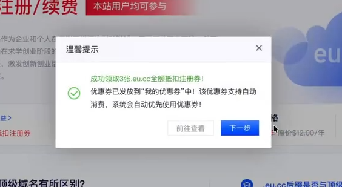

接着，在注册域名之前，我们先来看看官方对免费域名的条件或要求。这里摘录如下：

> 1. eu.cc后缀并非 ICANN 批准的顶级域名，而是基于二级域名形式的注册项目，但它在管理、注册、续费及转移等方面具备与顶级域名相同的权限和功能，能够完全满足客户的正常使用需求，不会对业务运营产生任何影响。
> 2. 根据注册局要求：对于像双字母 (如AA.eu.cc、BB.eu.cc)、三字母 (如ABC.eu.cc、XYZ.eu.cc) 以及品牌词 (如知名企业名称、热门行业词汇) 等溢价域名无法使用.eu.cc全额抵扣注册券进行注册，实际注册价格需以查询结果为准！
> 3. 域名需在到期90天内，才可在“免费续费”列表中提交免费续费申请。仅在“免费注册”活动页面支持提交免费续费，在我的域名列表或开启自动续费等其他相关页面，均无法享受免费续费活动。
> 4. 溢价域名暂不支持免费续费，实际续费价格要以查询结果为准，像双字母（如AA.eu.cc、BB.eu.cc）、三字母（如ABC.eu.cc、XYZ.eu.cc）以及品牌词（如知名企业名称、热门行业词汇）等属于溢价域名范畴。
> 5. 该优惠券领取成功后有效期为30天，逾期作废，不退不换，请注意使用时间，优惠券不支持转赠，只能用户对应账户使用。

因此，由上述要求，我们就可以总结出如下要点：

* `.eu.cc` 属于公共子域后缀，类似于上期的`.dpdns.org` 或`.com.cn`。
* 注册的三级域名部分最短长度是**4位** ，因此建议优先选择**四位纯字母**的非溢价三级域名去注册。
* 续签：在域名**到期前90天**去免费域名页面续费。
* 3张券的有效期为**30天**，鉴于现在四位纯字母的资源还挺多，建议可以把三个名额都一次性用掉，除了注册你想好的域名以外，还可注册一些尚未被注册的、有公共意义的非溢价域名。

:::warning
1. 本文教程仅供技术交流与个人学习使用。免费资源来之不易，请大家合规使用，切勿滥用于非法用途，共同维护良好的网络环境。
2. 这样注册得到的域不支持在中国大陆备案，请大家在使用时务必遵守法规。如果是企业或团队需要构建网站，建议还是注册正规域名并依规建站。
:::

## 2 注册免费域名并创建域名模板

完成上述操作后，回到免费域名页面，直接在搜索框中输入想注册的域名，点击**免费注册**，进入查询页面，**如果是可以免费注册的，那么价格会标注为 $1.88** ，如下图，博主以注册`ohoh.eu.cc`为例，可以看到很幸运，没人注册。
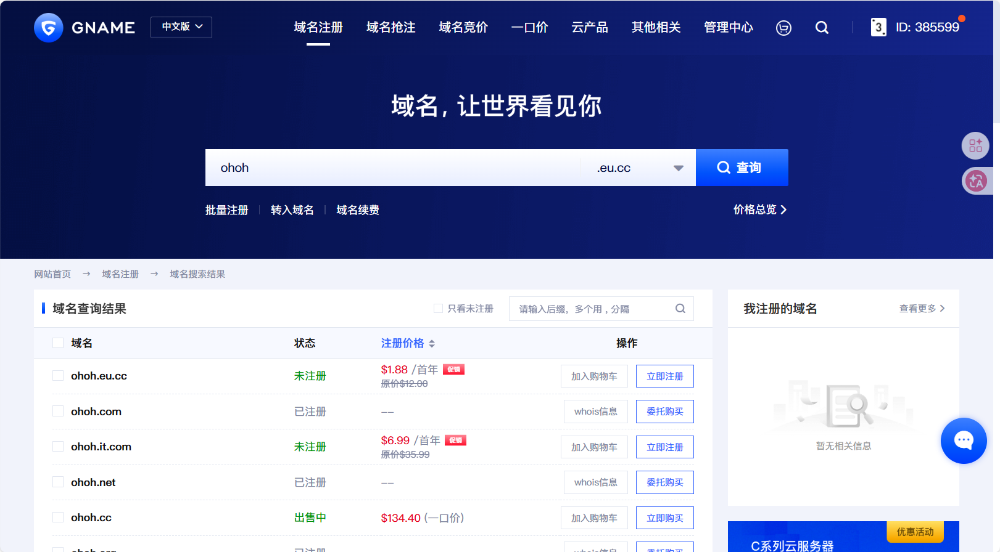

直接点击**立即注册-确认结算**，会提示需要完善资料。这个资料会用于域名的WHOIS信息，填自己的真实信息可以，去[随机地址生成器](https://www.meiguodizhi.com/hk-address)生成一个填进去也可以，反正后续都不会被别人看到。用地址生成器的话需要注意，填完别急着关掉生成器页面，后面还要填一次。
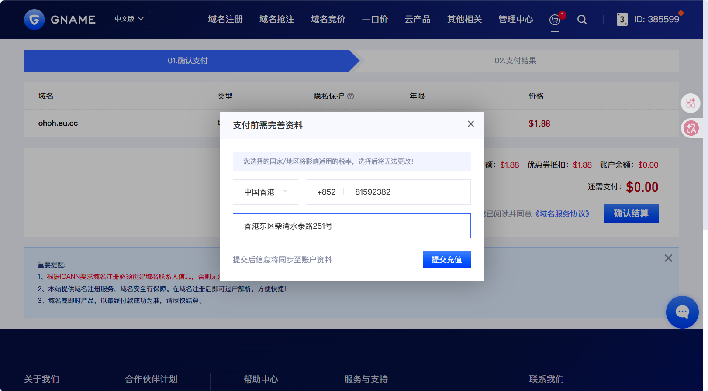

提示已完成后，点击页面下方**管理我的域名**，进入控制台，首先提醒你要绑定多种验证方式，这个好说，再绑一个MFA，即Authenticator验证即可。
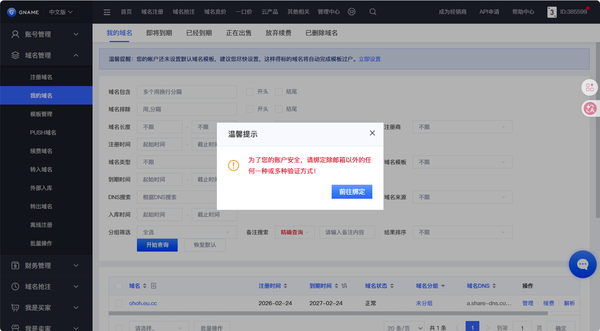

然后点击**我的域名**，在列表中点击你刚注册的域名行右侧的“管理”，为其开启保护。
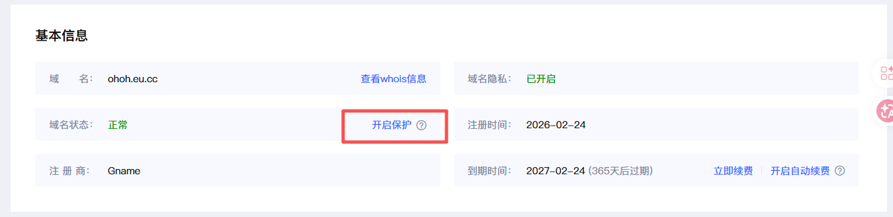

然后创建一个域名模板，后续将NS改到Cloudflare需要用到。点击左侧**模板管理**，上方**添加域名模板**，在打开的页面中按要求输入模板信息，如果你注册域名时填写了你的真实信息，那这里也填真实信息，如果之前填的是随机信息，这里也要填相同的，所以刚才博主让大家先别关闭生成器页面。**总之这里的模板内容要尽量和之前填过的保持一致**，而且**邮箱地址要真实可用**。
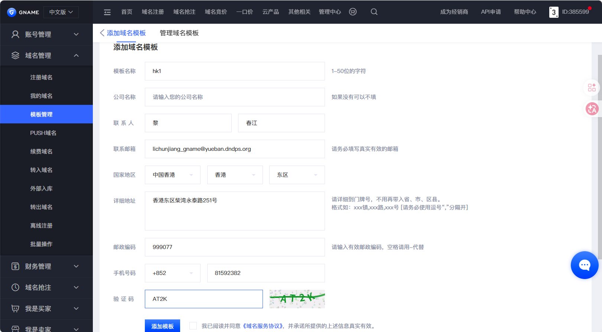

填好后点击**添加模板**，GNAME会往你填入的邮箱发送验证链接，这时候去验证一下，这里就可以使用了。
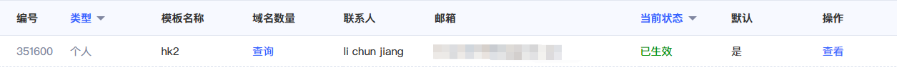

## 3 完成Cloudflare托管

现在打开Cloudflare开始添加域名，具体流程不再赘述，大家可参考[上期免费域名的文章](https://www.ybjun.com/posts/dpdns-free-domain/)。
直至看到CF给出NS服务器地址后，先把这个页面放着，回到GNAME控制台。
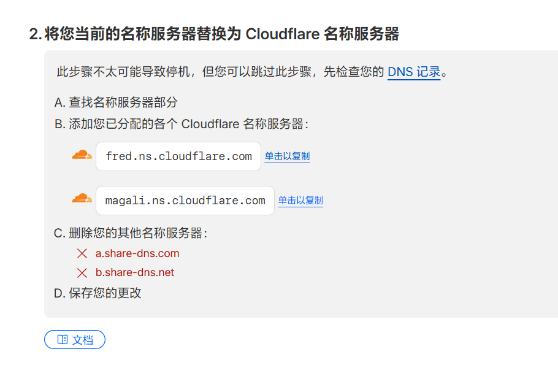

再GNAME控制台，点击左侧**我的域名**，在列表中点击你刚注册的域名行右侧的“管理”，点击**常用功能-域名DNS**的**修改DNS**按钮。
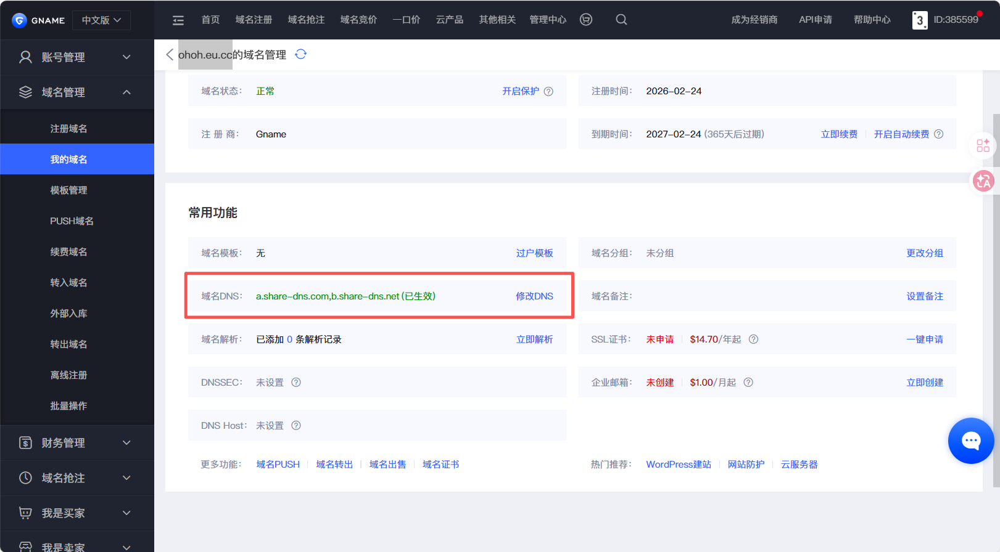

在弹出的窗口中，“选择DNS”改为“请选择”，然后将刚才CF页面生成的两个NS服务器地址分别粘过来，点击**修改DNS**，就可以了。
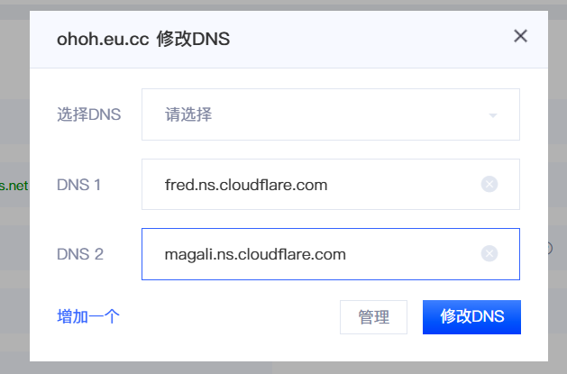
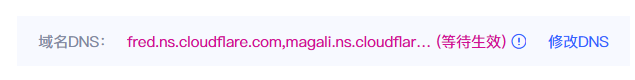

修改生效需要一点时间，但我们不用等，直接回到CF点击页面下方的**我已更新名称服务器**即可。等几分钟，刷新一下CF页面看到CF提示的域名状态为**活动**就可以正常使用了。
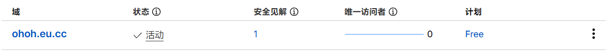

## 免费续费

正如官方要求，在域名到期前**90天**内，可以回到免费域名页面续费，打开页面向下滚动，就可以看到续费按钮了！
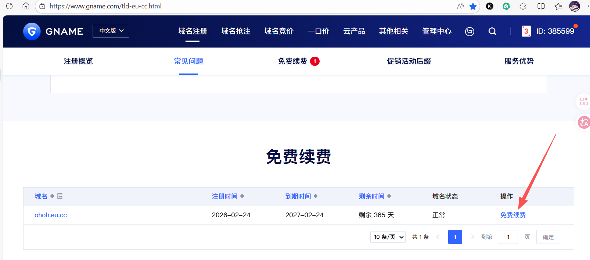