最近，相信几乎所有“白嫖”谷歌AI Pro 学生一年的帐号都收到了二次验证学生身份的通知，如果不按时做验证，学生优惠就会被强制“清洗”，不过截至发文的时候，似乎也没有什么通用且好用的解决方法。
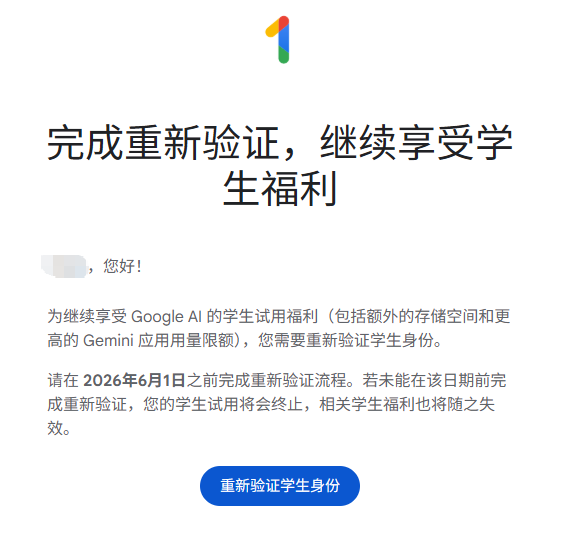
对此，我们只能采取一些其它手段去把 Pro“续上”，就比如**跟别人使用家庭组拼车**。或者，可以搞一个 Pixel 成品号，然后把主号挂到成品号开的家庭组里，这样就能完整保留之前的对话和记忆，继续使用主号。
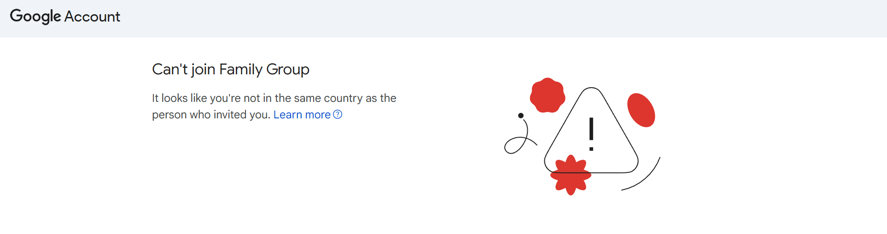
但是当我们想加入别人的家庭组时，经常会报**不在同一个国家**，无法加入家庭。这就涉及到了为谷歌账号改地区的问题。

但对于如何改区，网上的教程要么操作繁杂，要么步骤不全导致失败或无效，有时甚至可能会造成账号被风控。所以，在本文中，博主将结合自己的成功经历和踩坑实录，向大家分享完整的谷歌账号地区修改过程，供大家参考！

## 1 前期准备

### 1.1 两个地区

对于每个谷歌账号而言，有**两个**地区属性需要我们关注并修改，它们都会关系到账号和服务的使用，当然也包括家庭组：一个是**服务地区**，一个是**Play 商店地区**。

#### 1.1.1 服务地区

* 在浏览器登录你的谷歌账号后，打开这个链接：[https://policies.google.com/terms](https://policies.google.com/terms)
* 页面中的**国家/地区版本**显示的就是你账号当前的服务地区。比如下图这个账号是博主的主号，其服务地区就是**美国**。
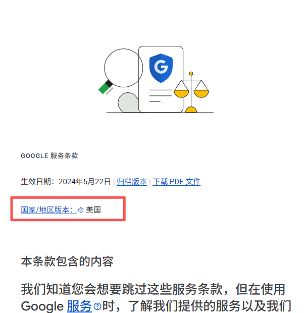

#### 1.1.2 Play 商店地区

* Play 商店地区决定了你能看到的 Play 商店内容是向哪个地区提供的，比如一个游戏有日服和美服，那么**只有使用 Play 商店地区为日本的账号打开商店，才能下载到日服的版本**，同理，只有使用 Play 商店地区为美国的账号打开商店，才能下载到美服的版本。
* Play 商店地区由你所添加的**支付资料**决定，如果你添加的支付资料中，账单地址在美国，那么当你使用这个支付资料时，你账号的 Play 商店地区就是美国。
* **如果你的账号从未设置过支付方式和支付资料，那么你账号的 Play 商店地区跟随你的 IP 所在地。** 这就叫做**地区没有固定** 。比如你现在没有添加支付资料，使用新加坡节点访问 Play 商店，那此时你的商店地区就是新加坡，下次你换成了英国节点访问，那你的商店地区就变成了英国。

:::important
请大家注意，**支付资料 ≠ 你绑的卡**，这个后续我们会说到。
:::

* 查看你账号的 Play 商店地区，有两种方法，一种在电脑端，一种在安卓端，但都需要提前在这些设备上登录你的账号：
	* 对**电脑端**，使用浏览器访问：[https://play.google.com/store/games](https://play.google.com/store/games) ，滑到页面最底下，**右下角**显示的就是你账号的 Play 商店地区，比如下图这个账号就是美区。
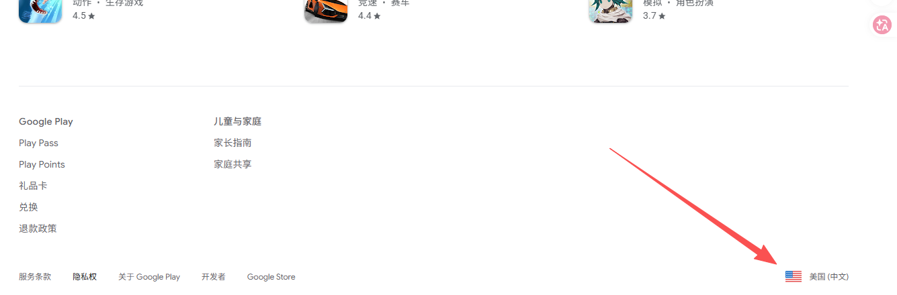
	* 对**安卓端**，打开 Play 商店 — 点右上角头像 — 设置 — 常规 — 账号和设备偏好设置，在**国家/地区和个人资料**中就可以看到你账号的 Play 商店地区，比如下图这个账号也是美区。
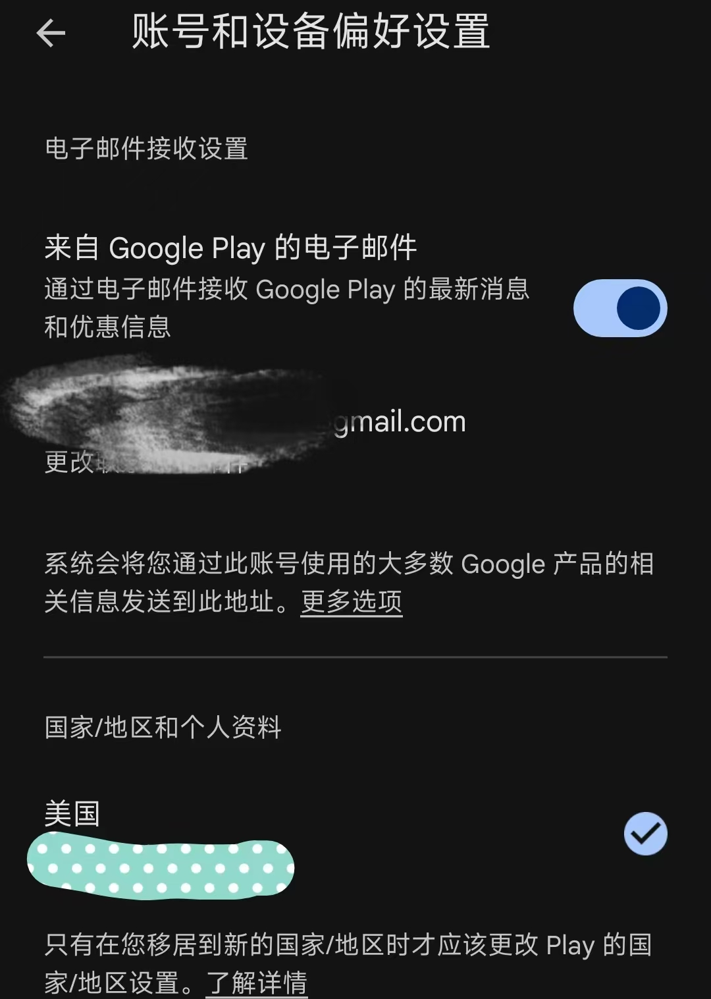

### 1.2 修改地区前准备

我们要修改的，就是上述 1.1 节说到的两个地区。我们只有确保**这两个地区和家庭组管理员账号的都一致**，才能正常加入家庭组。

此外，在开始修改你的账号地区前，还需要做如下准备：
* **已经在你自己的至少一台安卓手机和一台电脑浏览器中成功登录：** 在安卓手机登录是因为后续会用到，如果是刚买的成品号，在手机登录一下还可以降低被风控封号的风险。苹果设备由于没有 Play 商店和付款管理，所以不行。
* **确保你的账号有多种安全验证方法，并且你掌握全部验证渠道：** 确保账号只在你自己的常用设备上登录，没有任何其它设备，并且你有多个通行密钥、自己的手机登录提示、TOTP验证器等多种两步验证方式。这一步是确保后续修改支付资料后可以顺利通过安全验证。

:::tip
1. 如果你的账号是刚买的 Pixel 成品号，那么**不建议直接删除**其中的 Pixel 手机会话，但要确保没有其它任何你的设备之外的活跃设备（如果有其它不是你自己的手机的活动会话，可以在确保安全的前提下，直接在[查找中心](https://www.google.com/android/find/?hl=zh-cn/)将其标记为丢失）。
2. 如果你是刚在你手机上登录这个账号，为保证可靠，**建议手机上登录3-7天后再做敏感操作，包括但不限于改密码、改区、改支付方式等，至少连续登录3天，7天以上最佳**，因为7天后谷歌才会把你的手机标记为常用设备，这样后续用你的手机做验证时就不会卡住了。
:::

* **确保准确知道你的两个目标地区：** 明确知道你要把这两个地区分别修改到哪里，下文将以全部修改到**美国俄勒冈州**做示范，你可以**提前找一个随机地址生成器**，来生成一个对应地区的详细地址做备用。
* **确保修改全程连接在目标地区的同一节点：** 你要改区到哪里，就连接哪里的节点，节点越纯净越好，全程尽量不要更改。

:::tip
如果要改区到美国，建议选择免税州地址。免税州分别是：俄勒冈州 Oregon、特拉华州 Delaware、蒙大拿州 Montana、新罕布什尔州 New Hampshire、阿拉斯加州 Alaska。
:::

## 2 服务地区的修改

服务地区的修改相对容易。比如我们要改到美国俄勒冈州，首先当然需要全程连接到一个美国的节点，如果节点在俄勒冈那是最好了。然后确保你的账号是登录状态。

接着打开网址：[https://policies.google.com/country-association-form](https://policies.google.com/country-association-form)

在网页中填写你的目标地区，原因这里随便勾1-2个即可，但不建议勾选“我经常使用虚拟专用网 (VPN)”。最后提交。
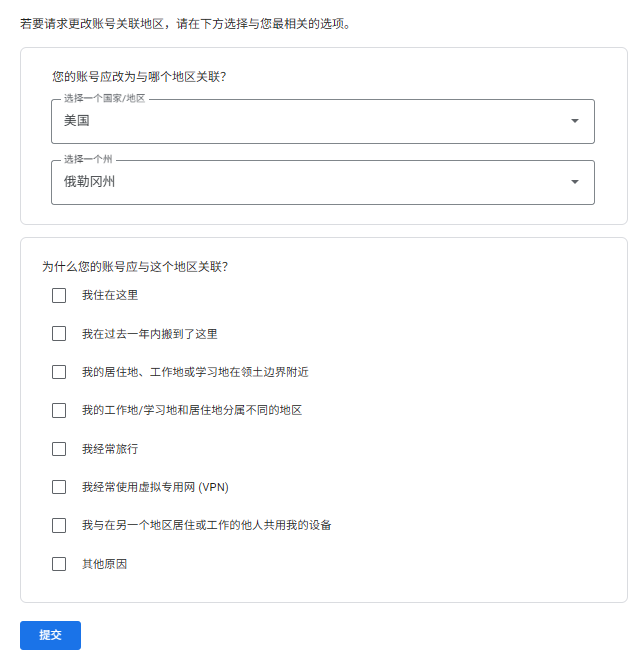

等待一段时间，如果修改成功，你的 Gmail 会收到如下图的邮件（附图某账号是之前改到了华盛顿特区，但也在美国，不影响家庭组使用）。
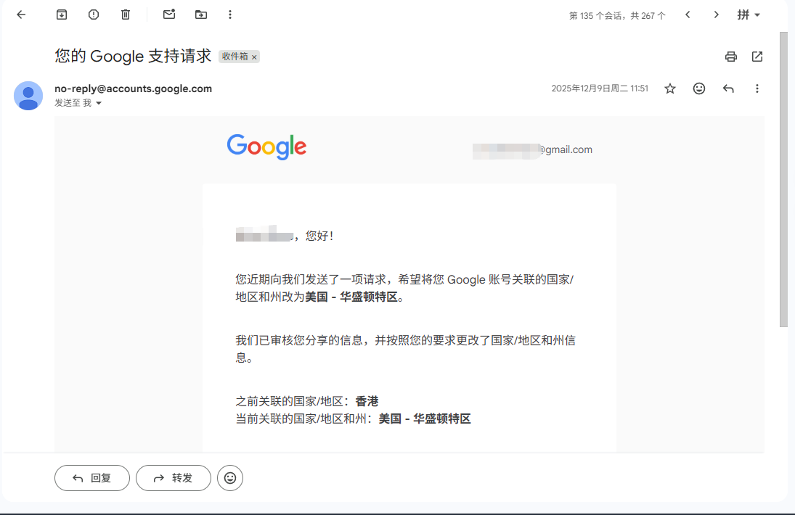

这样就修改成功了。如果迟迟未收到，可以等几天重新提交请求试试。

## 3 Play 商店地区的修改

由于涉及到支付资料的变化，Play 商店地区修改较为复杂。不过家庭组的加入主要看的还是 Play 商店地区，所以这部分反而是重头戏。

:::important
理论上说，如果账号没有支付方式和支付资料，也就是**地区没固定下来**的情况，只要使用对应国家的节点，即可成功加入家庭组。对于成品号，取消订阅+关闭支付资料+删除虚拟卡也可以。但由于虚拟卡亦可留作它用（比如去 GCP 开免费 VPS 实例等），所以我们这里不介绍“取消订阅+关闭支付资料+删除虚拟卡”的方法，而是**修改支付资料以修改地区**。
:::

:::tip
如果你的电脑浏览器登录了多个谷歌账号，为防止新页面串号，可以使用无痕窗口登录目标账号来操作。
:::

首先，**用电脑浏览器**打开[https://payments.google.com](https://payments.google.com) ，打开后应该是需要你的验证，**大概率会要求使用手机点击通知验证**。此时只要你如 1.2 所说**掌握全部验证渠道**，那肯定是能通过的。

打开后点击页面上方**设置**，一般成品号都会绑一个虚拟卡，有一个既有的支付资料。此时随便点击现有支付资料某一项的铅笔图标，点击**新建个人资料**，开始新建。
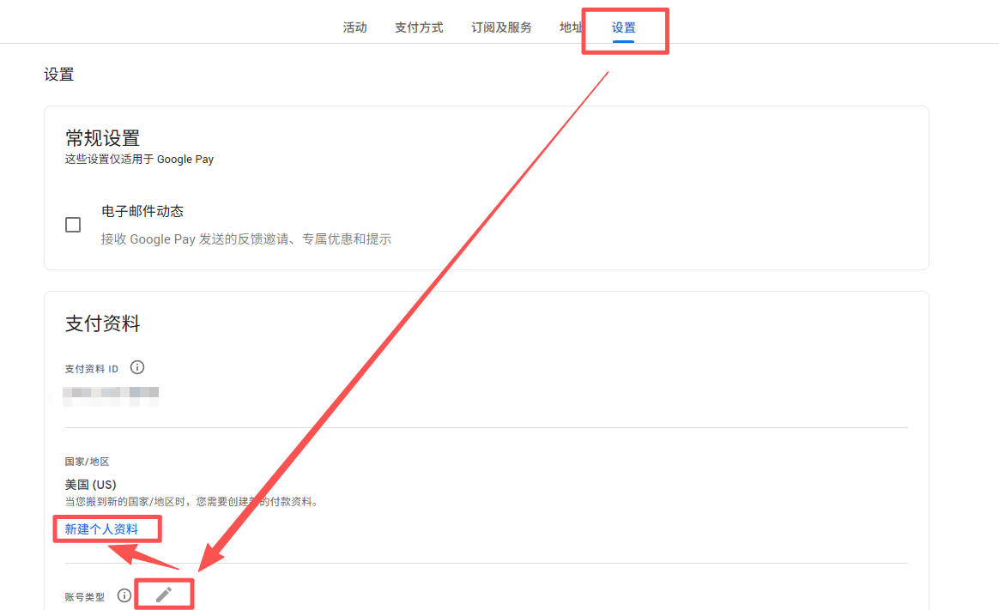

:::note
顺带一提，这一页滑到最底部，就可以**关闭支付资料**。
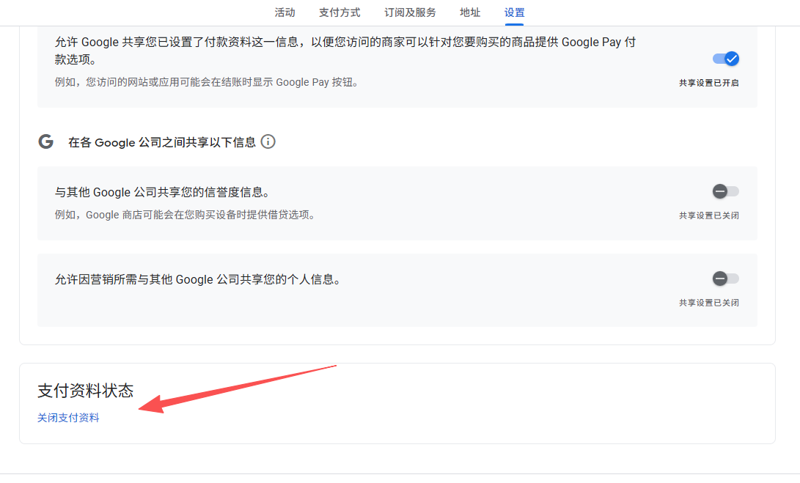
:::

点击**继续**：
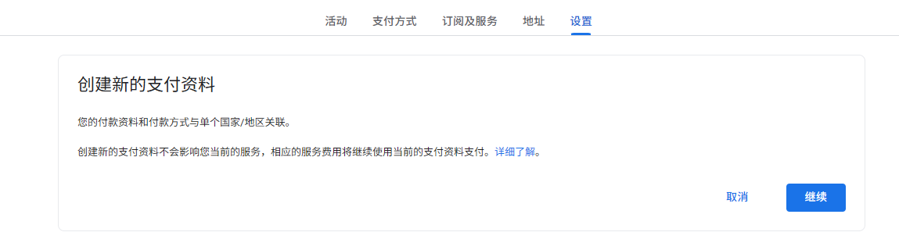

先选择国家地区，选择美国：
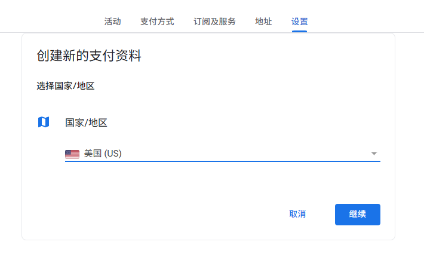

然后把之前准备好的详细地址填进去，提交，例如这里就填写之前随机生成的俄勒冈地址：
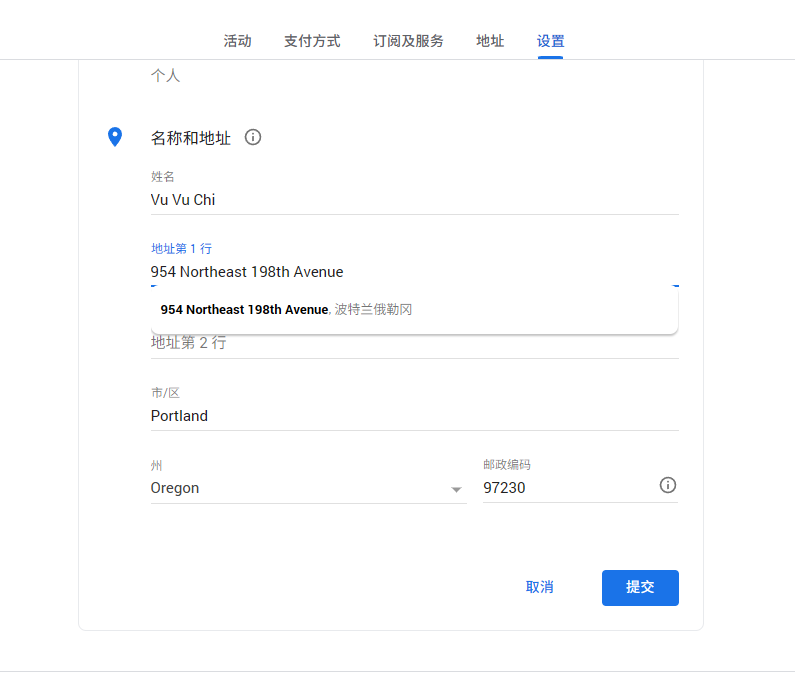

创建成功后，点击**查看支付资料**：
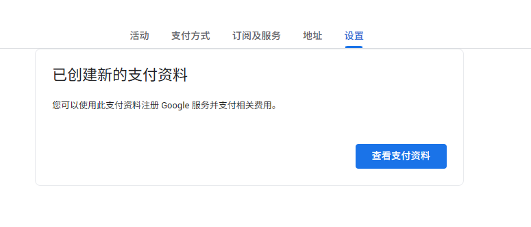

这时候应该还要再做一次验证，完成后还是在设置页面中，在**用于 Google Pay 的支付资料**中点选新创建的美国支付资料（如果看不到就点击一下右边的下拉），刷新页面后，显示美国的选中即可。
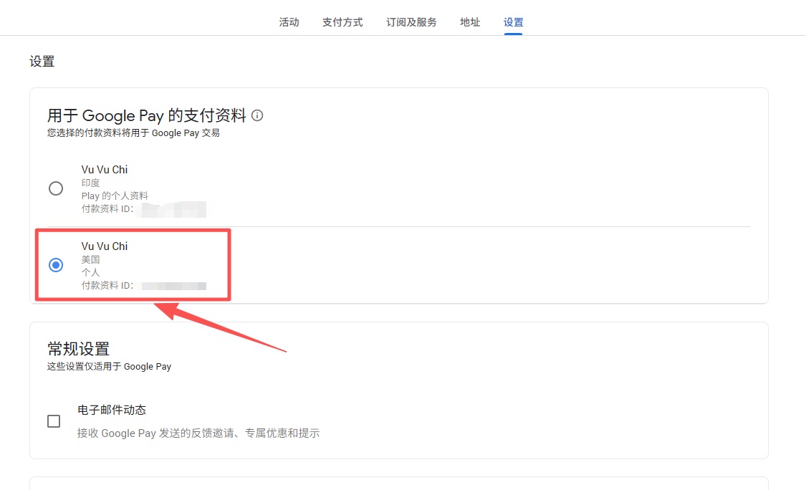

接着在安卓手机上打开 Play 商店 — 点右上角头像 — 设置 — 常规 — 账号和设备偏好设置，在**国家/地区和个人资料**中就可以看到有新旧两个支付资料可选，选择美国的新资料，**至此，换区完成！** 需要注意的是，如果还需要再次修改支付资料，需要等90天后了，所以修改后只显示美国一个支付资料。
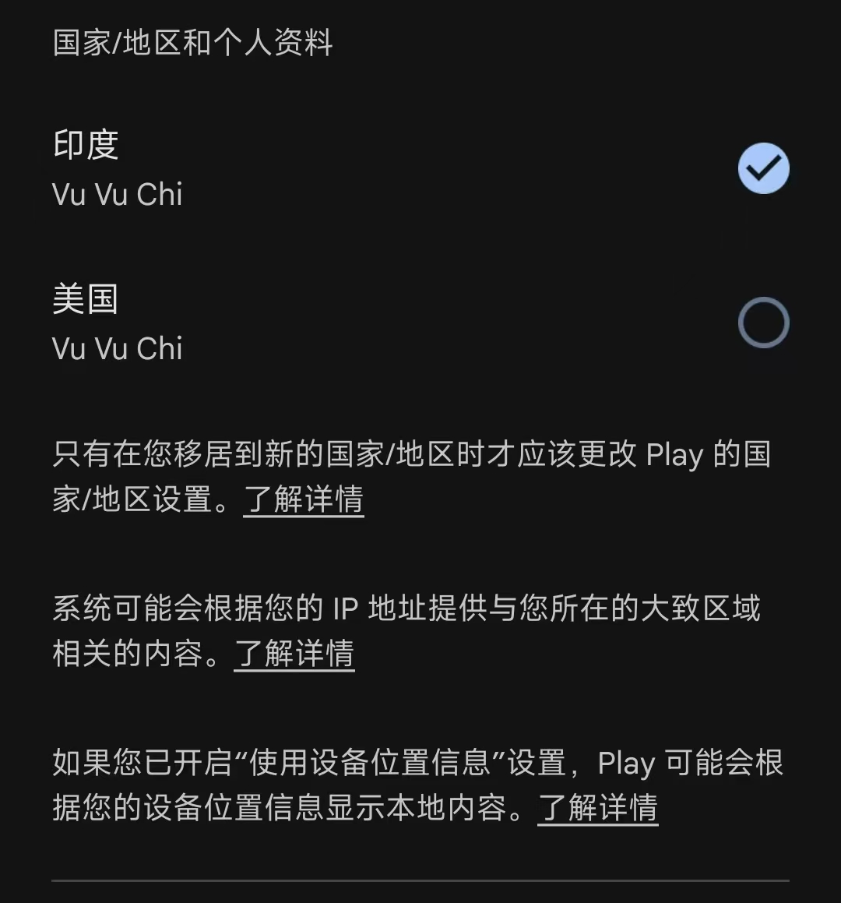
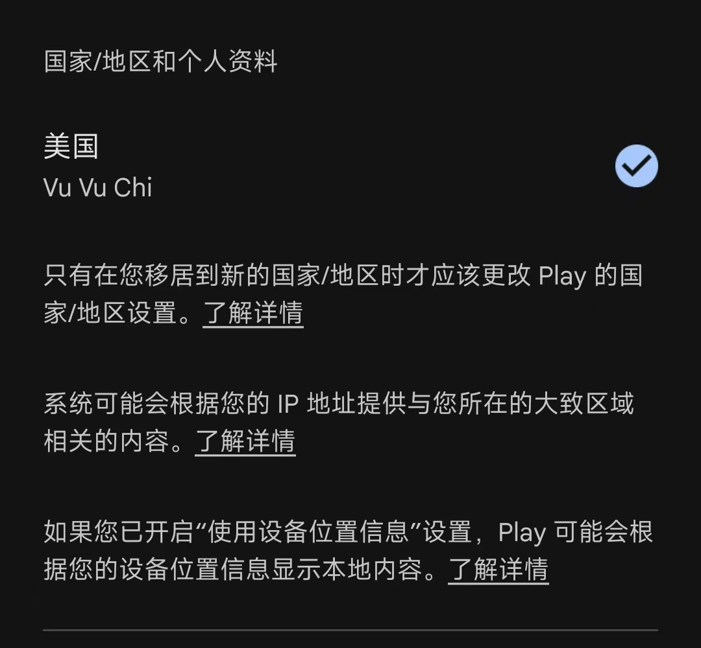

**操作完成后，相信大家就可以理解之前说的“支付资料 ≠ 你绑的卡”了。**

我们添加的卡只是支付方式，**有支付方式就一定要有支付资料，但是有支付资料不一定非要有支付方式，支付资料和支付方式页并非一一对应！** 无论有没有支付方式，你都可以根据实际情况更换支付资料，而**支付资料中填写的地址就决定了商店的地区**。

所以单纯的删卡并不能解除 Play 商店地区的固定，必须关闭支付资料才可以。我们也可以在不删卡的前提下通过添加和修改使用的支付资料来换区。大家也看到了，**本章操作全程，我们压根没去过“付款方式”这个页面！** 实际上，博主示范用的这个账号，一张卡都没有！
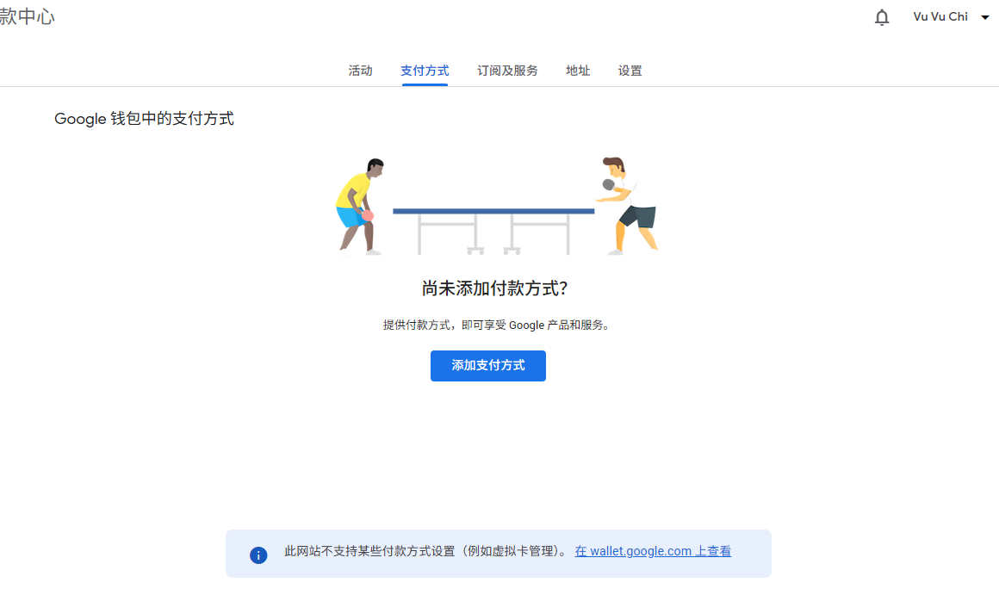

---

以上就是博主这次谷歌账号改区的完整操作流程。总体来说，服务地区修改并不复杂，真正容易踩坑的是 Play 商店地区以及支付方式和支付资料之间的关系。只要提前准备好手机设备验证、目标地区节点和对应地址，并确认两个地区都与家庭组管理员一致，成功加入家庭组的概率就会高很多。当然，谷歌账号风控策略随时可能变化，本文方法仅基于博主当前实测经验整理，大家操作前务必确认账号安全，谨慎修改，避免因频繁切换地区或验证失败导致不必要的风险。