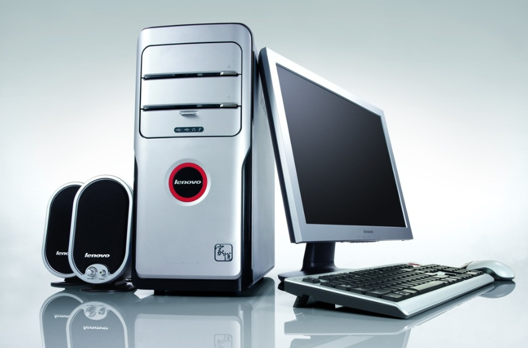
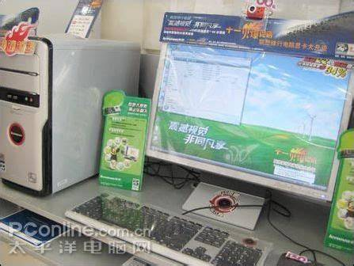
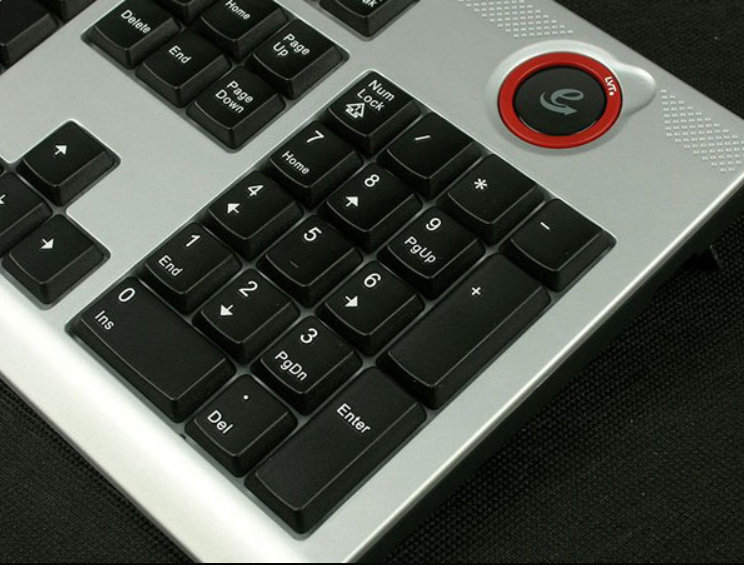
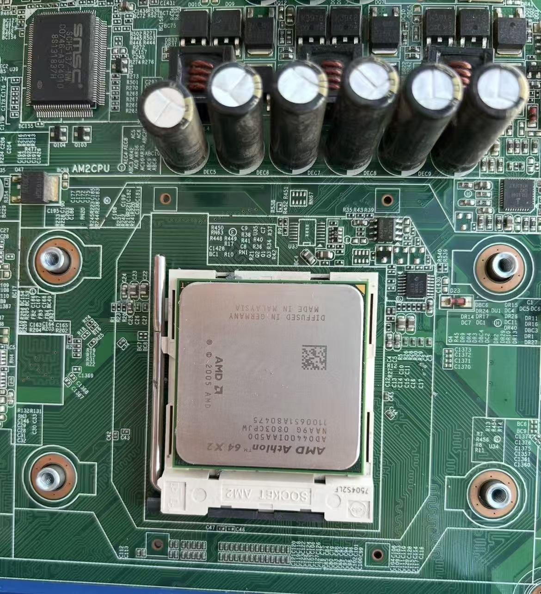
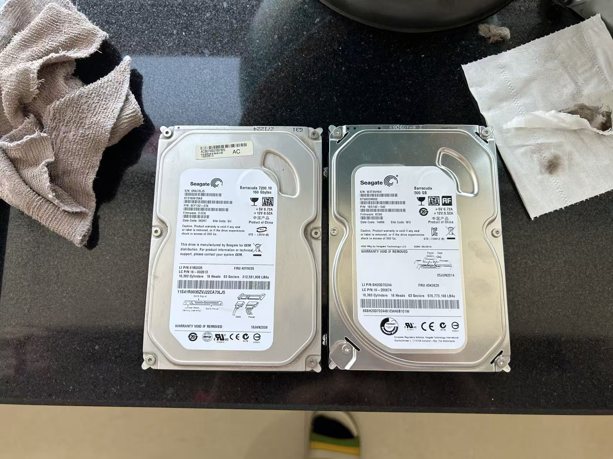
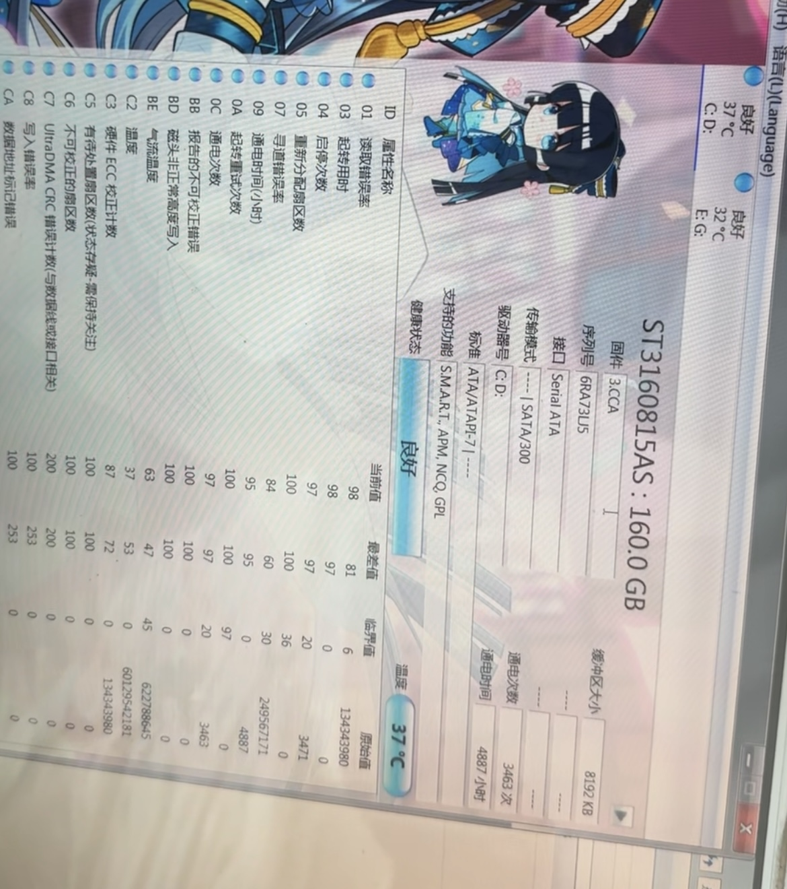

亲戚家里有一台 2008 年购入的联想家悦 U5050A 台式机，说起来，这台机器也算是博主的电脑启蒙之一。从画图到 Office，从祖玛到 4399，它承载着博主幼时对计算机的憧憬向往，更标志着那段时光的许多快乐回忆。

十八年过去，这台电脑早已跟不上时代，但放在老家偶尔查查资料、处理点简单文档，需求倒也不高。

2024 年初，亲戚说这台机器又要派上用场了，让博主帮忙整备一下，发挥一点余热。于是做了些简单升级，却遇到了一件至今想来都觉得有意思的 "怪事"—— **换了新硬盘之后，系统无论如何都装不进去、启不起来**。

最近这台老机器又出了状况，频繁出现疑似掉盘的症状，索性就借着这个机会，把当年的疑惑挖了个底朝天。这篇文章就来聊聊这台老电脑的故事，以及藏在它背后那些很多老玩家都踩过的硬件坑。

## 1 电脑基本情况

### 1.1 历史定位

当年只顾着徜徉在“计算机海洋”中的博主，自然对这款机型的历史并不了解，只是知道，嗯，是联想家悦，联想是大牌子，电源开关在顶部很方便，机箱很好看，22 寸的显示器足够大，电脑足够好玩。

现在回过头来查查资料，才懂得当时市场究竟是什么样的。这里就浅浅让豆包总结了一下：

联想家悦 U 系列是 2006 到 2008 年间联想主打的家用台式机产品线，定位面向普通家庭和学生群体，主打教育功能与性价比。那个年代的品牌机市场，联想家悦、方正卓越、戴尔 Inspiron 三足鼎立，而家悦系列凭借 "新联想 100 分学校"、"网络爸爸" 等本土化功能，在三四线城市和中小学家庭中拥有极高的市场占有率。

U5050A 作为家悦 U 系列的中配型号，上市时间大约在 2007 年后期，当时的官方指导价在 5000 多元。这个价位在 2008 年意味着什么？彼时一台主流配置的兼容机也要四千出头，而品牌机附带的正版系统、三年上门保修和教育软件，让很多家庭用户愿意多花几百块买个省心。

外观上，家悦 U 系列采用了欧洲蒙特里安艺术风格设计，银灰配色的立式机箱，17L 的体积在当年属于小巧精致的类型。顶置开关、前置 USB 接口、抗菌键盘等人性化设计，在当时的家用机中算是比较用心的了。

不过后面想来，什么"新联想 100 分学校"、"网络爸爸"、"LVT"，这些功能**一个也没用过**，小时候特别好奇键盘右上角那个大大的 e 按钮是干什么的，却又一直不敢按下去，听大人说按下去电脑所有数据就都没了。后来整备时，博主试图找到这款机型在 Vista 下完整的驱动和预置软件包，安装到 Win7 以补全这块体验拼图，但再也找不到完整资源了，能找到的软件也都不出意外地无法运行了。

### 1.2 硬件配置

不说那些没用的，一台电脑最重要的还是它的硬件配置指标，那就一起来看看 **拆机 + AIDA64 + 网络资料** 三方互相印证后得到的配置清单：

| 项目 | 详细信息 |
| :--- | :--- |
| 处理器 | AMD Athlon 64 X2 4400+ (2.3GHz, 65nm, AM2接口) |
| 内存 | 1GB DDR2 667MHz 单条 (主板提供双插槽) |
| 主硬盘 | 希捷 ST3160815AS (160GB, SATA 2.0, 7200转, 8MB 缓存) |
| 独立显卡 | NVIDIA GeForce 7300 LE, 128MB DDR2 显存, PCI-E x16 (微星代工) |
| 网卡 | 博通 BCM4401，10/100Mbps 自适应 |
| 主板 | 联想 M2VLE-RH (技嘉代工 OEM 主板) |
| 北桥 | VIA K8M890CE (集成 VIA Chrome9 核显) |
| 南桥 | VIA VT8237A (仅提供 2 个 SATA 1.0 通道) |
| 电源 | 航嘉 HK280-22GP (额定功率 180W) |
| 操作系统 | Windows XP Home SP2 |

在 2008 年的背景下，这是一套典型的“高配低芯”品牌机打法，整体应该属于**家用主流偏下**水平吧，性能足以应对日常办公、网页浏览和简单的网络游戏。速龙 X2 双核加持让它在多任务上表现不错，但联想可能是为了控制成本，采用了当时已经相对开始走下坡路的 VIA 芯片组方案。特别是那颗 VT8237A 南桥，为后来的种种怪事埋下了伏笔。整机额定仅 180W 的电源，带这套配置也是紧巴巴的“刚刚好”。

顺带一提，网上大部分资料都提到这款机型预装的应该是 Windows Vista Home Basic，但亲戚这台安装的确实也是联想 OEM 正版 Windows XP Home SP2。不排除是买到后商家重装的可能，但也有资料提到这款机型出了两种预装系统的版本。不管怎样， 1G 内存带 Vista，博主真得打个问号，哪怕是 Home Basic。不过这不是本文重点，在此不再讨论。

## 2 整备情况

2024 年初，由于亲戚需要重新使用这台电脑以便回到老家查阅资料和轻度办公，博主对它进行了升级整备。

博主对主机进行了彻底的清灰，更换了 CPU 硅脂，更换了 BIOS 电池，并加装了一条 2G 的 DDR2 内存组成 3G 容量，同时准备将系统从老旧的 XP 升级到 Windows 7 32位。其中**最重要的**环节，就是硬盘升级。

### 2.1 老硬盘和新硬盘

原机那块希捷 160GB 硬盘 *（下图左）* 已经连续工作了十几年，虽然容量勉强还够，但机械硬盘的老化是客观存在的 —— 寻道变慢、噪音变大、速度降低，随时有挂掉的风险。既然要继续用，换硬盘是第一要务。

正好，博主手头有一块闲置的技嘉 500GB 机械硬盘 *（下图右）* ，也是一台2015年左右联想电脑的拆机盘，比原硬盘缓存更大，容量也翻了三倍多。那就把它换上去吧。

两块硬盘的关键参数对比如下：

| 指标 / 内容 | 老硬盘 | 新硬盘 |
| 型号 | 希捷 ST3160815AS (Barracuda 7200.10) | 希捷 ST500DM002 (新酷鱼) |
| 容量 | 160GB | 500GB |
| 转速 | 7200rpm | 7200rpm |
| 固件 | 3.CCA |	KC66 |
| SATA 接口规格 | SATA 2.0 (3Gb/s) | SATA 3.0 (6Gb/s) |
| 物理扇区规格 | 512n | 512e / 4K AF |
| 生产时间 | 2008年1月 | 2014年6月 |
| FRU | 40Y9035 | 45K0629 |

后文为叙述方便，统一将**原厂希捷 160GB 称为老硬盘**，**后加装的 500GB 称为新硬盘**。

### 2.2 失败的尝试

最初的计划很简单：彻底换掉老硬盘，只用新硬盘。分出 100GB 做系统分区，剩下的做数据分区。然而**现实给了博主当头一棒。**

在新硬盘上安装 Windows 7 32 位，在 PE 内使用 WinNTSetup 安装过程一切顺利，但重启后，系统卡死在 Windows 7 的启动画面，四色球还没聚拢，**画面直接出现了黑白块的花屏，随后启动失败。**

整个启动前期也异常缓慢，伴随着硬盘疯狂的寻道声。博主以为是 Win7 的兼容性问题，于是换回 Windows XP，结果更惨，PE 中使用 Ghost 恢复完成并重启后，**直接在引导阶段黑屏死机，根本无法启动。**

经过反复多次、多种组合的折腾尝试，博主发现了一个规律：**在这台电脑上，无论是装 Win7 还是 XP，只有必须使用那块 160G 的老硬盘作为系统盘，才能正常开机进系统。** 但是进系统后，新硬盘作为数据盘的读写就一切正常了。

### 2.3 最终妥协

当时没有合适的 AI 辅助，能查到的资料也很少。一开始博主以为这是联想 OEM 的硬件校验机制 —— 品牌机出厂时绑定了原配硬盘的序列号，**换硬盘就不让启动系统，** 类似某些笔记本的电池校验。如果真是这样，那别说机械硬盘了，就连 SATA 固态升级计划也得泡汤。

另一个现实限制是：这台机器的 VT8237A 南桥**只有两个 SATA 通道**。原机一个接硬盘，一个接 DVD 光驱。如果要加第二块硬盘，**就得在光驱和硬盘之间二选一**。

和亲戚商量后，决定放弃光驱 —— 最终采用了这样的妥协方案：
* **老硬盘**划分为 C、D 两个分区：C 盘装 Windows 7 系统，D 盘装软件，代价是必须忍受近三分钟的漫长开机速度和较慢的使用体验。
* **新硬盘**划分为 E、F 两个分区：分别存放原老硬盘中的用户等数据，也作为新的数据盘。

简单说就是：系统必须留在老硬盘上，新硬盘只当数据盘用。虽然别扭，但至少容量和数据安全都得到了提升。这个方案一直用到了现在，其未解之谜也就这么搁置了。

## 3 深入研究：究竟是怎么回事

为什么新硬盘不能当系统盘？这个问题断断续续困扰了博主很久。一开始的 OEM 校验猜想，后来仔细想想站不住脚 —— 系统激活跟硬盘序列号没关系。而且如果是校验，作为从盘也应该不认新硬盘才对。

直到最近重新研究，经过查阅芯片组手册和相关技术文档、对比各种老平台案例、结合多个 AI 辅助分析和交叉比对，博主终于搞清楚了问题的根源。这事儿说穿了，就是**老南桥 SATA 控制器与新一代硬盘之间的兼容性鸿沟**，而且是**多层因素叠加**的结果。

要解释这个现象，必须先明白一个核心原理：电脑在开机引导阶段（看到 Windows 桌面之前），和进入系统后，对硬盘的访问使用的是两套完全独立的代码体系。

* **BIOS 阶段** (故障发生)：CPU 完全依赖主板固化的老旧 BIOS 固件，通过调用 `INT 13H` 中断来读取硬盘。
* **OS 阶段** (正常工作)：Windows 加载现代化的 SATA 驱动程序，直接接管南桥控制器，绕过 BIOS 读写硬盘。

### 3.1 问题一：4K 高级格式化 (AF) 遭遇 `INT 13H` 寻址错位

这应该是导致系统引导崩溃的首要元凶。

老硬盘是传统的 `512n` 扇区，盘片上每一个物理扇区就是 512 字节。2008 年的 VIA BIOS 里的 `INT 13H` 引导代码，是严格按照“1个物理扇区=512字节”写死的。

而新硬盘带有一个标志性的 **AF (Advanced Format) 4K 扇区**标志。它的物理扇区大小是 4096 字节，对外模拟成 8 个 512 字节逻辑扇区，即`512e`。

当新硬盘作为系统盘时，BIOS 笨拙地按照 512 字节的步长去读取。当跨越 4K 扇区物理边界时，老 BIOS 并没有相应的地址转换和时序等待逻辑，导致读取数据出现了严重的字节偏移。

这就导致了荒谬的一幕：硬盘里的数据是正确的，**但 BIOS 读进内存里的数据全是乱码。** 当 BIOS 把读错的启动画面位图数据塞给显卡渲染时，直接导致了“花屏死机”。

### 3.2 问题二：VIA VT8237A 的跨代 OOB 握手失败

如果说 4K 扇区让 BIOS 读错了数据，那 VIA 南桥问题则差点让硬盘都连不上。

新硬盘是 SATA 3.0 (6Gb/s)，而 VT8237A 南桥的 PHY 物理层仅支持古老的 SATA 1.0 (1.5Gb/s)。按照协议，新设备理应自动降速协商。但在 BIOS 自检的 OOB（带外信号）握手阶段，VIA 早期的固件太老了，并不能很好处理这样的问题。遇到 SATA 3.0 设备时，协商频繁超时、重置，处于极度不稳定的状态。

至于 SATA 2.0 老硬盘能正常用，博主猜测大概率在出厂时被联想通过固件锁死了 1.5Gb/s，完美避开了上述问题。不过这一点还有待考证。

### 3.3 问题三：Legacy IDE 模拟模式

或许是 VT8237A 这一代南桥的默认操作，又或许是联想 BIOS 默认设置，这台电脑会把 SATA 硬盘模拟成 IDE 硬盘工作（Legacy IDE Emulation）。这点从 CrystalDiskInfo 中老硬盘的传输模式 `---- | SATA/300` 也可看出（当前生效的传输模式为空）。

这么做的好处是在 XP 这种老系统下免驱，但代价就是：**IDE 模拟模式不支持 NCQ（原生指令排序）等高级特性。**

没有了 NCQ，新硬盘 4K 扇区不对齐带来的额外“读-改-写”惩罚会被放大，机械寻道效率很低。这就解释了为什么当年不仅花屏，启动过程还伴随着硬盘极其痛苦的疯狂寻道声。

### 3.4 为什么当从盘就没事？

因为作为数据盘时，它完美避开了系统开机最脆弱的 BIOS `INT 13H` 引导阶段。

进入 Windows 后，系统加载了专用的存储驱动，直接接管了南桥控制器。Windows 现代化的驱动体系不仅原生支持 `512e` 扇区转换，还拥有极强的重试和纠错机制，强行稳住了这条脆弱的 SATA 链路。所以，它躲在后面当数据盘时能“苟且偷生”。

## 4 最新问题

为什么博主会在一坤年后的今天，突然想起并深入研究这个问题？是因为最近几天，