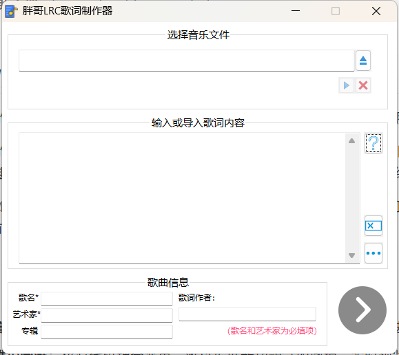
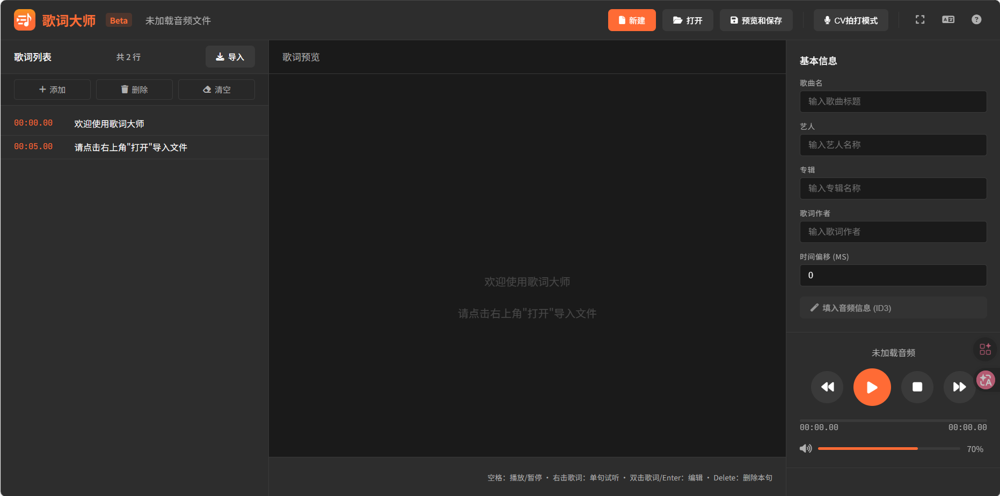
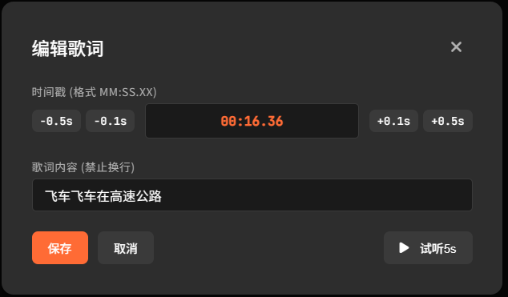
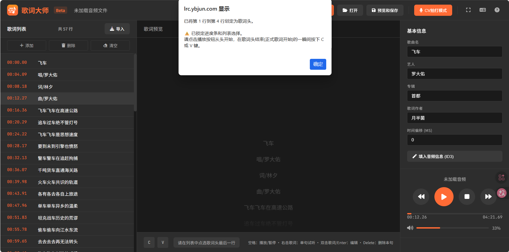
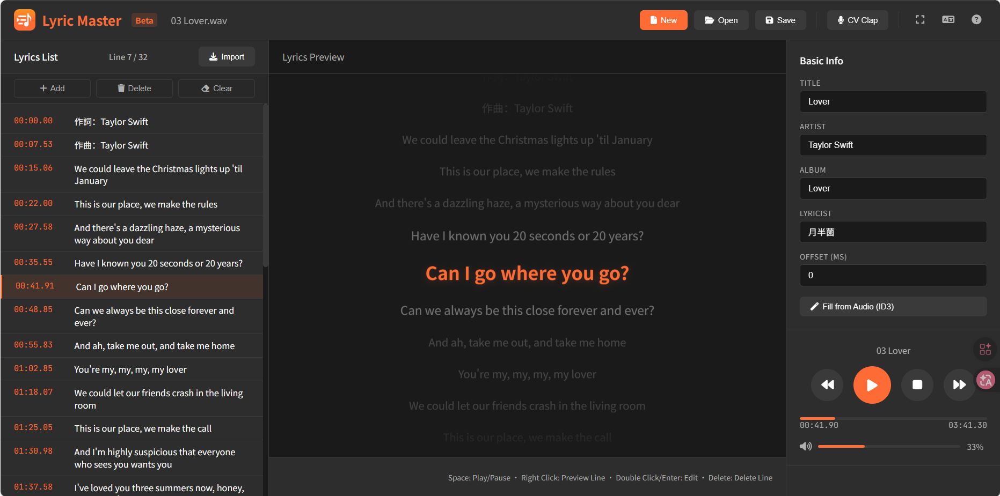

> **项目地址**：https://lrc.ybjun.com
>
> **帮助文档**：https://lrc.ybjun.com/help/


## 从“胖哥 LRC 制作器”说起

故事的起点要追溯到 2019 年。那时，笔者使用**易语言**编写了一款名为“胖哥 LRC 制作器”的桌面软件。

当时的初衷很简单：市面上的歌词制作软件要么过于复杂，要么功能陈旧。作为一个爱折腾的人，笔者决定**从零开始构想核心算法**，自己写一个。那时的我尚处编程入门阶段，甚至连数组的概念都运用得磕磕绊绊。

尽管如此，我还是实现了两个核心理念——**“ 拍打模式”**（像玩音游一样打轴制作歌词）和**“歌词头处理”**（线性插值分配前奏时间）。这两个功能成为了软件的灵魂。



然而，随着时间的推移，易语言开发的弊端逐渐显现：

- **鲁棒性差**：运行不稳定，偶发崩溃，且易语言本身的机制导致很难进行现代化重构。
- **维护困难**：核心代码耦合严重，难以扩展新功能（如撤销、实时预览、跨平台）。
- **环境限制**：易语言程序容易被杀毒软件误报，且仅限 Windows 平台。

为了延续这个好用的工具，并赋予它现代化的生命力，笔者决定进行一次彻底的**重构**。这次，笔者选择了 **Web 技术栈**。Web 应用具有跨平台、免安装、即开即用的巨大优势，且现代浏览器强大的 API (Web Audio, File System Access等) 足以支撑相对而言更专业的媒体处理需求。

于是，**“歌词大师 (Lyric Master)”** 诞生了。

## 2. 需求分析

**歌词大师**被定义为一款**纯前端、隐私安全、专业级**的在线 LRC 编辑器。



### 核心需求

1. **纯前端运行**：所有逻辑（音频解码、歌词解析和制作、歌词保存等）均在用户浏览器本地完成，服务器不接触用户任何文件，确保绝对的隐私安全。
2. **CV 拍打模式 (灵魂功能)**：保留并优化原有的键盘交互逻辑，支持触屏点击，让打轴变成一种享受。
3. **歌词头处理**：一键解决前奏/Intro部分的时间分配问题。
4. **全能编辑**：支持歌词的增删改查（CRUD）、时间戳微调、整体偏移（Offset）调整。
5. **ID3 信息读取**：支持一键读取音频文件内置的 ID3 标签（标题、艺人、专辑），自动填入歌词头部信息。
6. **文件系统集成**：利用现代浏览器 API，实现“打开音频自动关联同名歌词”的桌面级体验。
7. **国际化 (i18n)**：原生支持中英双语切换。

## 3. 技术实现深度解析

### 3.1 项目结构

本项目采用原生 HTML5 + CSS3 + Vanilla JavaScript 构建，未引入 Vue/React 等重型框架，保持极致轻量，没有后端。主要文件就是三大金刚`index.html`、`style.css`、`scripts.js`，外加多语言字典`translations.json`。

### 3.2 界面架构与组件

界面采用了经典的 **“左-中-右”** 三栏布局：

- **顶部 `Header`**：包含 Logo、全局操作按钮（新建、打开、保存）、模式切换（CV模式）、全屏/语言/帮助入口。
- **左侧歌词列表 (`.lyrics-panel`)**：显示所有歌词行，支持滚动、点击跳转、双击编辑、右击播放单句、导入纯文本歌词。还集成了 CRUD 工具栏（添加、删除、清空）。
- **中间预览区 (`.preview-panel`)**：
  - **视觉核心**：模拟Apple Music效果的高亮滚动展示。
  - **CV 指示器**：C/V 键的视觉反馈灯，支持触屏点击以方便平板用户使用。
  - **动态提示条**：根据当前模式显示操作指引。
- **右侧控制区 (`.control-panel`)**：
  - **信息编辑**：歌词元数据编辑、Offset 调整。
  - **播放控制**：步进步退、播放暂停、进度条、音量控制。

**模态框 (Modals) **： 为了保证交互的连贯性，项目包含了一套完整的模态框组件：

- `#welcomeModal`: 首次访问欢迎指引。
- `#dirAuthModal`: 引导用户授权文件夹访问权限。
- `#editModal`: 双击歌词时的详细编辑器（支持微调，如下图）。
- `#saveModal`: 导出预览，支持 LRC/纯歌词文本 格式切换及编码选择。
- `#portraitModal`: 移动端竖屏劝退提示。



### 3.3 核心算法与功能实现

#### A. ID3 信息一键读取

为了省去用户手动输入歌曲信息的繁琐，项目引入了 `jsmediatags` 库。当用户加载音频文件后，点击“填入音频信息”按钮，系统会解析 MP3/FLAC 文件的二进制头信息。

```javascript
// src/scripts.js (ID3 读取逻辑)
function readID3Tags(file) {
    new window.jsmediatags.Reader(file)
        .setTagsToRead(["title", "artist", "album"])
        .read({
            onSuccess: function(tag) {
                // 自动填充右侧输入框
                if (tag.tags.title) document.getElementById('songTitle').value = tag.tags.title;
                if (tag.tags.artist) document.getElementById('artistName').value = tag.tags.artist;
                // ...
                hasUnsavedChanges = true;
            },
            onError: function(error) {
                alert(t('msg_id3_read_error'));
            }
        });
}
```

#### B. 歌词解析与平滑滚动渲染

LRC 解析器使用正则表达式 `\[(\d{2}):(\d{2}\.\d{2,3})\]` 提取时间标签，将其转换为秒数（Float）。

在渲染层面，为了实现类似 Apple Music 的**丝滑滚动效果**，笔者放弃了传统的 `scrollTop` 滚动，而是采用了 CSS `transform: translateY` 配合贝塞尔曲线过渡。这种方式由 GPU 加速，性能极佳。

**实现原理**：

1. 容器设置为 `position: relative; overflow: hidden;`，并设置遮罩 `mask-image` 实现上下边缘渐隐。
2. 内容层设置为 `position: absolute; top: 50%;`（初始居中）。
3. 每次高亮更新时，计算选中行距离顶部的距离，通过负向 `translateY` 将其拉回中心。

```javascript
// src/scripts.js (渲染核心逻辑)
function updatePreview() {
    const container = document.getElementById('lyricsPreviewContainer');
    const allLines = container.querySelectorAll('.lyrics-line');
    
    // ... 清除旧高亮样式 ...

    if (selectedLyricIndex >= 0 && selectedLyricIndex < allLines.length) {
        const activeLine = allLines[selectedLyricIndex];
        activeLine.classList.add('current');
        
        // 【核心算法】计算偏移量
        // 目标：让选中行的中心点，与容器的中心点重合
        // 公式：偏移量 = 元素顶部距离(offsetTop) + 元素高度的一半(offsetHeight / 2)
        const offset = activeLine.offsetTop + (activeLine.offsetHeight / 2);
        
        // 应用位移
        container.style.transform = `translateY(-${offset}px)`;
    }
}
```

CSS 中配合 `transition: transform 0.4s cubic-bezier(0.25, 0.46, 0.45, 0.94);`，实现了富有惯性的滚动质感。

#### C. “灵魂功能”：CV 拍打模式算法

这是本软件最复杂的逻辑之一。核心采用**“打地鼠”策略**：用户按下按键的瞬间，代表确认了**下一句歌词**的开始，立即跳转到高亮**下一句**歌词，并记录按下按键的时间作为其时间戳。

```javascript
// src/scripts.js (CV模式核心逻辑)
function recordTimestamp(keyType) {
    const now = currentAudio.currentTime;
    
    // 逻辑：Target = Current + 1
    // 初始状态选中为-1，第一下按键 Target = 0 (第一句)
    const targetIndex = selectedLyricIndex + 1;

    if (targetIndex < lyricsData.length) {
        // 1. 视觉先行：立即选中目标行 (让用户看到焦点跳到了这句)
        selectLyricLine(targetIndex, false);

        // 2. 数据录入：将当前播放时间赋予这句歌词
        lyricsData[targetIndex].timestamp = now;
        lyricsData[targetIndex].time = formatTime(now);

        // 3. 刷新视图：更新列表中的时间显示
        updateLyricsList(); 
        
        // 4. 再次选中：确保重绘后依然保持选中
        selectLyricLine(targetIndex, false); 
        hasUnsavedChanges = true;
    }
}
```

#### D. 歌词头 (Header) 智能填充

针对歌曲前奏部分（如“作词：xxx”、“作曲：xxx”），用户只需划定范围，并在正式歌词开始的一瞬间按键。系统会利用**线性插值算法**倒推每一行的时间。

算法公式：
$$
t_i = \frac{T_{end}}{N} \times i
$$
 其中 $T_{end}$ 是正式歌词开始时间，$N$ 是歌词头总行数，$i$ 是当前行索引（从0开始）。这将保证第一行歌词头的时间严格为 00:00.00。



#### E. 国际化 (i18n) 方案

为了避免引入沉重的第三方库，设计了一套轻量级的**“字典 + 数据标签”**方案。

1. **字典 (`src/translations.js`)**：存储 `zh` 和 `en` 两套文案对象。
2. **HTML 标记**：使用 `data-i18n="key"` 标记文本，`data-i18n-placeholder` 标记输入框提示，`data-i18n-title` 标记按钮提示。
3. **驱动引擎**：编写 `updateLanguageUI()` 函数，遍历 DOM 树并替换内容。

```javascript
// src/scripts.js
function updateLanguageUI() {
    // 替换文本内容
    document.querySelectorAll('[data-i18n]').forEach(el => {
        const key = el.getAttribute('data-i18n');
        // 支持参数替换，例如 "共 {n} 行"
        const params = JSON.parse(el.getAttribute('data-i18n-params') || '{}');
        el.textContent = t(key, params); 
    });
    // ... 处理 title, placeholder 等属性 ...
}
```



## 4. 部署与 SEO 优化

### 4.1 部署方案

由于项目是纯静态、纯前端的，故直接选择 **Cloudflare Pages** 进行部署。

- **优势**：全球 CDN 加速、免费 SSL 证书、Git 自动流水线构建（Push 即部署）。
- **自定义域名**：绑定了 `lrc.ybjun.com`。

### 4.2 SEO 组合拳

为了让工具被更多人发现，进行了一系列 SEO 优化：

1. **Meta 标签**：完善了 `description` 和 `keywords`，涵盖了“LRC编辑器”、“CV拍打”、“Lyric Master”等中英核心词。
2. **Open Graph (OG)**：配置了社交媒体分享卡片。
3. **IndexNow**：这是一个“主动推送”技术。在根目录部署了 API 密钥文件，并配合 Cloudflare 的 Crawler Hints 或手动脚本，在每次更新时主动通知 Bing 搜索引擎，实现**分钟级收录**。例如。下方代码就是一个IndexNow提交申请的Python示例脚本：

   ```python
   import requests
   
   url = "https://api.indexnow.org/indexnow" # 一般这里填yandex更好提交，限制更少
   headers = {
       "Content-Type": "application/json; charset=utf-8"
   }
   data = {
       "host": "lrc.ybjun.com",
       "key": "你的API密钥",       # 填入生成的密钥
       "keyLocation": "https://lrc.ybjun.com/你的API密钥.txt", # 填入放在网站根目录的验证文件的URL
       "urlList": [
           "https://lrc.ybjun.com/",
           "https://lrc.ybjun.com/help/index.html"
       ]
   }
   
   response = requests.post(url, json=data, headers=headers)
   print(response.status_code, response.text)
   # 如果返回 200 或 202，说明通知成功
   ```

4. **站点验证**：放置了 Google 和 Bing 的验证文件，以便这两款搜索引擎定期爬取网站数据。

## 5. 踩坑实录

### Q1: 浏览器沙箱导致无法读取本地文件路径

**问题**：为了实现“打开音频自动加载同名 LRC”的桌面级体验，传统 `<input type="file">` 无法获取路径。

**解决**：使用 **File System Access API** (`window.showDirectoryPicker`)。让用户授权一个“工作目录”，浏览器返回目录句柄（Handle）。通过这个句柄，网页可以自由读取目录下的文件，并能直接回写文件（保存时无需弹窗下载）。

### Q2: 歌词列表排序的不确定状态

**问题**：在编辑或添加歌词时，如果立即按时间排序，会导致无时间戳的新歌词（通常是插在中间的空行或间奏）瞬间“飞”到列表底部，打断用户操作流。 

**解决**：引入**智能排序策略**。

- **添加/编辑无时间戳歌词**：**不排序**，严格保持在用户插入的位置（上一句之后）。
- **修改时间戳**：仅当检测到有效的时间戳变更时，才触发全局排序 `sortLyrics()`。

### Q3: 竖屏设备的适配问题

**问题**：复杂的左右分栏布局在手机竖屏上完全没法看，且打轴需要精确操作，手机屏幕并不适合。 

**解决**：与其勉强适配导致体验稀烂，不如**“劝退”**。增加了一个检测逻辑：`if (window.innerHeight > window.innerWidth + 10)`，则弹出一个全屏模态框，礼貌地提示用户“请旋转设备或使用 PC 访问”。

## 6. 快速入门指南

感谢你看到这里！如果你也有制作滚动歌词的需求，不妨试试 **歌词大师**。

### 🚀 30秒上手

1. **访问**：打开 https://lrc.ybjun.com。
2. **加载**：点击右上角“打开”音频，左侧“导入”歌词文本。
3. **模式**：点击顶部的 **“CV拍打模式”**。
4. **录制**：播放音乐，像玩音游一样，跟随歌词演唱节奏按下 **V 键**（或点击屏幕上的 V 指示灯）。
5. **导出**：制作完成后，点击“预览和保存”即可下载 LRC 文件。

**更多高级玩法（如歌词头处理、快捷键），请查看** [**完整帮助文档**](https://lrc.ybjun.com/help/)**。**

*技术改变生活，希望这个小工具能帮到每一位热爱音乐的朋友。*