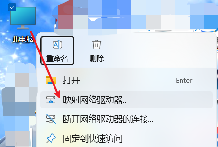
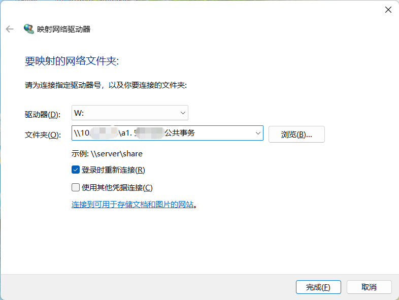
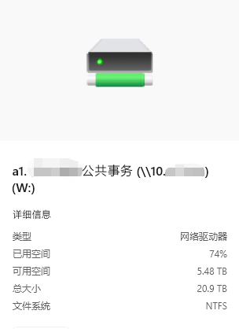
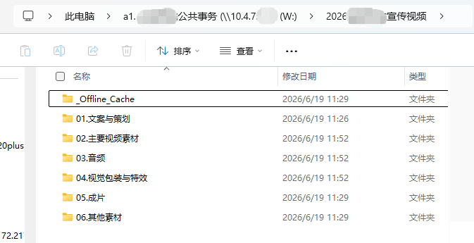
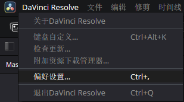
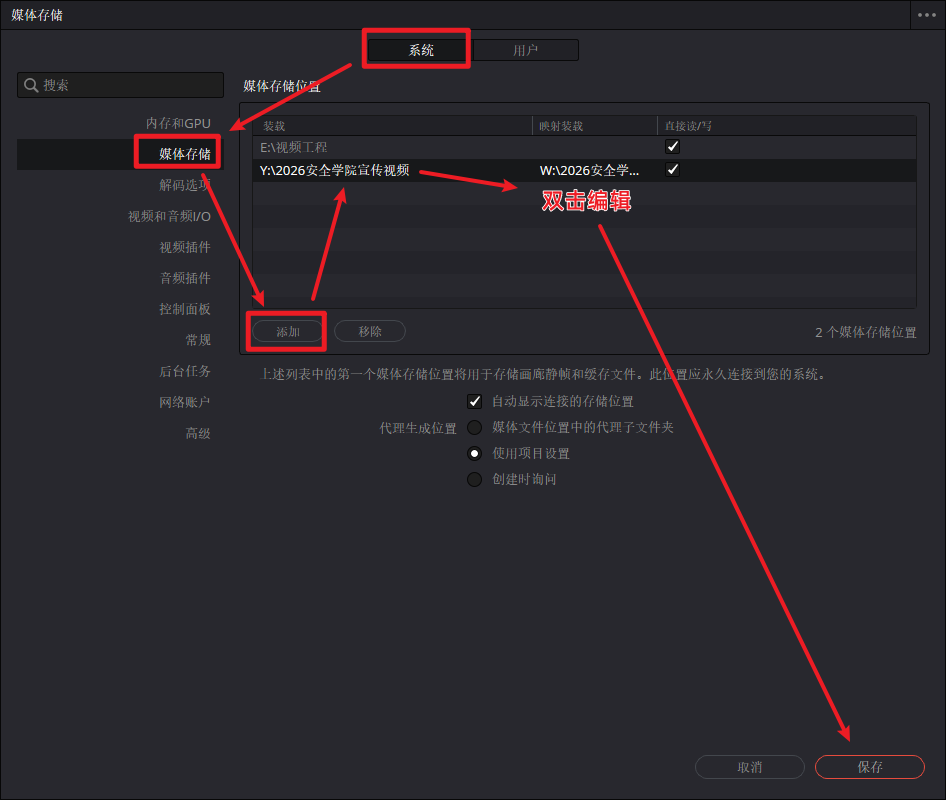
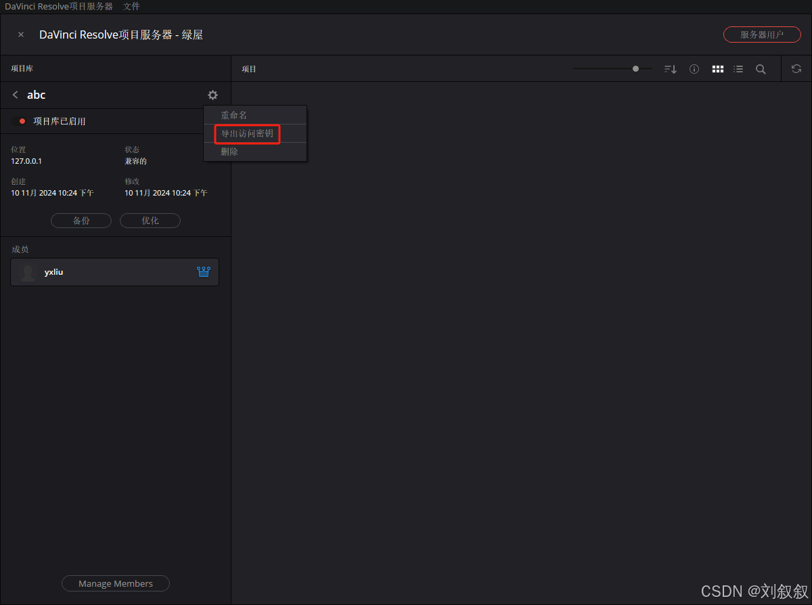
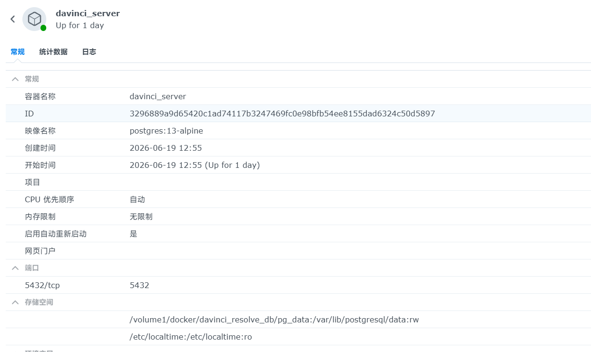

如果换上视频剪辑制作这个 Persona，那一定能看到**博主一直都是 DaVinci Resolve（后文直接叫“达芬奇”了）的“忠实拥趸”** 。在目前的视频制作全流程中，除了**部分重型 CG/MG/视效包装实在无法替代 After Effects** 之外，其余的剪辑、调色、混音、轻度视效等工作，博主已完全使用达芬奇来完成。

但一直以来，博主都是**单兵作战**，所有的工程和素材都堆在自己电脑的硬盘里。这次又接到一个大型的 2026 宣传片项目，考虑到项目素材量巨大、涉及多人协作，且博主本机的硬盘空间也已告急，所以决定尝试一下团队在线协同剪辑的工作流，发挥起手里这台群晖 NAS 的作用。

这篇文章完整记录博主将素材库和达芬奇项目库全部“上云（群晖 NAS）”、并配置本地代理缓存的全过程。无论你是影视飓风级别的大制作，还是小型工作室/校园团队，又或是像博主一样的“单兵作战”，这套工作流都绝对能保障数据安全，让我们事半功倍。

## 1. 项目素材库的构建

所谓“兵马未动，粮草先行”，**一套逻辑清晰的目录结构，绝对是大型视频项目不翻车的基础**。当然，素材管理这事儿向来“见仁见智”，无论是个人还是团队，都有自己用得最顺手的体系。下面博主也顺便分享一下自己沿用多年的项目素材库框架，希望能给大家提供一些参考。

### 1.1 创建项目库

首先需要在 NAS 上创建整个视频项目的目录。博主选择将其创建在群晖的共享文件夹下，路径为：`X:`/2026宣传片`。

按照博主的惯例，为了实现素材和内容的条理存放，博主在该目录下先期建立了如下的树状文件夹结构。大家可以直接参考这个目录树：

```yaml
- 01.文案与策划 # 存放基础文稿、分镜脚本、旁白稿、拍摄计划、arctime字幕工程文件等
- 02.主要视频素材: # 核心视频素材区
  - 01.实拍: # 实际拍摄的素材归档
    - 20260619_拍摄场景: # 示例：按拍摄日期+场景分类
      - A-Roll # 存放主镜头、带有关键叙事或同期声的素材
      - B-Roll # 存放空镜头、环境特写等辅助素材
  - 02.历史素材 # 往年积累的，可在项目中使用的视频素材
  - 03.网络素材 # 从网上搜集的新闻片段等素材
- 03.音频: # 声音相关工程与素材
  - 01.旁白配音 # 人声配音干音及处理后的文件
  - 02.音乐和音效 # BGM及各类转场音、环境音效
- 04.视觉包装与特效: # 动效及包装工程区
  - 01.AE项目 # 所有AE工程文件，如开头CG、各部分标题包装等
  - 02.其它项目 # prproj、psd、ppt等其它软件的工程项目及模板
  - 03.相关素材 # 制作特效所需的专属素材，如logo png、遮罩转场的mov等
  - 04.预渲染片段 # AE等软件输出的、供达芬奇直接调用的高画质成品片段
- 05.成片 # 存放各个版本的导出文件，命名如：01_修改内容.mp4，分支如01_1_xxx.mp4，样片如【样片】01_1_xxx.mp4
- 06.其他素材 # 临时杂项或未分类素材存放
- _Offline_Cache # 占位符警告目录！提醒团队成员缓存必须放本地，切勿写入NAS！
```

### 1.2 目录映射

在团队协作中，**最怕的就是媒体离线**。这通常是因为每个人电脑挂载 NAS 的盘符不同（比如博主挂的是 `Z:\`，同学挂的是 `D:\NAS`）。所以就需要在开始创作之前，**先做好目录映射**。

#### 1.2.1 无需目录映射的情况及 Windows 挂载项目素材库的方法

由于博主和团队成员用于达芬奇项目的电脑全是 Windows 系统，所以我们**完全不需要做任何目录映射**！我们可以直接**统一使用 UNC 路径**访问 NAS，因为 NAS 的 IP 是固定的。例如： `\\10.4.7.2\A1.公共事务\2026宣传片` 。在达芬奇里直接从这个网络路径拖入素材，数据库里记录的就是这个绝对网络地址。只要大家都连在同一个局域网下，打开工程就能链接上素材。

当然，**更标准的做法**还是建议大家把素材库目录挂载为一个 Windows 网络驱动器，这样更符合规范，鲁棒性也更强。方法是：

* 右击桌面**此电脑**图标，点击**映射网络驱动器**。
* 在弹出的窗口中选择一个空闲的驱动器号，下方填上 NAS 中你所有视频项目库的总路径（例如博主就填 `\\10.4.7.2\A1.公共事务`），点击**连接**，输入账号密码，就 ok 了。

:::tip
选择驱动器号时，建议从后往前选，不建议选`X:`。推荐`Z:``Y:``W:`等都可以。不建议选`X:`的原因是 Windows PE 默认把内存盘挂载到`X:`，虽然这不是 PE 环境，但为了避免某些软件不必要的冲突和问题，我们还是避开一下吧。
:::

:::warning
如果你的电脑网络环境要改变（例如笔记本电脑要带出去出差），**强烈建议先把这些映射的网络驱动器断开连接再走**，等回来再重新挂载，**否则换网后，一打开“此电脑”就会卡死好长时间**。巨硬的史山还在发力！
:::


这样，我们就已经把`\\10.4.7.2\A1.公共事务`挂载为了 `W` 盘，可以直接通过 `W:\2026宣传片` 访问项目素材库。**如果其他成员在 Windows 系统上也采用相同的挂载路径`\\10.4.7.2\A1.公共事务 -> W:\`，那我们所有成员也都不用去做目录映射**。


#### 1.2.2 需要做映射的情况（盘符不统一或跨系统协作）

如果在团队协作中存在以下两种情况，非基准路径的协作者就必须在达芬奇中配置路径映射，否则一打开云端工程绝对满屏爆红，提示“媒体离线”。

* 情况一：Windows 团队内部盘符不统一。 比如博主作为项目主导，最先导入素材，定下的基准挂载盘符是 `W:\`。但**某位协助剪辑的成员电脑上的 `W:\` 已经被其他硬盘占用了**，他只能将 NAS 挂载为`Y:\`。
* 情况二：跨操作系统协作（如 macOS）。 如果团队里有使用 Mac 的同学，因为 macOS 的底层是 Unix，它**根本不认识 Windows 的驱动器号和 UNC 路径**，通过 SMB 连上 NAS 后，共享文件夹 `\\10.4.7.2\A1.公共事务` 默认会被挂载到底层的 `/Volumes/A1.公共事务` 目录下。

**无论是哪种情况，使用了“非基准路径”的同学，都需要在自己的达芬奇里设置映射，让软件学会自动“翻译”路径。**

**具体怎么做：**

假设我们在前文确立的项目基准路径是 `W:\`，而协作者本地的实际挂载路径是 `Y:\`（或 Mac 端的 `/Volumes/A1.公共事务`）。

1. 在协作者的电脑上打开达芬奇，点击`左上角菜单 DaVinci Resolve -> 偏好设置`。
2. 选择第一项 `系统 -> 媒体存储`。
3. 在媒体存储位置列表中，点击下方的添加按钮，浏览并选择该电脑当前的实际挂载目录（即 `Y:\` 或 `/Volumes/A1.公共事务`）。此时列表中会新增一行。
4. 最关键的一步！ 在新增的这一行中，找到 **映射装载** 这一列，手动双击输入框，填入团队统一使用的基准盘符，即 `W:\`。保存即可。


这样设置，相当于给这台电脑的达芬奇塞了一本**翻译字典**。当它从 PostgreSQL 协作数据库中读到 `W:\2026宣传片\A-Roll\xxx.mp4` 这条记录时，就会自动查字典，把前缀 `W:\` 替换成本地的 `Y:\`（或 `/Volumes/...`），从而精准找到 NAS 上的实体素材。

反之，当这位同学向项目里拖入新素材时，达芬奇也会自动将本地路径反向翻译成 `W:\...` 然后再写入数据库。这样就能彻底解耦本地物理路径与数据库元数据，**不管大家用什么系统、挂什么盘符，双方的媒体统统不离线！**

### 1.3 总结

至此，视频的项目素材库我们就建好了。**我们需要确保后续所有与该视频相关的内容，都严格按照分类扔进这个 NAS 目录里**。绝对禁止大家把素材遗漏在桌面上或者个人的下载文件夹里，否则一旦换电脑或者协同剪辑，马上就会体会到满屏红色的痛苦。

## 2. 达芬奇服务器的构建

### 2.1 介绍和准备

#### 2.1.1 什么是达芬奇服务器？

达芬奇官方提供了一个名为 **DaVinci Resolve Project Server** 的软件，用来实现多人的云端协同剪辑。但剥开它的 GUI 外壳，它的底层其实就是一个纯粹的 **PostgreSQL 数据库**。


#### 2.1.2 为什么用 PostgreSQL Docker？

官方的安装包**只有 Windows、macOS 和适用于特定几种发行版的 Linux 版**。对于群晖 DSM 这种系统，官方软件根本无法运行。有些小伙伴会选择在 NAS 里开个 Windows 虚拟机来跑，这极其浪费资源。 

既然它的本体就是数据库，我们可以选择直接在群晖里跑一个 **PostgreSQL 数据库** 的 Docker 容器。内存占用不到 100MB，也能达到同样目的。为了保证达芬奇的兼容性，我们选择 **13 版本**。

#### 2.1.3 注意网络瓶颈

在开始前，请务必确保你的剪辑电脑与 NAS 之间有**至少千兆（1Gbps）的稳定有线连接**。视频剪辑对网络的考验不是平均吞吐量，而是拖拽时间线时极其恐怖的**高频并发随机读取**。如果不满足千兆，即使勉强能连上，软件也可能频繁无响应甚至崩溃。

### 2.2 服务器创建

#### 2.2.1 检查端口占用

达芬奇客户端连接数据库时，底层**硬编码死锁了 `5432` 端口**。在部署前，我们需要通过 SSH 连入群晖 NAS，检查这个端口是否可用：

```bash
sudo netstat -tulpn | grep 5432
```

博主的输出结果如下，实际上群晖 DSM 默认情况下输出的都是这样：
```plaintext
tcp        0      0 127.0.0.1:5432          0.0.0.0:*               LISTEN      29138/postgres
```

看起来好像已经被占用了，其实是 DSM自身占用着 5432 端口（用于群晖的照片、Drive等内部索引）。 进一步切换到系统的 Postgres 用户并列出所有的现行数据库：
```bash
sudo su - postgres -c "psql -l"
```
我们会看到一张表格，里面的 Name 栏目出现了 `synofoto`、`synoindex` 等字眼。这就实锤了它是群晖官方的底层设施。
```
                                       List of databases
    Name     |           Owner            | Encoding  | Collate | Ctype |   Access privileges
-------------+----------------------------+-----------+---------+-------+-----------------------
 autoupdate  | postgres                   | SQL_ASCII | C       | C     |
 download    | DownloadStation            | SQL_ASCII | C       | C     |
 mediaserver | MediaIndex                 | UTF8      | C       | C     |
 ong         | SynologyApplicationService | SQL_ASCII | C       | C     |
 postgres    | postgres                   | SQL_ASCII | C       | C     |
 synofoto    | SynologyPhotos             | UTF8      | C       | C     |
 synoindex   | MediaIndex                 | SQL_ASCII | C       | C     |
 template0   | postgres                   | SQL_ASCII | C       | C     | =c/postgres          +
             |                            |           |         |       | postgres=CTc/postgres
 template1   | postgres                   | SQL_ASCII | C       | C     | =c/postgres          +
             |                            |           |         |       | postgres=CTc/postgres
(9 rows)
```

那这该怎么办，**不用慌！** 仔细看，群晖只占用了本地回环地址 `127.0.0.1`。这意味着我们只需要在 Docker 部署时，**强制将容器端口绑定到 NAS 的物理局域网 IP 上**，就能完美避开冲突。

#### 2.2.2 拉取 Docker 镜像与创建容器

在 NAS 的 Docker 存放目录创建新文件夹（博主的是 `/volume1/docker/davinci_resolve_db`），新建一个 `docker-compose.yml` 文件，写入以下内容：

```yaml
// docker-compose.yml
version: '3.8'
services:
  davinci-postgres:
    image: postgres:13-alpine
    container_name: davinci_server # 容器名
    restart: unless-stopped
    environment:
      - POSTGRES_USER=postgres # 用户名，一般保持默认即可
      - POSTGRES_PASSWORD="YourPasswordHere" # 请替换为你的密码。注意：密码请务必加上双引号！
      - POSTGRES_DB=AQXYNAS_DaVinci # 这个变量不仅是数据库名，它也将是你在达芬奇里填入的“项目库名称”！
    ports:
      - "10.4.7.2:5432:5432" # 强制指定局域网IP，解决群晖系统127.0.0.1端口冲突
    volumes:
      - /volume1/docker/davinci_resolve_db/pg_data:/var/lib/postgresql/data # 务必加上 /pg_data 这一级子目录
      - /etc/localtime:/etc/localtime:ro
```

然后，在 SSH 中定位到此目录，**先创建`pg_data`目录**，再运行 `docker-compose up -d`，等待拉取镜像并创建容器完成，看到容器管理器里正常运行即可。

```bash
cd /volume1/docker/davinci_resolve_db
mkdir pg_data
docker-compose up -d
```

