大家是否还记得这样一个画面：在那个使用 Windows XP 或 Windows 7 的年代，每当我们遇到意外断电或是强行长按电源键关机，再次开机时，原本熟悉的滚动条过后，迎来的不是桌面，而是一个蓝色或黑色的界面。屏幕上飞速跳动着一排排白色的英文字符，错过跳过的机会，需要等待好几分钟……

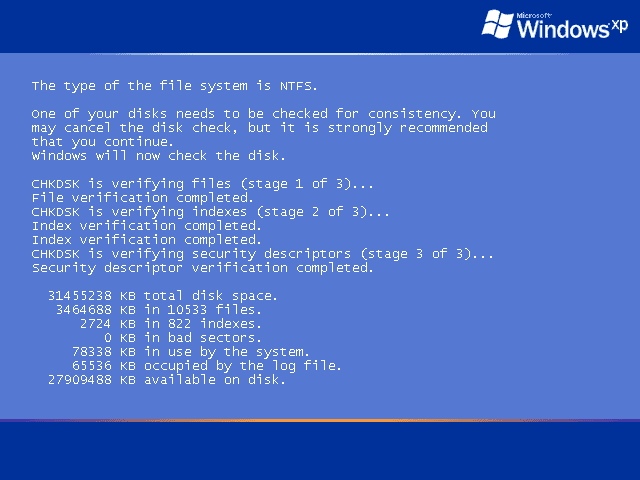

对于不熟悉电脑的朋友，和当时还处于童年时期的我们来说，这个无法用鼠标操作、满屏代码的界面简**直就是“童年阴影”，看着就像是电脑彻底坏掉了**。

但作为一个计算机爱好者，你是否思考过：**这个界面究竟是什么？它运行在操作系统的哪一个阶段？** 既然它能在进入桌面之前显示文字，那么我们能不能自己写一段代码，把我们的专属程序塞进这个神秘的阶段呢？

本文就来彻底扒下它的“底裤”，以及跨越二十年的技术演进。然后我们亲手用 C 语言“裸编”一个底层原生程序，尝试劫持 Windows 的启动过程，在这个阶段显示我们自己的内容！

## 1 这个神秘阶段究竟在干什么？

首先我们要为这个界面的程序正名。它既不是系统崩溃导致的蓝屏死机，也不是我们平时使用的命令提示符。它的真名叫做 **`autochk.exe`**（Auto Check Disk），是 Windows 系统内置的原生磁盘检查程序。

### 1.1 脏位

为什么只有非正常关机时它才会跳出来？这要归功于硬盘文件系统中的一个核心机制：**“Dirty Bit”**。

脏位（Dirty Bit）是计算机系统中的一个二进制位，用于表示**存储段中的数据是否已经被系统硬件修改过**。脏位的值可以是 `0` 或 `1`，其中 `0` 表示数据**未修改**，`1` 表示数据**已修改**。脏位在NTFS中记录在分区元数据内，在FAT16/FAT32下则是直接硬编码在 FAT 表的表头保留条目中。

不管咋样我们可以把脏位通俗地理解为挂在硬盘分区大门上的**一个“施工中”牌子**。当 Windows 系统正常启动并挂载硬盘分区时，内核会把这个分区的脏位置为 1；当你点击“关机”，系统有序地关闭所有程序、保存完数据并卸载硬盘时，内核会负责把脏位清零。

脏位主要有两大作用：

1. 用于追踪数据的修改状态，以便在系统崩溃时进行数据恢复。
2. 用于控制数据的写入，以提高系统性能。

但是，**如果发生了突然断电，系统根本来不及清零脏位**。下次开机启动时，系统一看硬盘上还挂着“施工中”的牌子，就知道上次的文件系统状态可能遭到破坏。为了防止带着内部错误继续运行导致数据大面积丢失，系统就会强制触发 `autochk.exe` 进行紧急抢修。

我们甚至可以在 Windows 的命令提示符中用下面命令强制将C盘脏位设置为1，下次开机必定触发磁盘检查！

```cmd
fsutil dirty set C:
```

### 1.2 时代的进步

仔细回想一下，在如今的 Windows 10 或 Windows 11 中，你似乎**很难再见到**这满屏跳动的英文字符了。这主要是因为两点：

**一方面是底层技术的更新**。现代 NTFS 文件系统拥有极其强大的日志恢复能力，配合微软后来引入的后台热修复（Spot Fix）机制，绝大多数的小错误在系统运行中就被悄悄抹平了。 不过，脏位和磁盘检查这套体系还是存在的哈！

**另一方面则是 UI 友好的改进**。为了不引起普通用户的恐慌，微软将这套让人害怕的文本输出彻底隐藏了起来。如今就算触发了磁盘检查，你也只能看到现代开机 Logo 下方一句温和的“正在扫描和修复驱动器”，配合着一个转圈动画，这样就不会让普通用户被吓到了。

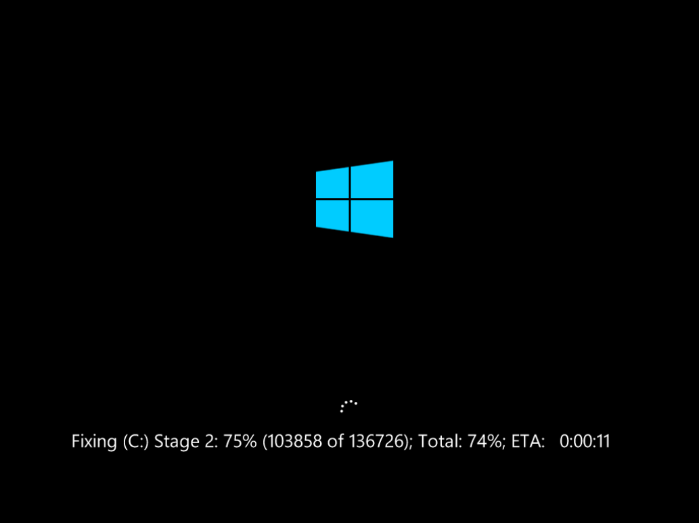

## 2 运行在“无主之地”

要想把我们自己的程序塞进这个位置，我们必须先摸清它的底细。了解这个`autochk.exe`究竟运行在 Windows 启动的哪个阶段。

如果用最简单的链条概括 Windows 启动的流程，大概经历了这样的交接：`winload` (引导器) -> `ntoskrnl` (内核) -> **`smss.exe` (会话管理器)** -> `win32k/csrss` (图形与环境) -> `logonui` (欢迎登录界面)。

今天我们的主角，就是 **`smss.exe`**。当操作系统内核刚刚把底层的内存、硬件初始化完毕后，它创建的**第一个**用户态（Ring 3）进程就是 `smss.exe`。可以这么说，它是整个 Windows 用户空间的“创世神”。

当 `smss.exe` 启动时，它会去读取注册表中的一个**特殊键值**，串行执行里面登记的程序，而 `autochk.exe` 就登记在这里。我们看到的那个蓝屏字符界面，其实就是这个阶段的输出画面。

此时的程序运行在一个极度受限的 **Native（纯原生）状态**，堪称程序的“无主之地”。此时：

- **没有 Win32 子系统**：这里没有GUI、没有鼠标，甚至连“C盘、D盘”这种 DOS 路径概念都不存在。
- **没有 C 标准库（CRT）**：我们熟悉的 `printf` 打印、`fopen` 读写文件在这里统统失效。就连读取键盘输入也只能截获最底层的数据包。
- 这里的程序**只能**使用系统内核暴露出来的**最底层**的 `ntdll.dll`，调用那些以 `Nt` 或 `Zw` 开头的原生 API。因为`ntdll`是所有用户态程序和内核态唯一的“桥梁”。

## 3 如何在荒野中“点火”？

要在没有图形界面标准库、仅有`ntdll`的支持下写程序，我们**必须使用纯 C 语言**，并依靠微软的C++开发套件进行**无依赖裸编**。

### 3.1 环境构建

如果你有Visual Studio，那只要保证把**使用C++的桌面开发**这个工作负荷安装好就ok了。

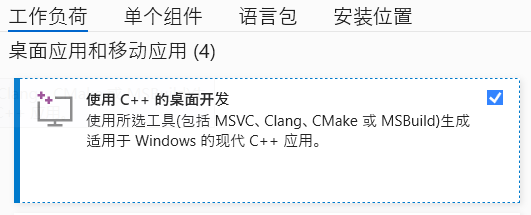

但博主刚把VS卸载，所以就演示一下如果要用**VSCode开发**，需要怎么配环境。

首先需要安装Visual Studio Build Tools，我们可以在[Visual Studio 官方下载页](https://visualstudio.microsoft.com/zh-hans/downloads/)下方找到最新版的下载。

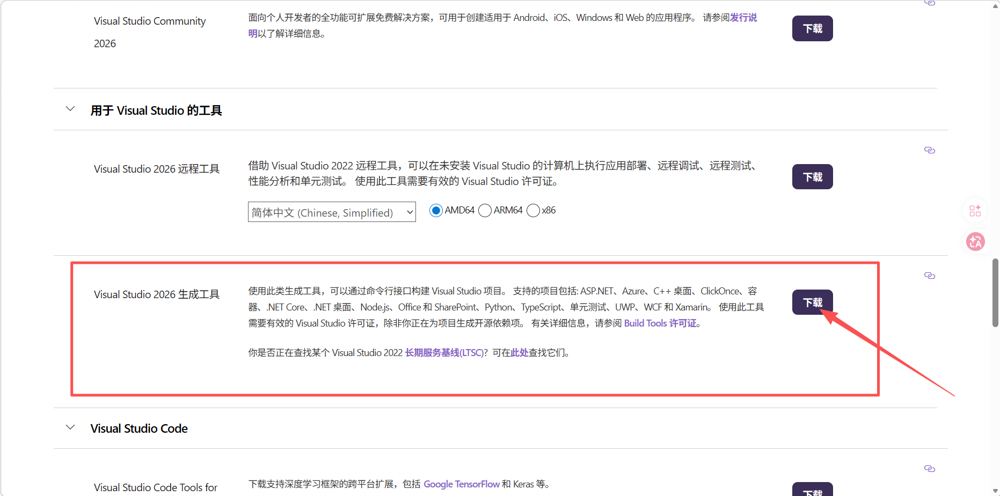

运行安装时，同样是确保把**使用C++的桌面开发**这个工作负荷勾选安装，安装完成即可。

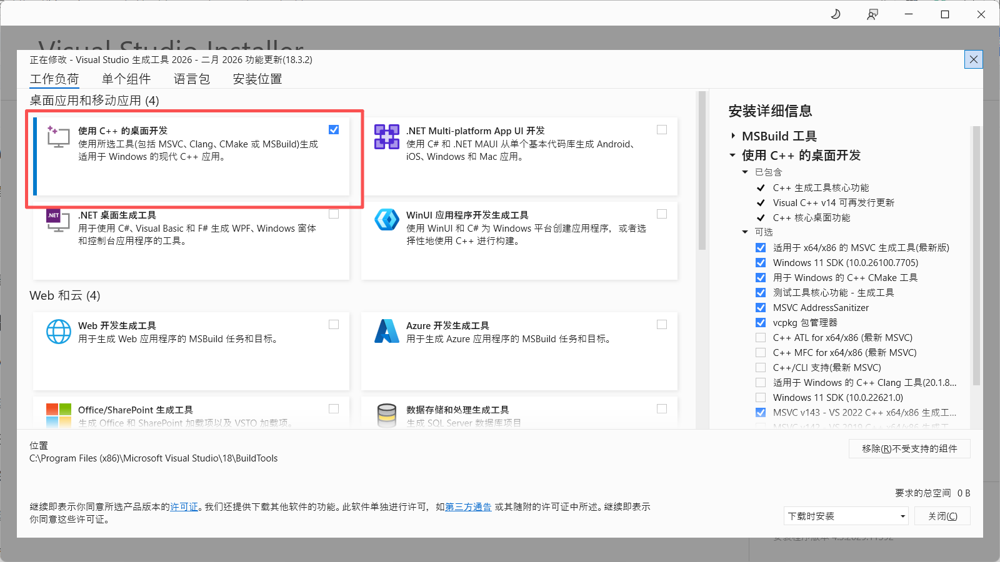

安装好后，在开始菜单程序列表中，我们会看到新增了**开发者命令提示符**以及**开发者 Powershell**两个入口。后续我们编译程序时需要用到。

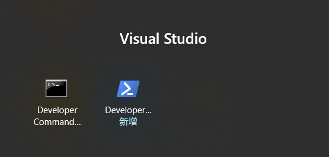

接着打开VSCode，安装下图三个插件，以便得到C/C++的功能支持：**C/C++、C/C++ DevTools、C/C++ Extension Pack**。

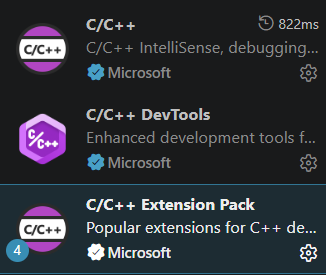

### 3.2 环境与代码的思维转换

我们刚才说了，硬盘检查的这个阶段属于 Native 状态，因此我们要编译的也是**Native 程序**。它和普通的 Win32 窗口及控制台程序是有区别的。所以首先我们先来说一下这个问题。

其实，我们在使用Windows时常见的**可执行程序文件`*.exe`**、**动态链接库文件`*.dll`**、**驱动文件`*.sys`**、甚至还有**UEFI启动文件`*.efi`** 等等，在二进制结构上**没有任何区别！** 它们统统都是 **PE（Portable Executable）文件格式**。

既然结构一样，Windows 是怎么区分它们的？秘密在于 PE 文件的**文件头（Header）**里有一个叫 Subsystem（子系统）的标志位：

* 如果 `Subsystem = WINDOWS_GUI`，系统就知道这是个带窗口的 `.exe`。
* 如果 `Subsystem = WINDOWS_CUI`，系统就知道这是个控制台黑框框程序。
* 如果 `Subsystem = NATIVE`，系统就明白这是个不需要用户干预、直接调用底层或内核的原生程序或驱动程序。

所以，我们要想编译在 Native 状态可运行的程序，自然需要确保编译时，将`Subsystem`设置为`NATIVE`。这个倒是问题不大，使用刚才的开发者命令提示符带参数编译即可，这个我们后续再说。而且，这种程序是**无法直接在正常的桌面环境运行**的。比如我们尝试在桌面环境运行`autochk.exe`，就会提示：

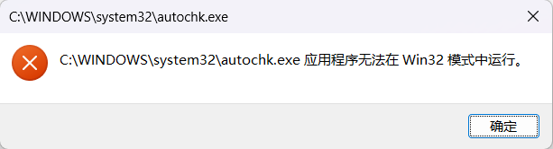


此外，在编写 Native 程序时，我们也需要抛弃过去写 C 语言的习惯：

1. **入口点异变**：程序的入口绝不能是 `main()`，而是标准的 `NtProcessStartup`。
2. **重塑数据类型**：我们需要手工定义 `NTSTATUS`、`UNICODE_STRING` 等底层结构体。
3. **系统中断调用**：打印文本只能通过 `NtDisplayString`，延时只能用 `NtDelayExecution`。

### 3.3 劫持运行的原理

编译出我们的原生程序（假设命名为 `yb_boot.exe`）后，只需将其放入 `C:\Windows\System32\` 目录。然后在注册表中的 `HKEY_LOCAL_MACHINE\SYSTEM\CurrentControlSet\Control\Session Manager\BootExecute`这个值下追加我们的程序名`yb_boot` ，就能让 `smss.exe` 乖乖地执行我们的代码。`smss`会**串行执行**这里列出的所有程序命令。所以相当于我们的程序会运行到磁盘检查之后。


## 4 开始实战

接下来，我们正式进入敲代码环节。我们的挑战分为三关，需求越来越复杂，我们也会逐步深入地体会在系统底层编程的感觉和难度。

### 4.1 第一关：输出自己的slogan

我们的第一个目标很简单：在开机的这个阶段，打印一段 ASCII 字符，展示我们的slogan，停留 5 秒后程序自我了断，让系统继续启动。

#### 4.1.1 写代码

```c
// yb_native_v1.c

// 只链接ntdll
#pragma comment(lib, "ntdll.lib")

// ==========================================
// 1. 手工定义 Windows 底层数据类型
// ==========================================
typedef long NTSTATUS;
typedef unsigned short USHORT;
typedef void* PVOID;
typedef long long LONGLONG;

// 著名的 UNICODE_STRING 结构体
typedef struct _UNICODE_STRING {
    USHORT Length;
    USHORT MaximumLength;
    const unsigned short* Buffer; // PWSTR
} UNICODE_STRING, *PUNICODE_STRING;

typedef struct _LARGE_INTEGER {
    LONGLONG QuadPart;
} LARGE_INTEGER, *PLARGE_INTEGER;

// ==========================================
// 2. 声明要使用的 ntdll.dll 原生 API
// ==========================================
// 初始化字符串
__declspec(dllimport) void __stdcall RtlInitUnicodeString(PUNICODE_STRING DestinationString, const unsigned short* SourceString);
// 原生打印文字函数
__declspec(dllimport) NTSTATUS __stdcall NtDisplayString(PUNICODE_STRING String);
// 原生延时函数
__declspec(dllimport) NTSTATUS __stdcall NtDelayExecution(unsigned char Alertable, PLARGE_INTEGER DelayInterval);
// 结束进程
__declspec(dllimport) NTSTATUS __stdcall NtTerminateProcess(PVOID ProcessHandle, NTSTATUS ExitStatus);

// ==========================================
// 3. 程序的入口点，不是main
// ==========================================
void __stdcall NtProcessStartup(PVOID ArgumentBlock) {
    UNICODE_STRING msg;
    LARGE_INTEGER delay;

    // 准备要打印的内容 (使用 \n 换行，L 代表 UTF-16 宽字符)
    // 注意：在这个极早的阶段，不支持中文字体渲染！只能用英文或 ASCII 画。
    const unsigned short* text = L"\n\n\n\n\n\n\n"
                                 L"        =================================================\n"
                                 L"        |                                               |\n"
                                 L"        |   Welcome to YueBanJun's Native Space!        |\n"
                                 L"        |   This is a pure Ring 3 Native Application.   |\n"
                                 L"        |                                               |\n"
                                 L"        =================================================\n\n"
                                 L"        We bypassed the Win32 subsystem completely.\n"
                                 L"        The boot process will continue in 5 seconds...\n";

    // 组装字符串
    RtlInitUnicodeString(&msg, text);

    // 调用系统中断，直接把字拍在屏幕上
    NtDisplayString(&msg);

    // 设置延时 5 秒
    // 延迟时间的单位是 100 纳秒（10^-7 秒）。负数表示相对时间。
    // 5 秒 = 5 * 10,000,000 = 50,000,000 纳秒
    delay.QuadPart = -50000000LL;
    NtDelayExecution(0, &delay);

    // 优雅地自我了断，让 smss.exe 继续去加载 Windows 桌面
    // -1 (0xFFFFFFFF) 代表 CurrentProcess
    NtTerminateProcess((PVOID)-1, 0); 
}
```

#### 4.1.2 编译

写好代码后，以**管理员身份**运行刚才提到的**开发者命令提示符**，先使用`cd /d`命令定位到代码目录下，然后使用下面两条命令来完成编译：

1. 先编译`.obj`文件，用 `/utf-8` 解决中文注释带来的编译警告。

```cmd
cl.exe /c /GS- /utf-8 yb_native_v1.c
```

2. 编译最终的exe。指定`subsystem`为`NATIVE`，指定运行版本为`5.01` (Windows XP)，同时为了剥离 C 标准库，我们必须使用 `/NODEFAULTLIB` 链接选项，但这会导致隐式链接失效，所以我们还需要在命令行中显式喂给它 `ntdll.lib`。

```cmd
link.exe yb_native_v1.obj ntdll.lib /SUBSYSTEM:NATIVE,5.01 /ENTRY:NtProcessStartup /NODEFAULTLIB /OUT:yb_boot.exe
```

这样，我们就得到了最终的编译结果`yb_boot.exe`。
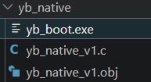

#### 4.1.3 部署和运行

现在，打开 Windows XP 虚拟机，将刚编译出炉的`yb_boot.exe`复制到`C:\WINDOWS\System32`下。

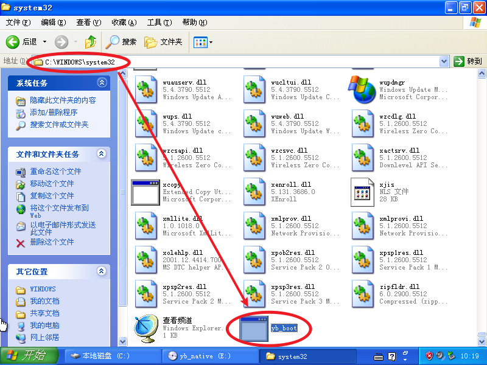

然后在“运行”中输入`regedit`，打开注册表编辑器，并定位到：`HKEY_LOCAL_MACHINE\SYSTEM\CurrentControlSet\Control\Session Manager`，双击右侧的 `BootExecute`，在其原有的 `autocheck autochk *` 下方换行追加我们的程序名 `yb_boot`，确定即可。
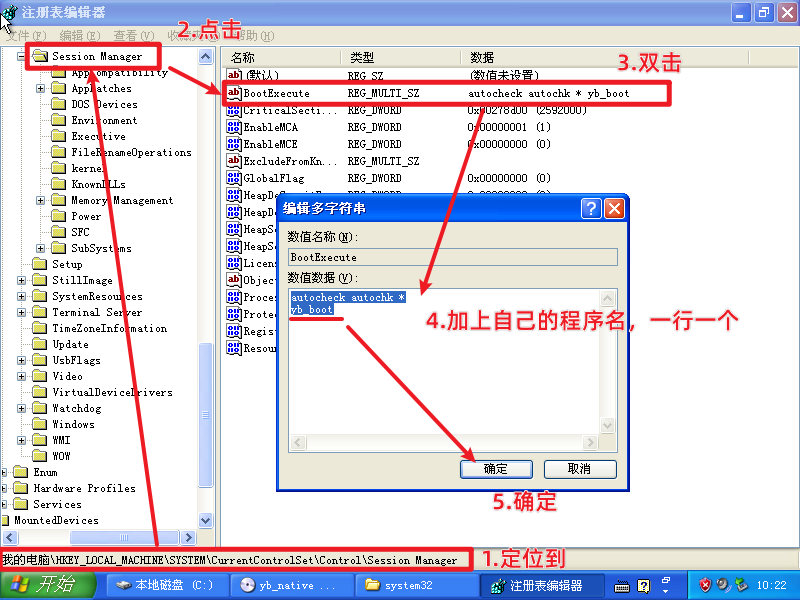

现在，重启电脑，系统启动画面过后，**我们写在代码里的字符串成功显示！** 内容持续 5s 后自动消失，开始正常加载鼠标和`LogonUI`。

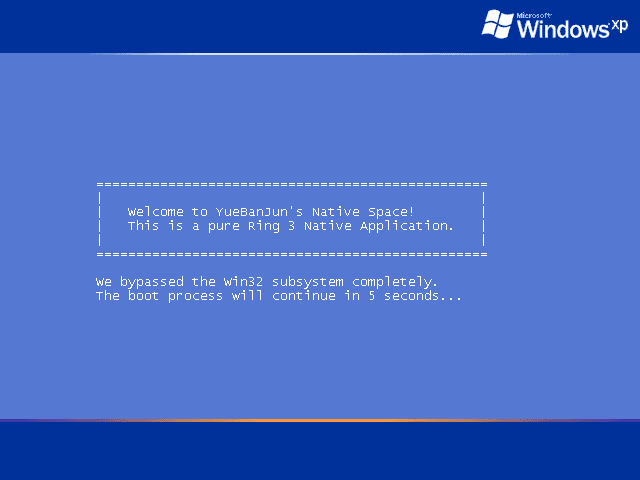

### 4.2 输出外部txt文件中的内容

上面我们成功实现了硬编码slogan的显示，但是有点太死板了，每次换文字都要重新编译。所以接下来我们要让程序能够**动态读取外部的 `.txt` 文本并显示出来**。

但正如前文所言，在这个连 C 盘的概念都尚未存在的阶段，同时还没有 Win32 模式下的`fopen`方法，想读一个文件简直是**限制重重**！所以在写代码时，我们应该注意以下三点：

1. 必须使用** NT 内部设备命名空间**：如`\??\C:\yb_boot_text.txt`。
2. 要读取的文本文件必须另存为 **UTF-16 LE（Unicode）格式**。
3. 标准 UTF-16 文件开头会自带两个字节的 `0xFF 0xFE` 签名。我们必须**手动将指针向后偏移两个字节**，否则打印出来开头就是一个乱码方块。

我们先来写代码：

```c
// yb_native_v2.c

#pragma comment(lib, "ntdll.lib")

// ==========================================
// 1. 底层数据类型与结构体声明
// ==========================================
typedef long NTSTATUS;
typedef unsigned short USHORT;
typedef void* PVOID;
typedef long long LONGLONG;
typedef unsigned long ULONG;

typedef struct _UNICODE_STRING {
    USHORT Length;
    USHORT MaximumLength;
    const unsigned short* Buffer;
} UNICODE_STRING, *PUNICODE_STRING;

typedef struct _LARGE_INTEGER {
    LONGLONG QuadPart;
} LARGE_INTEGER, *PLARGE_INTEGER;

// IO 状态块（记录文件读取结果）
typedef struct _IO_STATUS_BLOCK {
    union {
        NTSTATUS Status;
        PVOID Pointer;
    };
    ULONG Information; 
} IO_STATUS_BLOCK, *PIO_STATUS_BLOCK;

// 对象属性（用于定义文件路径）
typedef struct _OBJECT_ATTRIBUTES {
    ULONG Length;
    PVOID RootDirectory;
    PUNICODE_STRING ObjectName;
    ULONG Attributes;
    PVOID SecurityDescriptor;
    PVOID SecurityQualityOfService;
} OBJECT_ATTRIBUTES, *POBJECT_ATTRIBUTES;

// 底层 API 的宏定义
#define InitializeObjectAttributes( p, n, a, r, s ) { \
    (p)->Length = sizeof( OBJECT_ATTRIBUTES );          \
    (p)->RootDirectory = r;                             \
    (p)->Attributes = a;                                \
    (p)->ObjectName = n;                                \
    (p)->SecurityDescriptor = s;                        \
    (p)->SecurityQualityOfService = 0;                  \
}
#define OBJ_CASE_INSENSITIVE 0x00000040L
#define FILE_GENERIC_READ 0x00120089L
#define FILE_SHARE_READ 0x00000001L
#define FILE_SYNCHRONOUS_IO_NONALERT 0x00000020L

// ==========================================
// 2. 声明 ntdll.dll 原生 API
// ==========================================
__declspec(dllimport) void __stdcall RtlInitUnicodeString(PUNICODE_STRING DestinationString, const unsigned short* SourceString);
__declspec(dllimport) NTSTATUS __stdcall NtDisplayString(PUNICODE_STRING String);
__declspec(dllimport) NTSTATUS __stdcall NtDelayExecution(unsigned char Alertable, PLARGE_INTEGER DelayInterval);
__declspec(dllimport) NTSTATUS __stdcall NtTerminateProcess(PVOID ProcessHandle, NTSTATUS ExitStatus);
// 新增：文件操作 API
__declspec(dllimport) NTSTATUS __stdcall NtOpenFile(PVOID* FileHandle, ULONG DesiredAccess, POBJECT_ATTRIBUTES ObjectAttributes, PIO_STATUS_BLOCK IoStatusBlock, ULONG ShareAccess, ULONG OpenOptions);
__declspec(dllimport) NTSTATUS __stdcall NtReadFile(PVOID FileHandle, PVOID Event, PVOID ApcRoutine, PVOID ApcContext, PIO_STATUS_BLOCK IoStatusBlock, PVOID Buffer, ULONG Length, PLARGE_INTEGER ByteOffset, ULONG* Key);
__declspec(dllimport) NTSTATUS __stdcall NtClose(PVOID Handle);

// ==========================================
// 3. 核心入口：NtProcessStartup
// ==========================================
void __stdcall NtProcessStartup(PVOID ArgumentBlock) {
    UNICODE_STRING filePath;
    OBJECT_ATTRIBUTES objAttr;
    IO_STATUS_BLOCK ioStatus;
    PVOID fileHandle = 0;
    LARGE_INTEGER delay;
    
    // 我们在栈上开辟一块 4096 字节的内存作为读取文件的缓冲区
    // 现在连 malloc 都没有，栈内存是最可靠的
    unsigned char buffer[4096] = {0}; 

    // 1. 定义 NT 形式的文件路径
    // \??\ 是 NT 对象命名空间中 DOS 设备的根目录
    RtlInitUnicodeString(&filePath, L"\\??\\C:\\Windows\\System32\\yb_boot_text.txt");
    InitializeObjectAttributes(&objAttr, &filePath, OBJ_CASE_INSENSITIVE, 0, 0);

    // 2. 尝试打开文件
    NTSTATUS status = NtOpenFile(
        &fileHandle, 
        FILE_GENERIC_READ, 
        &objAttr, 
        &ioStatus, 
        FILE_SHARE_READ, 
        FILE_SYNCHRONOUS_IO_NONALERT
    );

    if (status == 0) { // 0 代表 STATUS_SUCCESS
        // 3. 读取文件内容到缓冲区
        NtReadFile(fileHandle, 0, 0, 0, &ioStatus, buffer, sizeof(buffer) - 2, 0, 0);
        NtClose(fileHandle);

        // 4. 处理文本并打印
        // 实际读取到的字节数
        USHORT bytesRead = (USHORT)ioStatus.Information; 
        
        // UTF-16 LE 文本文件通常带有 2 字节的 BOM 标头 (0xFF 0xFE)
        // 我们需要跳过这两个字节，否则会在屏幕开头打出一个乱码字符
        unsigned short* textPtr = (unsigned short*)buffer;
        if (bytesRead >= 2 && buffer[0] == 0xFF && buffer[1] == 0xFE) {
            textPtr = (unsigned short*)(buffer + 2);
            bytesRead -= 2;
        }

        // 手动构造一个 UNICODE_STRING，不用 RtlInitUnicodeString，因为它依赖 \0 结尾
        UNICODE_STRING printMsg;
        printMsg.Buffer = textPtr;
        printMsg.Length = bytesRead;
        printMsg.MaximumLength = bytesRead;

        NtDisplayString(&printMsg);

    } else {
        // 如果文件打开失败（比如文件不存在），打印备用错误信息
        UNICODE_STRING errorMsg;
        RtlInitUnicodeString(&errorMsg, L"\n\n    [ERROR] Cannot find C:\\Windows\\System32\\yb_boot_text.txt\n    Please check the file path and name.\n");
        NtDisplayString(&errorMsg);
    }

    // 延迟 5 秒退出
    delay.QuadPart = -50000000LL;
    NtDelayExecution(0, &delay);
    NtTerminateProcess((PVOID)-1, 0); 
}
```

然后，再使用VSCode新建一个文件`yb_boot_text.txt`，写入想要显示的内容，然后修改编码，**通过编码保存** 为`UTF-16 LE`。必须是`UTF-16 LE`哦！
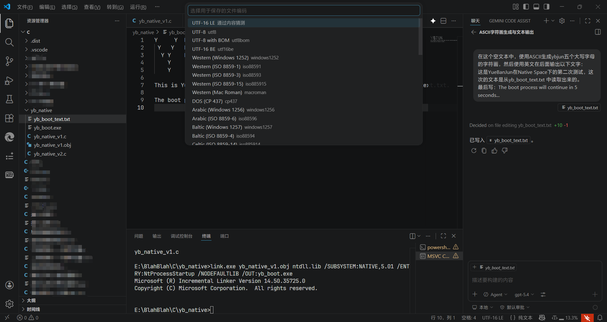

接着按照同样的方式编译